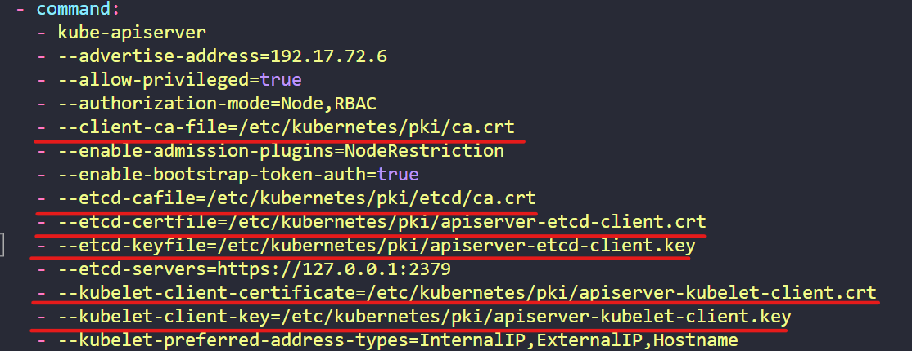
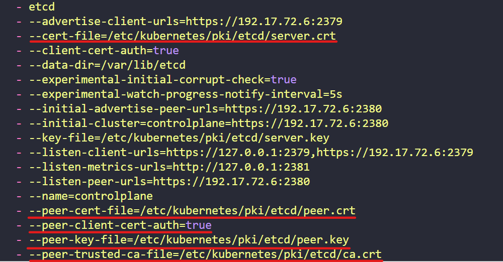
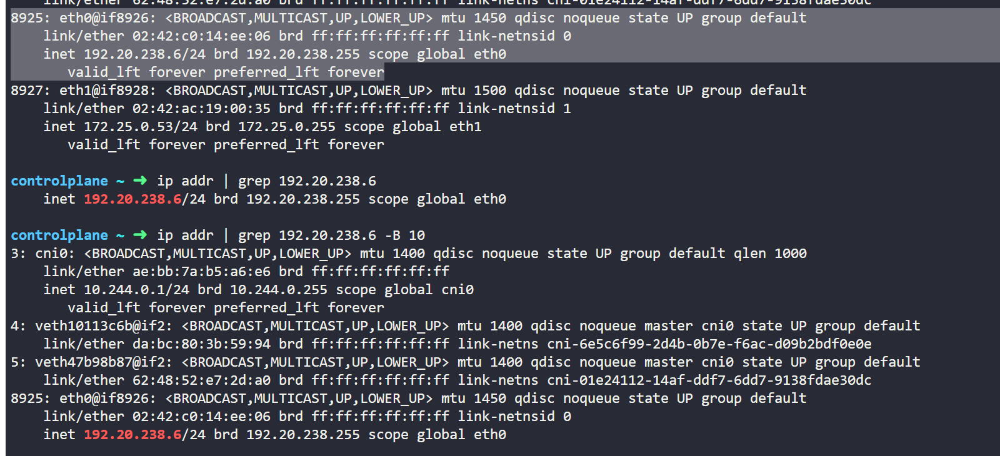

## Certification Tips

#### Options

`--dry-run=client`
    - 리소스를 생성하지 않고 리소스를 생성할 수 있는지 여부만 단순히 테스트

`-o yaml`
    - YAML 형식의 리소스 정의 파일 출력

#### Imperative Commands

| Pod 생성은 run, ReplicaSet이나 Deploy, Namespace는 create

| NodePort 생성 시에는 nodePort 포트 번호를 작성해야 하기 때문에 `kubectl create` 명령어가 유리하고, ClusterIP Service 생성 시에는 Selector가 원하는 pod와 일치해야 하기 때문에 `kubectl expose` 명령어가 유리

`kubectl run nginx --image=nginx`

- 이름이 nginx이고 이미지로 nginx 사용하는 pod 생성

`kubectl run nginx --image=nginx --dry-run=client -o yaml`

- pod의 YAML 파일 생성(-o yaml)하고 실제로 생성하지는 않음(--dry-run=client. 예상 결과만 알려줌)

`kubectl create deployment --image=nginx nginx`

- deployment 생성

`kubectl create deployment --image=nginx nginx --dry-run=client -o yaml`

- deployment YAML 파일 생성하고 실제로 생성하지는 않음

`kubectl create deployment --image=nginx nginx --dry-run=client -o yaml > nginx-deployment.yaml`

- nginx-deployment.yaml 이름으로 deployment YAML 파일 생성

`kubectl create -f nginx-deployment.yaml`

- 생성한 YAML 파일로 리소스 생성

`kubectl create deployment --image=nginx nginx --replicas=4 --dry-run=client -o yaml > nginx-deployment.yaml`

- nginx-deployment.yaml이라는 deployment 정의 파일 생성. image와 replicas 설정 가능

| 아래에서 Service 생성 방법으로 `k expose`와 `k create`가 나오는데, `k expose` 권장

`kubectl expose pod redis --port=6379 --name redis-service --dry-run=client -o yaml`

- redis-service 이름의 ClusterIP Service 생성하고 6379 포트를 가지는 redis 이름의 pod에 노출
    - 이때 pod의 label을 자동으로 Service의 Selector로 동작

`kubectl create service clusterip redis --tcp=6379:6379 --dry-run=client -o yaml`

- 이 Service의 selector는 app=redis가 되므로 pod에 또다른 label이 존재한다면 **Service의 selector 수정 필요**

`kubectl expose pod nginx --type=NodePort --port=80 --name=nginx-service --dry-run=client -o yaml`

- nginx-service 이름의 service 생성. pod의 label이 자동으로 Service의 Selector로 들어감
    - 단, **NodePort 포트 번호를 설정할 수 없으므로 definition file 생성 후 수정 필요**

`kubectl create service nodeport nginx --tcp=80:80 --node-port=30080 --dry-run=client -o yaml`

- **pod의 label이 Service의 Selector로 들어가지 않아 수정 필요**


`kubectl replace --force -f [YAML]`

- YAML 파일 수정 사항 있는 경우, 이전의 리소스를 삭제하고 다시 생성해야 하는데 replace 명령어가 이를 한 번에 진행시켜줌
    - 이때 반드시 `--force`가 정상적으로 동작


## 명령어

- 복사 붙여 넣기는 `ctrl + shift + c` , `ctrl + shift + v`

#### 1. 리소스 생성 & 조회

`kubectl run [POD NAME] --image=[IMAGE NAME]`

- pod만 생성할 때 빠르게 생성

`kubectl run [POD NAME] --image=[IMAGE NAME] --dry-run=client -o yaml > redis.yaml`

- `--dry-run=client`
- `-o yaml > redis.yaml`으로 yaml 파일 생성 가능

`kubectl get pods -o wide`

- pod node, IP 조회 가능

`cat pod.yaml`

- yaml 파일 조회

`kubectl describe pod [POD NAME] | grep [보고 싶은 단어]`

- 원하는 정보 빠르게 찾을 수 있음
- `-B 5` 해당 단어가 나온 줄로부터 5줄 뒤까지 조회 가능

#### 2. ReplicaSet 

| replicaset = rs

| Replicaset 변경할 때에는 (1) pod를 모두 지우거나 (2) replicaset yaml 파일을 delete 하는 작업 필요

| Replicaset replicas 개수 변경
1. `k scale --replicas=[NUMBER] -f [REPLICASET YAML FILE]`
2. `k scale rs [REPLICASET NAME] --replicas=[NUMBER]`
3. 또는 yaml 파일 변경 후 `k edit -f [YAML FILE]` 
4. 또는 `k edit replicaset [REPLICASET NAME]`으로 정의 파일 들어가서 replicas 변경

`kubectl explain replicaset`

- replicaset의 kind, version, field 등 나타남

#### 3. Deployment

| deployment = deploy

`kubectl get all`

- pods, replicaset, deployment 모두 조회 가능

`kubectl create deploy --help`

- 명령어로 deployment 생성 시 사용하는 명령어 조회 가능

#### 4. Service

`k create service --help`

- service 생성 명령어를 모르는 경우

`kubectl run [POD NAME] --image=[IMAGE NAME] --port=[PORT NUMBER] --expose=true`

- 특정 image와 port 번호를 가지는 Pod와 그 pod의 label을 가지는 Service가 한 번에 생성

| NodePort는 `kubectl create` 명령어로 nodePort 번호 지정하고, ClusterIP는 `kubectl expose` 명령어로 pod의 label을 selector로 가지는 것이 유리

`kubectl expose pod redis --port=6379 --name redis-service --dry-run=client -o yaml`

- redis-service 이름의 ClusterIP Service 생성하고 6379 포트를 가지는 redis 이름의 pod에 노출
    - 이때 pod의 label을 자동으로 Service의 Selector로 동작

`kubectl create service clusterip redis --tcp=6379:6379 --dry-run=client -o yaml`

- 이 Service의 selector는 app=redis가 되므로 pod에 또다른 label이 존재한다면 **Service의 selector 수정 필요**

`kubectl expose pod nginx --type=NodePort --port=80 --name=nginx-service --dry-run=client -o yaml`

- nginx-service 이름의 service 생성. pod의 label이 자동으로 Service의 Selector로 들어감
    - 단, **NodePort 포트 번호를 설정할 수 없으므로 definition file 생성 후 수정 필요**

`kubectl create service nodeport nginx --tcp=80:80 --node-port=30080 --dry-run=client -o yaml`

- **pod의 label이 Service의 Selector로 들어가지 않아 수정 필요**


#### 5. Namespace

| namespace = ns

`kubectl config set-context ${kubectl config current-context} --namespace=dev`

- namespace 변경

`kubectl get pods --all-namespaces` 또는 `kube get pods -A`

- 모든 namespace에서 리소스 조회

#### 6. Scheduling (Node)

| Pod를 특정 Node에 위치시키고 싶은 경우, YAML 파일에 nodeName 필드 추가 이후 아래 명령어 수행

1. `kubectl replace --force -f [YAML]`
    - 이전의 리소스를 제거하고 즉시 재생성

2. 또는 `kubectl delete -f [YAML]`한 후 `kubectl apply -f [YAML]`
    - 이전의 리소스를 제거한 후 생성 명령어 진행

`kubectl get pods --watch` 

- pod의 상태 변화 모니터링 가능

`kubectl get pods -o wide` 

- 더 많은 정보 조회 가능. 특히 Node 조회 가능

#### 7. Labels and Selectors

`k get pods --selector env=dev`

- label이 env=dev인 pod 탐색

`k get pods --selector env=dev --no-headers | wc -l`

- `wc -l`은 숫자 빠르게 계산해주는 명령어(wc -l: word cound와 line의 축약어). 맨 윗 줄(NAME|READY|STATUS|RESTARTS|AGE)이 출력되지 않도록 `--no-headers` 옵션 사용

`kubectl get all --selector env=prod,bu=finance,tier=frontend`

- 여러 조건을 모두 만족하는 리소스 찾기

#### 8. Taints And Tolerations

`kubectl taint node [NODE NAME] [KEY]=[VALUE]:[EFFECT]`

- Taint 명령어. (Tolerations는 Pod의 Defintion file에 작성)

`kubectl taint node [NODE NAME] [해당 NODE의 TAINTS]-`
    - Ex. `kubectl taint node controlplane node-role.kubernetes.io/master:NoSchedule-`

- 마지막에 `-`를 붙여 Node의 Taint 제거

#### 9. Node Selector & Node Affinity

`kubectl label nodes [NODE NAME] [LABEL KEY]=[LABEL VALUE]`

- Node에 크기 관련한 label 붙임 (Pod의 Definition file에 nodeSelector 작성)

`kubectl get node [NODE NAME] --show-labels`

- Node가 가지는 label 확인

#### 10. Resource Requirements and Limits

`k edit` 명령어 사용해 requests와 limits를 변경할 수 없지만, 이때 새로운 파일에 변경 사항이 적용되어 `k replace --force -f` 명령어로 변경사항 저장 가능

#### 11. DaemonSets

`kubectl create deployment [DAEMONSET NAME] -n [NAMESPACE] --image=[IMAGE] --dry-run=client -o yaml > daemonset.yaml`

- Daemonset은 replicaset, deployment와 유사한 형태이기 때문에 --dry-run=client -o yaml을 사용해 생성
- replicas와 strategy 필드 삭제


#### 12. Static Pods


`kubectl get pod [POD NAME] -o yaml`

- YAML 파일의 ownerReferences의 kind가 Node인 경우 Static pod
- Static pod는 이름 뒤에 node명이 붙음

`cat /var/lib/kubelet/config.yaml`

- 위 YAML 파일에서 staticPodPath가 static pod의 definition file이 존재하는 경로

`k run [POD NAME] --image [IMAGE NAME] --dry-run=client -o yaml>[YAML FILE NAME]`
`cp [이동시킬 YAML 파일] [이동할 경로]`

- YAML 파일 생성 후 경로 이동

`kubectl get nodes -o wide`
`ssh [NODE INTERNAL IP]`
- 해당 node IP를 확인한 후 이동

(node로 이동 후) `cat /var/lib/kubelet/config.yaml`

- 디렉토리 경로 확인

`cd [디렉토리 경로]`
(디렉토리 경로로 접근 후) `rm [FILE NAME]`

(node 탈출) `exit`

#### 13. Logging&Monitoring

| Metrics server 배포 방법

1. 깃에서 metrics-server 배포 파일 클론

`git clone https://github.com/kodekloudhub/kubernetes-metrics-server.git`

2. 해당 파일 들어가서 Metric server 배포

`cd kubernetes-metrics-server`
`kubectl create -f .`

| Metrics server 사용

`kubectl top node`

- node의 리소스 사용량 조회

`kubectl top pods`

| Application 로그 조회 

`kubectl logs -f [POD NAME]`

- 실시간으로 pod의 container의 로그 조회 가능

`kubectl logs -f [POD NAME] [CONTAINER NAME]`

- 실시간으로 해당 container 로그 조회 가능

#### 14. Rolling Updates & Rollback


1. Create

`kubectl create -f [DEPLOYMENT YAML FILE]`

2. Get

`kubectl get deployments`

3. Update

`kubectl apply -f [DEPLOYMENT YAML FILE]`

`kubectl set image deployment/[DEPLOYMENT NAME] [CONTAINER NAME]=[변경할 이미지]`

4. Status

`kubectl rollout status deployment/[DEPLOYMENT NAME]`

- deployment 진행 상태 확인 가능

`kubectl rollout history deployment/[DEPLOYMENT NAME]`

- deployment history 조회 가능

5. Rollback

`kubectl rollout undo deployment/[DEPLOYMENT NAME]`

- 이전 Revision으로 Rollback

#### 15. Commands & Arguments

- Definition file에서 command & args 명시

`방법 1`
```
spec:
    containers:
        - name: ...
          command: ["sleep","5000"]
```

`방법 2`
``` 
spec:
    containers:
        - name: ...
          command: 
            - "sleep"
            - "5000"
```

---

`k replace --force -f [임시파일]`
- 이미 생성된 리소스의 YAML 파일에서 command와 argument 수정 시 경고 문자 나옴
- 이때 변경된 YAML 파일은 임시파일 경로에 존재하므로 해당 파일이 적용되도록 함

`k run [POD NAME] --image=[IMAGE NAME] -- [ARGS1] [ARGS1] ...`

- `--` 뒤에는 내부에서 실행되는 Application을 위한 옵션
    - 이때 command에 해당하는 --도 반드시 넣어야 함
    - `k run webapp-green --image=kodekloud/webapp-color -- --color green`

#### 16. Environment Variables

1. ConfigMap

| ConfigMap = cm

`k create configmap [CONFIGMAP NAME] --from-literal=[KEY]=[VALUE]`

2. Secret

`kubectl create secret generic [SECRET NAME] --from-literal=[KEY]=[VALUE]`

#### 17. Multi-Container

`k -n elastic-stack exec -it app -- cat /log/app.log`
    
- `exec`: 지정된 pod 내에서 명령어 실행
- `-i`: 표준 입력 활성화해 터미널에서 명령어 입력할 수 있도록 함
- `-t`: 터미널 할당해 터미널에서 실행하는 것과 같은 환경 제공


`k edit pod [POD NAME]` > `k replace --force -f [YAML FILE]`

#### 18. Init-Container

`k logs [POD NAME] -c [CONTAINER NAME]`

- container 로그 확인

## Section6 명령어

#### 1. OS Upgrades

`k drain [NODE NAME] --ignore-daemonsets`

- Node 다운하는 경우 node에 존재하는 모든 pod를 다른 node에 evict시킴
- Unschedulable 상태

`k uncordon [NODE NAME]`

- 다운되고 다시 node가 정상이 되면 uncordon해야 다시 pod 스케쥴링할 수 있음
- Schedulable 상태

`k cordon [NODE NAME]`

- drain과 uncordon 사이에는 cordon 존재
- 단순히 node에 scheduling만 안 되도록 설정하고 내부의 pod는 건드리지 않음
- Unschedulable 상태


#### 2. Cluster Upgrades


Q1

`kubectl get nodes`

- kubernetes 버전 확인 가능

Q3

`kubectl describe node | grep Taints`

- node들의 Taints 조회 가능

Q7

`kubeadm upgrade plan`

- kubeadm 버전 확인


Q9

1. Package Repository 변경

- **안해도 됨 !! 이미 존재**
- 다음 단계 명령어(sudo apt update, sudo apt-cache madison kubeadm)에서 확인

`echo "deb [signed-by=/etc/apt/keyrings/kubernetes-apt-keyring.gpg] https://pkgs.k8s.io/core:/stable:/v1.30/deb/ /" | sudo tee /etc/apt/sources.list.d/kubernetes.list`

`curl -fsSL https://pkgs.k8s.io/core:/stable:/v1.30/deb/Release.key | sudo gpg --dearmor -o /etc/apt/keyrings/kubernetes-apt-keyring.gpg`

2. kubeadm 업그레이드

```
sudo apt update
sudo apt-cache madison kubeadm
```

```
sudo apt-mark unhold kubeadm && \
sudo apt-get update && sudo apt-get install -y kubeadm='1.30.0-*' && \
sudo apt-mark hold kubeadm
```

`kubeadm version`

`sudo kubeadm upgrade plan`

`sudo kubeadm upgrade apply v1.30.0`

3. kubelet & kubectl 설치

`kubectl drain <node-to-drain> --ignore-daemonsets`

```
sudo apt-mark unhold kubelet kubectl && \
sudo apt-get update && sudo apt-get install -y kubelet='1.30.0-*' kubectl='1.30.0-*' && \
sudo apt-mark hold kubelet kubectl
```

```
sudo systemctl daemon-reload
sudo systemctl restart kubelet
```

`kubectl uncordon <node-to-uncordon>`

Q11

1. `k drain [NODE NAME] --ignore-daemonsets`

2. node01에 접근

`ssh node01`

3. Package Repository 변경

`echo "deb [signed-by=/etc/apt/keyrings/kubernetes-apt-keyring.gpg] https://pkgs.k8s.io/core:/stable:/v1.28/deb/ /" | sudo tee /etc/apt/sources.list.d/kubernetes.list`

`curl -fsSL https://pkgs.k8s.io/core:/stable:/v1.28/deb/Release.key | sudo gpg --dearmor -o /etc/apt/keyrings/kubernetes-apt-keyring.gpg`

4. kubeadm 업그레이드

```
sudo apt-mark unhold kubeadm && \
sudo apt-get update && sudo apt-get install -y kubeadm='1.30.0-*' && \
sudo apt-mark hold kubeadm
```

`sudo kubeadm upgrade node`

- exit

5. kubelet & kubectl 설치

`kubectl drain <node-to-drain> --ignore-daemonsets`

- 다시 `ssh node01`

```
sudo apt-mark unhold kubelet kubectl && \
sudo apt-get update && sudo apt-get install -y kubelet='1.30.0-*' kubectl='1.30.0-*' && \
sudo apt-mark hold kubelet kubectl
```

```
sudo systemctl daemon-reload
sudo systemctl restart kubelet
```

`kubectl uncordon node01`

#### 3. Backup and Restore


| Backup

- volumes가 hostPath로 되어있다는 것은 실행중인 노드의 경로를 의미하고 controlplane에 존재하고, volumeMounts는 etcd 내부에 존재

1. ETCDCTL API Version 최신화 => 3으로
- `export ETCDCTL_API=3`
- 이 명령어 쓰면 etcdctl 앞에 ETCDCTL_API=3을 안 써도 되고, 반대로 이 명령어 수행하지 않으면 모든 etcdctl 앞에 ETCDCTL_API=3 을 작성해야 함

2. Snapshot 저장

- `--cacert`, `--cert`, `--key`, `--endpoints` 지정

```
etcdctl snapshot save --cacert="/etc/kubernetes/pki/etcd/ca.crt" --cert="/etc/kubernetes/pki/etcd/server.crt" --key="/etc/kubernetes/pki/etcd/server.key" --endpoints=127.0.0.1:2379 /opt/snapshot-pre-boot.db
```

| Restore

1. Snapshot restore
- `etcdctl snapshot restore --data-dir /var/lib/etcd-from-backup /opt/snapshot-pre-boot.db`
  - snapshot으로 저장한 파일 내의 데이터를 --data-dir 경로에 저장
  - /opt에는 일반적으로 **사용자 정의** 리소스,서드파티 소프트웨어(모니터링 도구,로깅 시스템, 데이터베이스 서버), 백업 및 복원 파일 존재

2. etcd의 etcd-data volume path 변경 
- `vim /etc/kubernetes/manifests/etcd.yaml`의 volumes.hostPath의 name이 etcd-data인 path를 /var/lib/etcd-from-backup으로 변경
  - `/etc/kubernetes/manifests/etcd.yaml` 암기할 것
  - /etc는 일반적으로 시스템 설정 파일 저장, /etc/kubernetes에는 cluster의 중요한 설정 파일 저장되어 있고, /etc/kubernetes/manifests에는 cluster의 중요 구성 요소가 YAML 형식으로 저장되어 있음 

3. 재시작 확인
- `k get pods -n kube-system`으로 etcd-controlplane, scheduler, controller manager가 재시작되는 것 확인

- 정상적으로 재시작되지 않는 경우, `k delete pod etcd-controlplane -n kube-system`으로 삭제 -> 자동 재시작


| 다중 클러스터의 경우도 있는데, 이는 section6 참고할 것 => 복잡

## Section7 명령어

#### 1. View Certification Details

Q1. Identify the certificate file used for the kube-api server

- `k get pods -A`에서 pod로 배포되었으므로 kubeadm 사용한 것
- `k describe pod [CONTROLPLANE POD] -n kube-system`
  - `--tls-cert-file=/etc/kubernetes/pki/apiserver.crt` 옵션이 kube-api server certificate file

- 이때 key와 certificate 구분 !
  - key는 .key
  - certificate는 .crt

Q6. What is the Common Name (CN) configured on the Kube API Server Certificate?

`openssl x509 -in /etc/kubernetes/pki/apiserver.crt -text -noout`

- openssl에 -in 옵션 뒤에 certificate 경로 넣기

Q12

- kubectl이 동작하지 않는 경우 docker를 사용하는 경우는 `docker` command, cri-o를 사용하는 경우 `crictl` 명령어 사용
  - `docker ps -a` or `crictl ps -a`
  - 이때 방금 생성된 container, 즉 running 상태의 container log 확인 => "2379 port 번호로 etcd에 문제가 있음을 알아차림"
  - `docker logs [CONTAINER ID]` or `crictl logs [CONTAINER ID]`
- 오류 메세지 경로 찾기
  - `ls /etc/kubernetes/pki/etcd`에 server-certificate.crt 존재 X
- `/etc/kubernetes/manifests/etcd.yaml | grep server-certificate.crt`
  - server-certificate.crt가 존재하는 --cert-file을 올바르게 변경
- 시간 오래 소요

Q13

- `/etc/kubernetes/manifests/etcd.yaml`와 같이 /etc/kubernetes/manifests 아래에 구성 요소 yaml 파일 존재 

- kube-apiserver yaml 파일에는 ca가 2개 존재하는데 --client-ca-file은 kube-apiserver의 ca.crt로 ../pki/ca.crt, --etcd-cafile은 /pki/etcd/ca.crt 
- 나머지 certificate와 key는 모두 pki 아래에 존재
- 즉, etcd의 ca.crt만 pki/etcd 아래에 존재하고 나머지는 모두 pki에 존재



- etcd는 모두 pki/etcd 아래에 존재



#### 2. Certificates API

Q2

`cat [CSR NAME] | base64 -w 0`

- `-w 0`을 안 하면 한 줄이 아니게 되어 오류 발생 => 반드시 작성해야 함
- base64로 인코딩한 값을 YAML 파일에 작성

Q4

`kubectl certificate approve [CSR NAME]`

- 승인시켜줘야 함

Q7

`k get csr agent-smith -o yaml > smith.yaml`

- csr의 group을 보려면 describe가 아닌 yaml 파일로 확인해야 함

Q8

`kubectl certificate deny [CSR NAME]`

- csr 거절

#### 3. KubeConfig

Q12

`k config --kubeconfig=my-kube-config use-context research`

- my-kube-config 이름의 config 파일의 current-context를 research로 변경

`k config --kubeconfig my-kube-config current-context`

- my-kube-config 파일의 current-context 조회

Q13

`cp my-kube-config ~/.kube/config`

- 생성한 config 파일을 기본 config 파일 경로에 복사
- 이때 /.kube/config와 ~/.kube/config는 다름
  - ~/.kube/config로 해야함
  - `~/.kube/config` = `$HOME/.kube/config`

#### 4. RBAC

Q3

- `k get roles -A --no-headers | wc -l`

Q8

- `k auth can-i get pod --as dev-user` 또는 `k get pods --as dev-user`

Q11

- `k auth can-i create deployment --as dev-user -n blue`

- rules의 resources가 deployments의 경우 apiGroups도 수정해야함

```
rules:
- apiGroups: ["apps"]
  #
  # at the HTTP level, the name of the resource for accessing Deployment
  # objects is "deployments"
  resources: ["deployments"]
  verbs: ["get", "list", "watch", "create", "update", "patch", "delete"]
```

#### 5. Cluster Roles and Role Bindings

Q2

- `k get clusterroles --no-headers | wc -l`
- 개수 카운트

#### 6. Service Accounts

Q12

- `kubectl create token [SERVICE ACCOUNT NAME]`
- service account의 token 생성

#### 7. Image Security

Q3

- registry 지정하지 않으면 Docker Hub에서 가져오기에 registry 지정

Q5

- `k create secret docker-registry private-reg-cred --docker-username=dock_user --docker-server=myprivateregistry.com:5000 --docker-password=dock_password --docker-email=dock_user@myprivateregistry.com`
  - Secret을 docker-registry 형태로 생성

#### 8. Security Contexts

Q1

- `ps aux`
  - 실행중인 프로세스 조회

- 또는 `kubectl exec ubuntu-sleeper -- whoami`

Q2

- `k edit pod [POD NAME]` 후 (1) `k replace -f [YAML 파일] --force` 또는 (2) `k delete pod [POD NAME]` > `k apply -f [YAML 파일]`
- `ps aux`로 User 조회

Q3

- Container 레벨이 Pod 레벨보다 높아 Container에 적용한 User 사용

#### 9. Network Policy

Q10

- Service를 조회해 label과 port 찾아 podSelector와 ports 작성


## Section8 명령어

#### 1. Volume, PV, PVC

| Persistent Volume = pv, Persistent Volume Claim = pvc

- 공식 페이지에서 복붙

#### 2. Storage Class

| Storage Class = sc

- 공식 페이지에서 복붙

## Section9 명령어

#### Explore Kubernetes Environment

Q3

`ip addr | grep [IP ADDRESS]`

- 해당 IP interface 탐색
- ip 주소와 ip 주소의 특징에 대한 정보를 출력



Q6

`ssh node01`

Q7

`ip address show type bridge`

- bridge의 interface 조회

Q9

`route`

- routing table 조회

Q10

`netstat -plnt`

- 실행중인 프로그램 조회
- 네트워크 연결 상태, 라우팅 테이블, 인터페이스 상태 등을 보여주는 명령어

Q11

`netstat -npa | grep -i etcd | grep -i 2379 | wc -l`과 `netstat -npa | grep -i etcd | grep -i 2380 | wc -l` 비교

#### Explore CNI


Q1

`ps aux | grep kubelet | grep end`

- `ps aux`는 모든 user의 process 전체 조회 가능

Q2

`ls /opt/cni/bin`

- 지원하는 모든 CNI 존재

Q4

`ls /etc/cni/net.d`

- 현재 Kubernetes에서 사용하는 CNI 

#### Deploy Network Solution

Q3

`k apply -f weave/weave-daemonset-k8s.yaml`

- 실행 후 `k get pods -n kube-system`,`k get cm -n kube-system`으로 weave plugin이 실행되는지 조회

#### Networking Weave

Q6

`ip addr show weave`

- weave가 사용하는 IP 조회 가능

또는 `k logs -n kube-system [WEAVE POD NAME]`

- log에서 ipalloc-range에 할당되는 IP 주소 조회 가능

Q7

`ssh node01` > `ip route`

또는 

pod 하나를 nodeName 지정해 생성 > 이후 `k exec [CONTAINER NAME] -- ip route`

#### Service Networking

Q1

`ip addr`

- `ip addr`에서 eth0에 존재하는 IP address 범위가 cluster의 node에 할당되는 IP address 범위


Q2

`k logs [WEAVE POD] -n kube-system`

- 위 명령어 결과에서 ipalloc이 pod에 할당되는 IP 주소
- weave가 pod에 주소 할당하고 packet을 운반하는 운송체이므로 

Q3

`vim /etc/kubernetes/manifests/kube-apiserver.yaml`

- 위 결과에서 `--service-cluster-ip-range`가 service의 IP range

Q5

`k logs [KUBE-PROXY POD NAME] -n kube-system`

- kube-proxy가 어떻게 구성되었는지 조회 가능

#### Explore DNS

Q5

`k describe deploy coredns -n kube-system`

- deploy 살펴봐 coredns 경로 확인
- Containers.coredns를 살펴보면 CoreDNS 서비스를 실행하는 container
- Containers.coredns.Args의 -conf는 CoreDNS를 실행하는 구성 파일을 의미하고, 이후 나오는 경로가 구성 파일의 경로


Q8

`k describe configmap coredns`

- configmap으로 coredns 설정 확인

Q15

`k exec hr -- nslookup mysql.payroll > /root/CKA/nslookup.out`

- `nslookup`은 DNS Server에 원하는 도메인 정보(현재는 mysql.payroll)를 조회하는 명령어
  - DNS Server로부터 여러가지 정보를 얻을 수 있는 명령어

## Section11 명령어

#### Cluster Installation using Kubeadm

Q1. kubeadm과 kubelet을 1.30.0-1.1 버전으로 설치

- https://kubernetes.io/docs/setup/production-environment/tools/kubeadm/install-kubeadm/
- 4단계의 `sudo apt-get install -y kubelet kubeadm kubectl`에서 버전 지정
    - `sudo apt-get install -y kubelet=1.30.0-1.1 kubeadm=1.30.0-1.1 kubectl=1.30.0-1.1`


Q5

`ifconfig`

- 네트워크 인터페이스 설정하거나 IP 주소, 서브넷마스크, MAC 주소, 네트워크 상태 확인 가능
- 암기

`kubeadm init --apiserver-advertise-address=192.15.114.12 --pod-network-cidr=10.244.0.0/16 --apiserver-cert-extra-sans=controlplane`

- apiserver-advertise-address는 `ipconfig`에서 문제에 주어진 interface의 IP 주소 

- 아래 명령어 실행해 kubeconfig 파일 설정 완료할 것

```
mkdir -p $HOME/.kube
sudo cp -i /etc/kubernetes/admin.conf $HOME/.kube/config
sudo chown $(id -u):$(id -g) $HOME/.kube/config
```

Q7

- Master node에서 `kubeadm init` 명령어 완료 시 나타난 메세지 중 join 복사 후 Worker node에 붙여넣기

Q8

- `kubeadm init` 시 addon 링크에서 flannel 찾아 배포
    - `kubectl apply -f https://github.com/flannel-io/flannel/releases/latest/download/kube-flannel.yml`

- flannel이 eth0 인터페이스와 상호작용하도록 수정
    - `k edit daemonset [DAEMONSET NAME]`
    - args에 `- --iface=eth0` 추가

## Section13 명령어

#### Application Failure

| 문제 풀기 전에 `tab` 눌러서 오류 원인 찾고 그 주변으로 문제 찾기

| Pod의 env, Service의 ports, Pod와 Service 사이의 label과 selector 중 하나

Q1

- `k config set-context --current --namespace alpha`
    - alpha namespace를 기본으로 변경

- NodePort service의 경우 `curl [SERVICE IP]:[SERVICE TARGET PORT]`

#### Control Plane Failure

#### Worker Node Failure

#### Network Troubleshooting