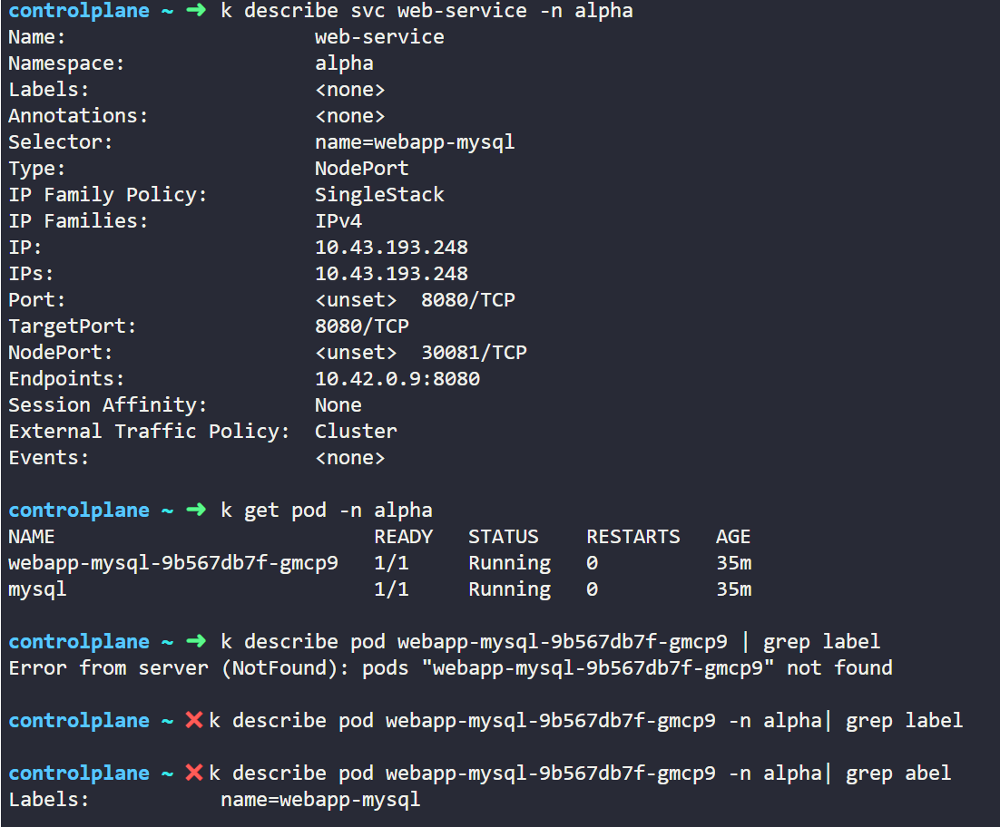
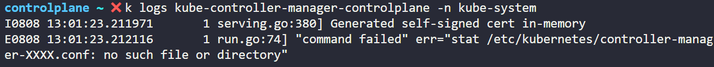
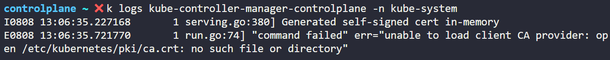
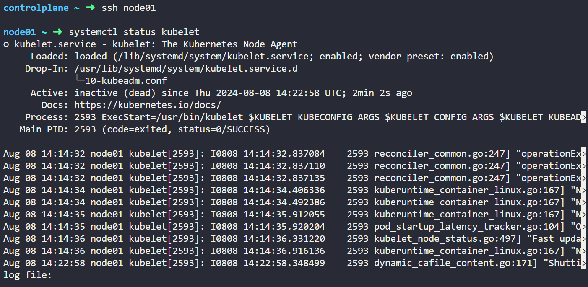
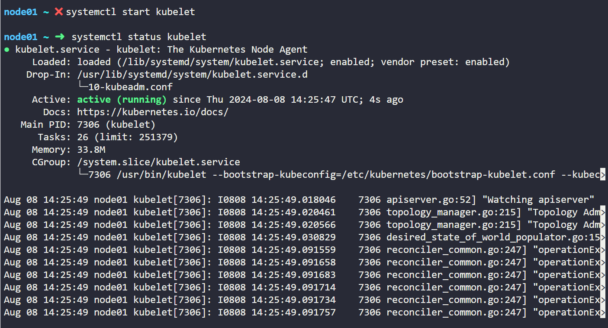

## Application Failure

#### Check Accessibility

- 2개 tier application
    - Web과 Database server 존재

- Database pod는 database application을 호스트하고 database service에 web server 제공
- Web server는 web pod에 호스트되고 web service를 통해 사용자에게 제공
- 즉, **User > Web-service > Web pod > DB-service > DB pod 형태**

- Failure에 대해 얼마나 아느냐에 따라 어느 endpoint에서 시작할지 결정할 수 있음
    - User or DB pod

- 문제를 찾을 때까지 모든 object와 연결을 체크해야함

#### Ex. User가 Application access에 문제가 있다고 신고

| Web-service > Web pod > DB-service > DB pod 순서

1. Check Accessibility 
    - Application Frontend
    - Application이 접근 가능하다면 표준 테스트 방법 사용
    - web application이라면 해당 server가 **nodePort service IP를 curl 하여 접근** 가능한지 확인
        - `curl http://web-service-ip:node-port`

2. Check Service Status
    - 접근할 수 없는 경우 Web Service 확인
    - Pod와 Service의 label과 Selector 일치하는지 확인
    - `k describe pod [POD NAME]`하여 Endpoint 찾기

3. Check Pod
    - `k get pod`하여 Pod의 STATUS와 RESTARTS 확인
    - 문제가 발생한 경우 `k describe pod [POD NAME]`
    - `k logs [POD NAME] -f --previous`으로 이전 pod 로그 확인

4. Check Dependent Service
    - DB service status를 체크

5. Check Dependent Applications
    - DB pod log를 확인하고 DB에 오류가 있는지 확인

## Practice Test - Application Failure

| 문제 풀기 전에 `tab` 눌러서 오류 원인 찾고 그 주변으로 문제 찾기

| Pod의 env, Service의 ports, Pod와 Service 사이의 label과 selector 중 하나

Q1

- `k config set-context --current --namespace alpha`
    - alpha namespace를 기본으로 변경

1. Web Service 확인

- NodePort service의 경우 `curl [SERVICE IP]:[SERVICE TARGET PORT]`
- 이때 curl 뒤의 경로는 `k describe svc [SERVICE NAME]`의 Endpoints

2. Web Pod 확인

- Pod의 label과 Service의 Selector 일치하는지 확인
- Environment에서 Database host 설정 이름과 service 이름이 다름

3. mysql Service 확인

- 앞의 Web Pod와 mysql service가 잘 연결되었는지 확인
- 오류발생
- service 이름이 잘못됨

4. mysql Pod 확인

- Pod의 label과 Service의 selector 일치하는지 확인

Q2

- App을 클릭했을 때 오류가 mysql service에 접근할 수 있다고 나타남 => web pod와 mysql service 사이의 문제 or mysql service와 mysql pod 사이의 문제
- service 정의에서 target port 번호가 잘못작성됨

Q3

- mysql pod의 label과 mysql service의 selector 일치하지 않는 문제

Q4

- web pod의 env가 정확하지 않음
- 이때 deployment를 수정해야함
    - Pod 수정해도 안 바뀜

Q5

- webapp-mysql pod의 env 잘못작성
- mysql pod의 env 잘못작성
- mysql과 webapp-mysql의 env가 일치해야 함

Q6

- web-service nodePort 문제
- webapp-mysql env 문제
- mysql env 문제

## Control Plane Failure

#### Check Node Status

- `k get nodes`

- `k get pods`

#### Check Controlplane Pods

- kubeadm으로 배포된 cluster에 control plane 구성 요소가 있는 경우
    - `k get pods -n kube-system`

#### Check Controlplane Services

- control plane 구성 요소가 service로 배포되는 경우
    - `service kube-apiserver status`
    - `service kube-controller-manager status`
    - `service kube-scheduler status`
    - `service kubelet status`
    - `service kube-proxy status`

#### Check Service Logs

- kubeadm으로 cluster 배포(= Pod)
    - `k logs kube-apiserver-master -n kube-system`

- service로 배포
    - 호스트 로깅 솔루션을 이용해 서비스 로그 조회
    - `sudo journalctl -u kube-apiserver`

## Practice Test - Control Plane Failure

Q1

- `k get pods -A`
    - kube-scheduler에 오류 발생
- `vim /etc/kubernetes/manifests/kube-scheduler.yaml`
    - kube-schedulerrrr -> kube-scheduler로 수정

Q3

- `k get pods -A`
    - kube-controller-manager pod에 오류 발생
- `k logs [POD NAME] -n kube-system`으로 오류 원인 찾기
- `vim /etc/kubernetes/manifests/kube-controller-manager.yaml`에서 오류 수정

Q4

- `vim /etc/kubernetes/manifests/kube-controller-manager.yaml`에서 오류 수정
- hostPath의 path 오류

## Worker Node Failure

#### Check Node Status

- Cluster 내 node의 상태 확인
    - `k get nodes`
    - STATUS가 Ready 또는 NotReady 상태

- NotReady 상태면 Fail 원인 조회
    - `k describe node worker-1`
    - Node가 disk를 넘어서면 OutofDisk, disk 용량이 낮으면 DiskPressure, memory를 넘어서면 MemoryPressure, 프로세스가 많으면 PIDPressure가 False 상태가 됨

- Worker node와 Master node의 통신이 멈추면 Status가 Unknown 상태

#### Check Node

- `top`
    - Node에서 사용 가능한 CPU 메모리와 Disk 공간 조회

- `ds -h`

#### Check Kubelet Status

- `service kubelet status`
- `sudo journalstl -u kubelet`

#### Check Certificates

- `openssl x509 -in /var/lib/kubelet/worker-1.crt -text`
    - 만료되지 않은 올바른 Certificates인지 확인

## Practice Test - Worker Node Failure

Q1

- `k describe node [NODE NAME]`의 Status에 Unknown 존재 => **Master node와 통신이 안 되는 것**

1. NotReady 상태의 노드로 들어감
- `ssh node01`

2. kubelet 상태 확인
- `systemctl status kubelet`
- Active가 inactive 상태인 경우 계속 진행 

3. kubelet 재시작
- `systemctl start kubelet` 또는 `service kubelet restart`

4. kubelet 상태 확인
- `systemctl status kubelet`

Q2

- `k describe node [NODE NAME]`

1. Not Ready 상태의 노드 들어감
- `ssh node01`
2. kubelet 상태 확인
- `systemctl status kubelet`
- 현재는 Active
3. kubelet 로그 확인 
- `journalctl -u kubelet`

4. 문제 해결
- `vim /var/lib/kubelet/config.yaml`에서 오류 해결
    - ca.crt로 변경

5. kubelet 재시작
- `systemctl restart kubelet`

6. kubelet 상태 확인 
- `systemctl status kubelet`

Q3

1. kubelet 상태 확인
- `systemctl status kubelet`
- Active이므로 다음 단계
    - InActive인 경우 `systemctl start kubelet`

2. kubelet log 확인
- `journalctl -u kubelet`
- Controlplane과 API 통신 문제

3. 수정
- `vim /etc/kubernetes/kubelet.conf`에서 controlplane port를 6443으로 변경

4. kubelet 재실행
- `systemctl restart kubelet`
