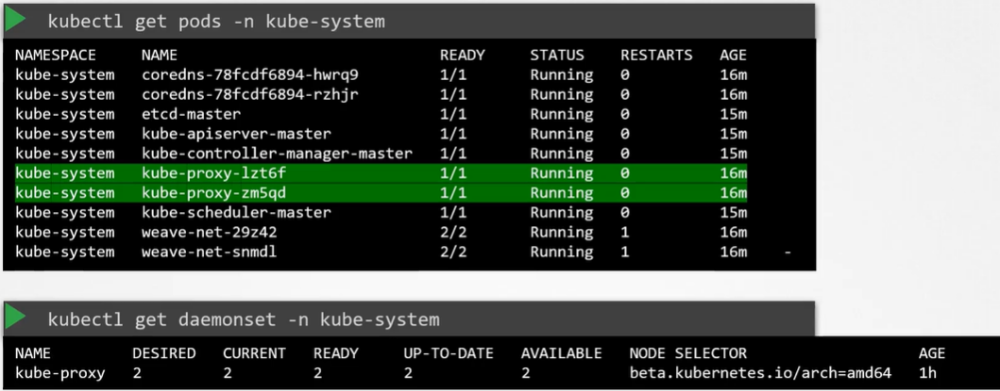
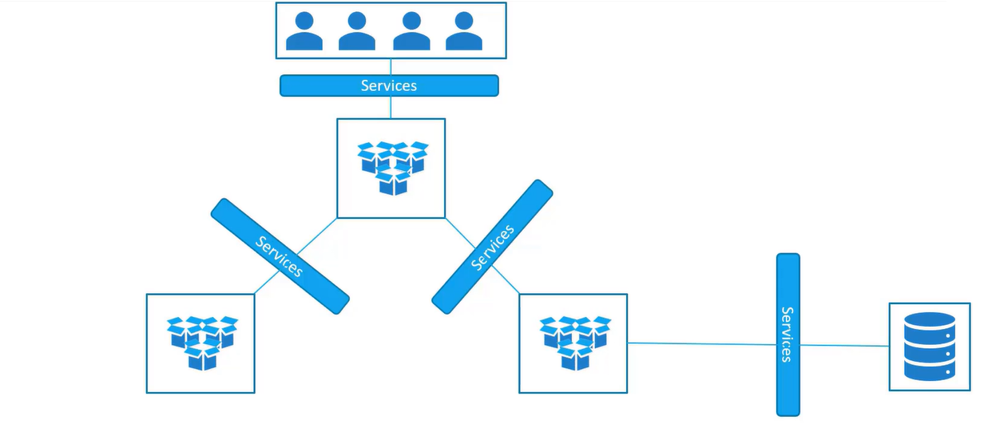
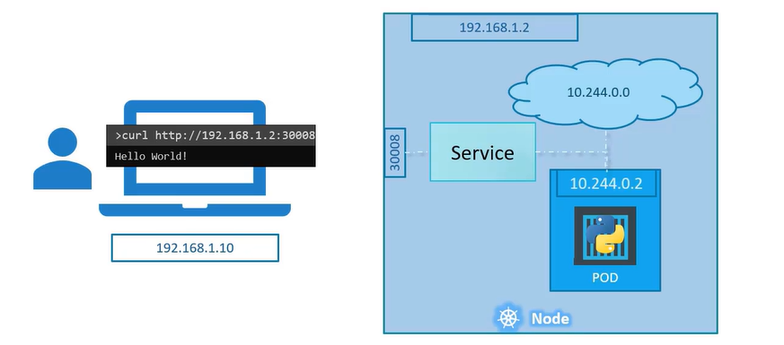
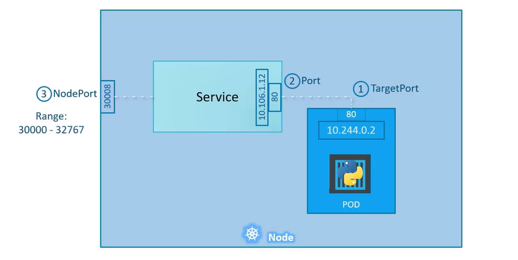
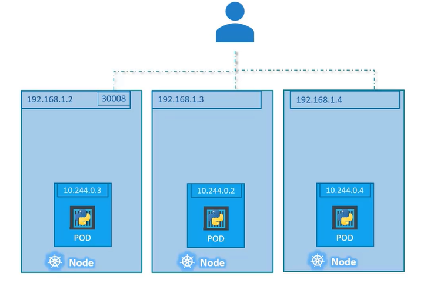

## Cluster Architecture

#### Contains

  - Kubernetes Architecture
  - ETCD For Beginners
  - ETCD in Kubernetes
  - Kube-API Server
  - Controller Managers
  - Kube Scheduler
  - Kubelet
  - Kube Proxy

#### Kubernetes의 목적

  - Application을 자동화된 방식의 Container 형식으로 호스트하는 것
  - 이로 인해 요구에 따라 Application의 많은 인스턴스를 쉽게 배포할 수 있고, Application 내 다양한 서비스 간의 통신이 쉽게 가능

#### Kubernetes Cluster는 Node set으로 구성되는데 물리적, 가상(virtual), on-premise, 또는 cloud일 수 있고, container 형태의 Application host일 수 있음

#### Kubernetes Architecture (화물선에 비유)

  - 모든 Node에는 `Container Runtime Engine` 설치되어 있음
  - `Worker Node`는 container를 로딩할 수 있는 배

    - Host Application as Containers

    1. `kubelet` : cluster의 모든 worker node에서 실행되는 agent. Master node의 Kube API server의 지시를 듣고 container를 배포하거나 파괴. Master node의 Kube API server에 node와 container의 상태 보고서 제공
    2. `kube proxy` : Worker Node 간의 통신. Worker Node에 필요한 규칙이 시행되도록 함. 그 위에서 실행되는 container가 통신이 가능하도록 함

  - 선박에 container를 적재하고, 어떻게 적재할지 계획하고, 선박을 식별하고, 그에 대한 정보를 저장하고, 선박에 실린 container의 위치를 감시하고 추적하는 등의 전적인 적재 과정을 관리하는 관제선 역할의 `Master Node`
    - Manage, Plan, Schedule, Monitor Nodes
    - Master Node는 cluster를 관리하고, 서로 다른 노드에 대한 정보를 저장하고, 어떤 container가 어디로 갈지 계획하고, node와 container를 모니터링하는 역할
    1. `ETCD Cluster` : Cluster에 관한 정보 저장, key-value 형식으로 정보를 저장하는 DB
    2. `Kube Scheduler` : container를 설치하기 위한 올바른 node 식별, container resource 요구 사항이나 worker node의 용량, 다른 정책(policy)이나 제약 조건들, taint-toleration과 같은 규칙에 근거
    3. `Controller Manager` : Node controller가 node 관리(새 node를 cluster에 온보딩하고, 노드가 사용 불가능하거나 파괴되는 상황 처리), Replication controller가 replication 관리(원하는 container 수가 replication에서 항상 실행되도록 보장)
    4. `Kube API server` : Kubernetes 주요 관리 구성 요소. Cluster 내에서의 모든 작업을 오케스트레이션. 주기적으로 Worker Node의 Kubelet으로부터 상태 보고서를 가져와 node와 container 상태 모니터링

#### Container
- Application은 Container 형태
- Master Node에 전체 관리 시스템을 형성하는 다양한 구성 요소는 container 형태로 호스트될 수 있음
- DNS Service Networking Solution은 Container 형태로 배포될 수 있음
- 따라서 container를 실행할 소프트웨어 필요 => `Container Runtime Engine` (Ex. Docker, ContainerD, Rocket)
  - Container Runtime Engine은 cluster 내 모든 Node에 설치되어 있음 (Master node(control 구성 요소를 container로 host하고 싶은 경우), worker node)

## Docker vs ContainerD

1. Docker

- Container가 발명되기 이전 Docker와 Rocket 존재
- container 작업이 간단해져 가장 지배적인 container 도구가 됨
- Kubernetes가 Docker의 지휘를 맡음 (과거에 Kubernetes는 Docker만 담당하고 다른 container solution은 지원하지 않음)
- 이후 Kubernetes가 다른 container runtime 지원
- Kubernetes는 `CRI`(Container Runtime Interface) 소개

  - CRI는 Kubernetes와 다른 container runtime으로 작업하게 해줌
  - OCI(Open Container Initiative) 표준을 준수한다는 가정 하에 동작 - imagespec(image 빌드 방식)과 runtimespec으로 구성 - 누구나 kubernetes와 작업할 수 있는 container runtime 만들 수 있음
    > OCI 표준을 준수하는 모든 container runtime은 CRI를 통해 kubernetes의 container runtime 지원 가능

- **BUT Docker는 CRI 표준을 지원하려고 만든 것이 아님**

  - Docker는 CRI가 나오기 전에 만들어졌고 여전히 주요 Container 도구였기 때문에 Kubernetes는 Docker를 계속 지원해야 했음
  - 따라서 Docker를 지원하기 위해 `dockershim`을 임시 방편으로 도입 => CRI 밖에서 Docker를 지속적으로 지원하기 위한 목적

- **Docker는 container runtime 기능만 존재하는 것이 아님**

  - Docker 구성: CLI, API, BUILD, VOLUMES, AUTH, SECURITY, CONTAINERD(container runtime)
  - ContainerD는 CRI 호환이 가능하고 다른 runtime처럼 Kubernetes와 직접적으로 작업할 수 있음
  - 따라서 ContainerD는 Docker와 별도로 Runtime으로 사용 가능

- Kubernetes는 Docker engine(`ContainerD`) 직접 지원
  - dockershim을 유지하기 위한 불필요한 노력으로 문제가 커짐
  - 따라서 dockershim을 완전히 제거하기 위해 kubernetes v1.24를 발표하고 docker 지원 해제
  - Docker 이미지는 OCI 표준에서 imagespec을 만족하기 떄문에 Containerd와 계속 동작
    > Docker 전체가 아닌 ContainerD를 직접 연결함으로써 다른 Docker 기능은 더이상 지원하지 않음. BUT image는 OCI 표준을 만족하기에 ContainerD와 계속 동작

2. ContainerD

- Docker의 일부이지만 현재는 독립된 프로젝트
- Docker를 설치할 필요없이 ContainerD 자체 설치 가능
- 일반적으로 Docker를 사용해 명령어를 실행하는 container를 실행했는데, docker가 설치 안 되었다면 containerD만 장착된 container 실행하는 방법 => `ctr`

- **ctr**

  - ContainerD 설치 -> `ctr` command 사용 가능
  - Not very user friendly
  - Only supports limited features
    - 디버깅 container를 위해 만들어짐
  - 이미지 pull
    - `ctr images pull docker.io/library/redis:alpine`
  - container 실행
    - `ctr run docker.io/library/redis:alpine redis`

- **nerdctl**

  - ctr보다 더 나은 대안
  - Docker의 CLI와 아주 유사
  - Docker가 지원하는 대부분의 옵션 지원
  - containerd에 구현된 최신 기능에 액세스 가능
    - Encrypted container images
      - 암호화된 container image로 작업 가능
    - Lazy Pulling
      - Lazy한 이미지 pulling 가능
    - P2P image distribution
      - P2P 이미지 배포 가능
    - Image signing and verifying
    - Namespaces in Kubernetes
  - container 실행
    - `nerdctl run --name redis redis:alpine`
  - port 매핑
    - `nerdctl run --name webserver -p 80:80 -d nginx`

- **crictl**
  - Kubernetes의 CRI(container runtime interface)와 호환되는 container runtime과 상호작용하는 데 사용
    - 다양한 runtime에 걸쳐 작동
  - Installed separately
    - 별도로 설치해야 함
  - Used to inspect and debug container runtimes
    - Not to create containers ideally
    - 검사와 container runtime에 사용되고, ctr과 nerdctl과 달리 container 생성에 사용되지 않음 (디버깅 도구)
  - Works across different runtimes
  - Kubernetes의 kubelet과 잘 어울려 생성에는 사용되지 않고 감시에만 사용
    - kubelet이 한 번에 특정 container나 pod를 특정 개수만큼 node에서 사용할 수 있게 보장
    - crictl이 container를 생성하면 kubelet이 삭제 (kubelet은 지정된 개수만큼만 존재하도록 보장)
  - `crictl pull busybox`
  - `crictl images`
  - `crictl ps -a`
  - container 내 명령 실행
    - `crictl exec -i -t [CONTAINER ID] ls`
  - log
    - `crictl logs [CONTAINER ID]`
  - pod
    - `crictl pods`
    - crictl은 docker와 달리 pod 인식 가능

> dockershim은 cri-dockerd로 변화

## ETCD For Beginners

> ETCD is a distributed reliable key-value store that is Simple, Secure & Fast

### key-value store

1. Tabular/Relational Databases
- 행과 열의 형태로 데이터 저장
- 새로운 정보가 추가될 때마다 테이블 전체가 영향을 받아 빈 공간이 많아짐

2. key-value store
- 정보를 문서나 페이지 형태로 보관
- 하나의 문서에 해당하는 모든 정보 저장
- 다른 문서를 업데이트할 필요 없이 하나의 문서만 업데이트 가능
- 데이터가 복잡해지면 JSON이나 YAML 타입의 데이터 포맷을 사용할 수 있음

### Install ETCD

1. Download Binaries

`curl -L [BINARY ADDRESS] -o [저장할 파일명]`

2. Extract

`tar xzvf [파일명]`

3. Run ETCD Services

`./etcd`

### Operate ETCD

> 직전에 ETCD 실행 명령어를 실행하면 2379 port가 열림

- 2379 port를 통해 정보를 저장하고 검색할 수 있음
- etcd 설치 시 `etcdctl` 명령어를 사용할 수 있게 됨
  - etcdctl은 etcd의 command line client
  - key-value를 저장하고 회수할 수 있음
  - 저장
    - `./etcdctl set key1 value1`
  - 회수
    - `./etcdctl get key1`
  - 명령어 조회
    - `./etcdctl`

### ETCD Versions

1. v0.1 (2013)
2. v0.5 (2014)
3. v2.0 (2015)
- 2015에 RAFT 합의 알고리즘 재설계
4. v3.1 (2017)
- 최적화와 성능 향상이 훨씬 더 많이 이루어짐
5. CNCF Incubation (2018)

> 이때 version2.0과 version3.1 사이의 변화를 잘 봐야 함

- 위에서 진행한 etcdctl 명령은 API v2.0과 작동하도록 구성

- `./etcdctl --version` 결과는 etcdctl version과 API version 두 개 존재
- API version 2와 3는 etcdctl 명령어에 차이가 있으므로 구분해야 함

- API Version 변경
  - `ETCDCTL_API=3 ./etcdctl version` 또는 `export ETCDCTL_API=3 ./etcdctl version`
  - 전자는 일회성으로 환경 변수 설정, 후자는 영구적으로 이후에 실행되는 모든 명령어에 영향 미침

### ETCDCTL v3

- 명령어 조회
  - `./etcdctl`
- 저장
  - `./etcdctl put key1 value1`
- 회수
  - `./etcdctl get key1`

## ETCD in Kubernetes

> kubectl get 명령어 사용 시에는 etcd DB로부터 데이터를 가져옴

> Kubernetes 배포(cluster 설정)에는 Scratch와 Kubeadm Tool 두 가지 방식이 있음

### Setup - Manual

- Cluster를 Scratch에서 셋업하는 경우 바이너리를 직접 다운로드해 배포
- Master node에 직접 바이너리를 설치하고 서비스로서 구성
- 대부분이 certificate(ex.TLS)와 관련
- etcd 클러스터의 유일한 설정 옵션이 `--advertise-client-urls https://${INTERNAL_IP}:2379`
  - 클라이언트에게 etcd 서버를 알리는 데 사용하는 URL
  - server의 IP와 port 2379
  - kube api server에서 구성되어야 할 URL

`wget -q --https-only \"https://github.com/coreos/etcd/releases/download/v3.3.9/etcd-v3.3.9-linux-amd64.tar.gz"`


### Setup - kubeadm

> kubeadm이란 쿠버네티스 클러스터를 빠르고 쉽게 구축하기 위해 제공하는 도구

- kubeadm이 kube system namespace에 있는 pod로 서버 배포

`kubectl get pods -n kube-system`


- etcdctl로 DB에 접근 가능
  - Kubernetes가 저장한 모든 key를 열거하려면 아래와 같이 명령어 실행
  - `kubectl exec etcd-master -n kube-system etcdctl get / --prefix -keys-only`

- Kubernetes는 특정 디렉토리 구조에 데이터 저장
  - Root registry는 registry로, 그 아래에 minions, pods, replications과 같은 다양한 쿠버네티스 리소스 존재
  

### ETCD in HA Environment

- 고가용성 환경(High Availability)에선 클러스터에 Master Node가 여러 개
- 이 경우 Master Node 전체에 여러 개의 etcd instance가 퍼지고, etcd 서비스 구성에 올바른 매개 변수를 설정해 etcd instance가 서로 알도록 설정
  - `--initial-cluster` 옵션으로 클러스터를 처음 설정할 때 각 etcd 노드의 정보 지정


## ETCD - Commands

- ETCDCTL은 ETCD와 상호 작용하기 위해 사용하는 CLI 도구
- 버전2와 버전3가 있으며 API 버전이 설정되지 않은 경우, 기본적으로 버전2로 설정
- ETCDCTL이 ETCD API 서버에 인증할 수 있도록 인증서 파일 경로 지정해야 하며, 인증서 파일은 etcd-master에서 아래 경로에 존재
```
--cacert /etc/kubernetes/pki/etcd/ca.crt
--cert /etc/kubernetes/pki/etcd/server.crt
--key /etc/kubernetes/pki/etcd/server.key
```

- ETCDCTL API 버전과 인증서 파일 경로 지정하는 최종 형태

```
kubectl exec etcd-master -n kube-system -- sh -c "ETCDCTL_API=3 etcdctl get / --prefix --keys-only --limit=10 --cacert /etc/kubernetes/pki/etcd/ca.crt --cert /etc/kubernetes/pki/etcd/server.crt --key /etc/kubernetes/pki/etcd/server.key"
```

## Kube-API Server

> 주요 관리 구성 요소

- kubectl 명령 실행
  1. Authenticate User 
  - kubectl 명령을 실행하면 kubectl utility가 `kube API Server`에 도달
  2. Validate Request
  - Kube API Server가 요청을 인증하고 유효성 확인
  3. Retrieve Data 
  - etcd cluster에서 데이터를 회수해 요청된 정보로 응답

- kubectl 대신 API를 직접 호출할 수도 있음
  - Ex. POST 요청 전송

- Example: Pod 생성
  1. Authenticate User
  2. Validate Request
  3. Retrieve Data
  - Kube API server는 node에 할당하지 않고 pod 개체 생성
  4. Update ETCD
  - etcd server에 있는 정보 업데이트 후 pod가 생성된 사용자 업데이트
  5. Scheduler
  - kube scheduler가 지속적으로 Kube API server 모니터링
    - node가 할당되지 않은 새로운 pod가 있다는 것을 알게 됨
    - kube scheduler가 올바른 node를 식별해 새 pod를 배치하고 kube API server와 통신
  6. Kubelet
  - API server는 etcd cluster의 정보 업데이트
  - API server는 해당 정보를 적절한 worker node의 kubelet에 전달
  - Kubelet은 node에 pod를 생성하고 Container Runtime Engine에 지시해 Application image 배포
  - 위 단계가 완료되면 kubelet은 상태를 API server로 다시 업데이트
  - API server는 etcd cluster에서 데이터 업데이트

- Kube API Server는 cluster에서 변경을 위해 수행해야 하는 모든 작업의 중심에 존재 

#### Kube-API Server

1. Authenticate User
2. Validate Request
3. Retrieve Data
- 데이터 검색
4. Update ETCD
- 데이터 업데이트
5. Scheduler
6. Kubelet

**Kube API Server는 ETCD 저장소와 직접 상호작용하는 유일한 구성 요소**

- Scheduler, kube controller manager, kubelet과 같은 요소는 API Server를 이용해 각 영역의 cluster에서 업데이트 진행

#### Installing kube-api server

- `kubeadmin` 도구를 이용해 cluster를 부트스트랩했다면, 하드웨어 설정하는 경우 kube API Server는 바이너리로 사용 가능
- Master node에서 서비스로 실행되도록 다운로드해 구성 가능
- kube API Server는 많은 매개 변수로 실행


- Section1에서 배우는 모든 구성 요소는 연결된 인증서(SSL/TLS)를 가짐

#### View api-server - kubeadm

- kubeadm 툴로 설정하면 kubeadm은 kube-api server 배포
- Master node의 kube-system namespace의 pod로 배포

#### View api-server options- kubeadm

- pod로 배포된 kube-api server의 yaml 파일 조회 가능

`cat /etc/kubernetes/manifests/kube-apiserver.yaml`

- kubeadm이 아닌 설정으로 kube-api server를 설치한 경우에는 kube api server 서비스를 통해 옵션 조회 가능

`cat /etc/systemd/system/kube-apiserver.service`

- Running process와 효과적인 옵션 조회 가능

`ps -aux | grep kube-apiserver`

## Kube Controller Manager

1. Watch Status
2. Remediate Situation

#### Controller

- Kubernetes Controller는 측면에서 시스템 내 다양한 구성 요소의 상태를 지속적으로 모니터링하고 시스템 전체를 원하는 기능 상태로 만드는 것

1. Node Controller
- Kube API Server를 통해 Node의 상태를 모니터링하고 Application이 계속 실행되도록 필요한 행동 진행
- Node Controller는 5초마다 node의 상태를 모니터링하고, node의 상태가 Unreachable로 표시되면 40초 후에 제거되며, node에서 pod가 제거될 때 정상적으로 종료될 때까지 기다리는 최대 시간은 5분
  - `Node Monitor Period`: 5s
    - node 상태를 주기적으로 확인하는 시간 간격
  - `Node Monitor Grace Period`: 40s
    - node 상태 변화를 유예하는 시간
  - `POD Eviction Timeout`: 5m
    - pod가 정상적으로 종료될 때까지 기다리는 최대 시간

2. Replication Controller
- ReplicaSet의 상태 모니터링하고 원하는 수의 pod가 set 내에서 항상 사용 가능하도록 함
- pod가 죽으면 새로 생성

- Node Controller와 Replication Controller 이외에도 다양한 Controller 존재

- Controller는 어떻게 보고 cluster의 어디에 위치하는가 => `Kubernetes Controller Manager`라는 하나의 프로세스로 패키징

#### Installing kube-controller-manager

- Kubernetes release 페이지에서 kube controller manager 다운로드 후 서비스로 추출해 실행
- 실행하면 아래와 같은 옵션 목록 제공
  - 사용자 지정 옵션 존재: Node Controller의 Node Monitor Period, Node Monitor Grace Period, POD Eviction Timeout, Controller(어떤 controller 활성화할지 지정. Default는 *. 모두 활성화. 특정 controller가 작동하지 않거나 존재하지 않는 경우 해당 옵션 확인)
  ```
  --node-monitor-period=5s
  --node-monitor-grace-period=40s
  --pod-eviction-timeout=5m0s
  --controllers stringSlice Default: [*]  #특정 controller가 작동하지 않거나 존재하지 않는 경우 해당 옵션 확인
  ```


#### View kube-controller-manager - kubeadm

- kube controller manager 서버 옵션 조회
- kubeadm으로 cluster 설정하면 kube-system namespace에 kube-controller-manager-master 이름의 pod로 배포

#### View kube-controller-manager options - kubeadm

- pod 정의 yaml 파일로 옵션 조회 가능

`cat /etc/kubernetes/manifests/kube-controller-manager.yaml`

- kubeadm이 아닌 설정으로 kube controller manager를 설치한 경우에는 kube api server 서비스를 통해 옵션 조회 가능
  - kubeadm이 아닌 직접 Kubernetes 컴포넌트를 설정하고 설치한 경우, systemd와 같은 서비스 관리 도구를 사용해 kube-controller-manager를 설정하고 실행
  - 설정과 옵션들은 서비스 유닛 파일(kube-controller-manager.service)을 통해 조회하고 설정할 수 있음

`cat /etc/systemd/system/kube-controller-manager.service`

- 프로세스가 실행 중인 경우 효과적인 옵션 조회
  - Master node에 프로세스 나열 후 kube-controller-manager 검색

`ps -aux | grep kube-controller-manager`

## Kube Scheduler

> Kube Scheduler는 어떤 pod가 어떤 node에 들어갈지만 결정. pod를 node에 두는 것을 하지는 않음

#### Kube-Scheduler

- 필요성
  - 알맞은 node에 알맞은 container를 넣어야 함
  - container를 수용할만한 크기를 가졌는가
  - container가 올바른 목적지로 갈 수 있는가

- Kubernetes에서는 Kube-Scheduler가 특정 기준에 따라 pod를 어느 node에 놓을지 결정
  - 리소스 요구 사항이 다른 pod가 존재할 수 있음
  - 특정 Application에 전용되는 node를 둘 수 있음

- 결정 방법
  - Container는 CPU와 메모리 요구 사항 set 존재
  1. Filter Nodes
  - Kube-Scheduler가 pod에 맞지 않는 node를 걸러냄
    - Ex. Node의 CPU와 메모리 리소스가 부족하면 pod 요청
  2. Rank Nodes
  - Kube-Scheduler는 pod에 가장 적합한 node 표시
  - priority 함수 사용해 0~10까지의 점수로 node에 점수 매김
    - pod를 설치한 후 node에 자유로워질 리소스의 양 계산해 양이 클 수록 우선순위에 높아짐

#### More Later

- Resource Requirements and Limits
- Taints and Tolerations
- Node Selectors/Affinity

#### Installing kube-scheduler

- Kubernetes release 페이지에서 kube-scheduler 바이너리를 다운로드해 추출해 서비스로 실행
- 서비스로 실행할 때 scheduler 구성 파일 지정


#### View kube-scheduler options - kubeadm

- kubeadm 툴로 설정하면 Master node의 kube-system namespace에 pod로 배포
- pod 정의 파일에서 옵션 조회 가능

`cat /etc/kubernetes/manifests/kube-scheduler.yaml`

- 실행 중인 프로세스 옵션 조회
  - 프로세스를 Master node에 나열하고 kube-scheduler 검색

`ps -aux | grep kube-scheduler`

## Kubelet

1. Register Node
- Cluster로 node 등록
2. Create Pods
- Node에 container 또는 pod를 로드하라는 지시를 받으면 Container Runtime Engine 요청
  - Ex. Docker
  - 필요한 이미지를 끌어와 인스턴스 실행 
3. Monitor Node & Pods
- Pod의 상태와 container를 모니터링하고 동시에 Master Node의 Kube-API Server에 보고

#### Installing kubelet

- kubeadm을 사용해 Cluster를 배포할 떄에는 **kubelet을 자동으로 배포하지 않음**
- **Worker node에 반드시 수동으로 kubelet 설치해야 함**
  - 다운로드 후 서비스로 실행
  

#### View kubelet options

- Worker node에 프로세스를 나열하고 kubelet을 검색해 실행 중인 kubelet 프로세스와 효과적인 옵션 조회 가능

`ps -aux | grep kubelet`

- 추후에 kubelet 구성하고 TLS 인증서를 생성해 부트스트랩하는 방법 배움

## Kube Proxy

- Kubernetes Cluster 내에서는 모든 pod가 서로 통신할 수 있음
  - `Pod Networking Solution`을 Cluster에 배포함으로써 이루어짐
- Pod Network는 내부의 가상 네트워크로 모든 pod가 연결되는 cluster 내 모든 node에 걸쳐 있어 서로 통신할 수 있음
  - 이러한 네트워크를 배포하는 데 사용 가능한 솔루션이 많음

- Ex. 첫 번째 node에 웹 앱, 두 번째 node에 DB Application 배포
  - 웹 앱은 단순히 pod의 IP를 이용해 DB에 접근 가능
  - BUT DB의 pod IP가 늘 같을 거라는 보장이 없음 => 더 나은 방법은 `Service` 이용
  - Cluster에 걸쳐 DB를 노출할 Service 생성
  - 웹 앱은 Service 이름을 이용해 DB에 액세스
  - Service는 할당된 IP 주소도 받음
  - pod가 IP나 이름을 이용해 Service에 도달하려 할 때마다 트래픽을 백엔드 pod(현재의 경우 DB)로 전달
  - 이때 Service는 실제로 있는 것이 아니기 때문에 pod network에 조인할 수 없음
  - pod 같은 container가 아니라서 인터페이스도 없고 적극적으로 듣는 프로세스도 없음
  - Kubernetes 메모리에만 존재하는 가상 구성 요소
  - BUT Service는 cluster를 가로질러 어떤 node에서도 액세스 가능해야 하는데 어떻게 가능한가? => `Kube-proxy`

#### Kube-proxy

- Kubernetes Cluster의 각 node에서 실행되는 프로세스
- 새 Service가 생성될 때마다 각 node에 적절한 규칙을 만들어 그 서비스(백엔드 pod)로 트래픽 전달
- 방법1. `iptables 규칙` 사용
  - Cluster의 각 node에 iptables 규칙을 만들어 Service의 IP로 트래픽을 향하게 함

#### Installing kube-proxy

- Kubernetes release 페이지에서 kube-proxy 바이너리 다운로드하고 추출해 서비스로 실행


#### View kube-proxy - kubeadm

- kubeadm은 각 node에 kube-proxy pod(정확히는 daemonset)로 배포



- 단일 pod는 항상 cluster 내 각 node에 배포

## Recap - Pods
#### Assumptions

- Docker Image와 Kubernetes Cluster가 설정되었다고 가정

#### Pod

- 최종 목표는 Application을 Cluster의 Worker node에 container 형태로 배포하는 것
- BUT Kubernetes는 Worker node에 직접 container를 배포하지 않음 => Container는 Pod라는 캡슐 형태의 kubernetes object로 포장
- Pod는 Application의 단일 instance이며 kubernetes의 가장 작은 Object


- 예시: 단일 Node kubernetes cluster로 Application instance가 pod에 캡슐화된 단일 docker container에서 실행
  - Application에 액세스하는 사용자 수가 증가해 Application의 scale을 늘려야 하는 경우
    - 로드를 공유하려면 웹 앱의 추가 인스턴스 추가
  - 추가 인스턴스를 어디에서 스핀업하는가?
    - 같은 Application의 새로운 인스턴스로 새로운 pod 생성
  - 사용자가 증가해 현재 node에서 충분한 용량을 확보하지 못하는 경우
    - Cluster의 새 node에 추가 pod 배포
    - 이때 cluster의 물리적 용량을 확장하기 위해 새로운 node 생성

=>  **보통 pod는 Application을 실행하는 container와 일대일 관계**
- 즉 규모를 키우려면 새 pod를 만들고, 줄이려면 기존 pod 제거
- Application 규모를 줄이기 위해 기존 pod에 추가 container를 추가하지 않음


#### Multi-Container Pods

- Pod는 보통 container와 일대일로 연결
- BUT **하나의 pod에 container가 여러 개**일 수 있음 => `Multi-Container Pods`
  - 보통 같은 종류의 container가 여러 개 존재하지 않고, Application을 지원하는 `Helper Container` 존재
  - Ex. 사용자와 데이터 처리, 사용자가 업로드한 파일 처리 등의 Helper container
- 새 Application이 생성되면 helper container도 생성되고, Application이 죽으면 helper container도 죽음
  - 같은 pod에 존재하기 때문
- 두 container는 같은 네트워크를 공유하기 때문에 서로 (localhost로) 직접 통신할 수 있고 저장소 공간도 쉽게 공유할 수 있음


#### Pods - Docker container 관련

1. Docker host에 application을 배포하기 위한 프로세스 또는 스크립트 개발 중이라 가정
2. Application 배포

`docker run python-app`

3. 로드가 증가하면 `docker run` 명령어를 통해 더 많은 application instance 배포


4. Application이 복잡해져 다른 곳에서 데이터 처리를 도와주는 Helper container 등장

`docker run helper -link app1`

5. Helper container는 Application container와 일대일 매핑 관계를 유지하므로 Application container와 직접적으로 소통하고 그 container로부터 데이터에 접근해야 함


6. 어떤 Application과 Helper container가 서로 연결되어 있는지 container 간의 네트워크 연결을 직접 구축해야 함
- 링크와 사용자 지정 네트워크 사용해 공유할 수 있는 volume을 만들어, container 사이 공유


7. Application container의 상태 모니터링해야 함
- Application container가 죽으면 Helper container도 수동으로 죽여야 함
- 새로운 Application container가 생성되면 새로운 Helper container도 배포해야 함

**Kubernetes에서는 위의 모든 과정을 Pod가 자동으로 해줌**

- Pod에 어떤 container로 구성되어 있는지 정의만 하면 됨
- Pod의 container는 기본값으로 같은 저장소와 같은 네트워크 namespace와 같은 공간에 접근할 수 있음
- 따라서 함께 생성되고 함께 삭제됨


- 다중 Container Pod는 드문 사례이고, 강의에서는 Pod당 Container 하나만 사용할 것

#### kubectl

- `kubectl run nginx --image nginx`
  - Pod를 생성해 Docker container 배포
  - Pod를 자동으로 생성해 nginx docker image의 instance를 배포
  - 이때 application image는 `--image` 파라미터 사용
    - image는 Docker Hub Repository에서 다운로드
- `kubectl get pods`
  - Cluster 내의 Pod 목록 조회

## Pods with YAML

> YAML 파일로 Pod 생성하는 방법

- Kubernetes definition file은 항상 4개의 상위 레벨(루트 레벨 속성) 존재
  - `apiVersion`
    - 리소스 생성할 때 사용하는 쿠버네티스 API 버전
    - 만드려는 리소스에 따라 올바른 버전 사용해야 함
  - `kind`
    - 만드려는 개체(리소스) 유형

    |Kind|Version|
    |:--:|:--:|
    |Pod|v1|
    |Service|v1|
    |ReplicaSet|apps/v1|
    |Deployment|apps/v1|

  - `metadata`
    - 리소스의 데이터
    - Dictionary 형태
      - 같은 라인에 존재해야 하는 데이터는 서로 빈 칸이 동일해야 함
      - 부모보다 빈 칸이 많아야 함

    - Ex. name, labels
      - name: 리소스의 이름
      - labels: dictionary 형태로, 원하는대로 key-value 쌍을 가질 수 있으며 해당 리소스를 식별하는데 도움이 됨
 
  - `spec`
    - pod에 필요한 container 또는 image 등 사양을 dictionary 형태로 작성
    - 생성하려는 리소스에 따라 관련된 추가 정보 제공
    - Ex. containers
      - 여러 container가 pod 안에 존재할 수 있기 때문에 list/array 형태
      - containers.name
        - containers 아래에 " - (대시)"는 list/array의 첫 번째 항목을 가리킴
      - containers.image
        - container에 사용할 이미지로, docker repository에서 가져옴

`pod-definition.yaml`
```
apiVersion: v1
kind: Pod
metadata:
  name: myapp-pod
  labels:
    app: myapp
    type: front-end
spec:
  containers:
  - name: nginx-container
    image: nginx
```

`kubectl create -f pod-definition.yaml`로 YAML 파일 이용해 pod 생성

#### Commands

`kubectl get pods`
- 사용 가능한 pod 목록 확인

`kubectl describe pod myapp-pod`
- 특정 pod에 대한 정보 확인
  - ex. name, namespace, node, label, container 등

## Demo - Pods with YAML

> YAML 파일 사용해 Pod 생성

1. `vim pod.yaml` 

- pod.yaml 이름의 파일 생성

2. pod.yaml 작성 후 esc :wq! 클릭

```
apiVersion: v1
kind: Pod
metadata:
  name: nginx
  labels:
    app: nginx
    tier: frontend
spec:
  containers: 
  - name: nginx #container name
    image: nginx #container image. 기본적으로 Docker Hub에서 가져옴
```

3. `cat pod.yaml`으로 definition file 확인
4. `kubectl apply -f pod.yaml`

- `kubectl create`와 `kubectl apply` 모두 동일하게 리소스 생성

5. `kubectl get pods` 

- 생성된 pod 확인

6. `kubectl describe pod nginx`

- pod의 더 많은 정보 획득 가능

## Practice Test - Pods


Q4

`kubectl describe pod [POD NAME] | grep [보고 싶은 단어]`

- 원하는 정보 빠르게 찾을 수 있음

Q5

`kubectl get pods -o wide`

- pod의 node 조회 가능 

Q10

`kubectl get pods`에서 READY는 [생성된 container 개수]/[생성해야하는 container 개수]

Q13

`kubectl apply -f pod.yaml`으로 잘못된 이미지 사용 후 수정하려면 pod.yaml 수정 후 다시 `kubectl apply -f pod.yaml`


## Recap - ReplicaSets

#### Replication Controller - High Availability

- Kubernetes의 두뇌는 Controller. Kubernetes를 모니터링하고 그에 따라 반응

- Scenario. Application을 실행하는 단일 Pod에서 Application이 다운되고 Pod가 fail되면 사용자는 Application에 더이상 접속할 수 없게 됨
  - 사용자가 Application에 대한 액세스를 잃지 않도록 하려면 1개 이상의 instance나 pod가 동시에 실행되어야 함
  - 그래야 하나가 fail되어도 다른 하나에서 Application이 실행됨
  - Replication Controller는 Kubernetes cluster에 있는 단일 pod와 다중 instance를 실행하도록 도와줌 => `High Availability` 고가용성 제공
  - Pod가 하나여도 Replication Controller는 기존의 pod가 고장났을 때 자동으로 새 pod를 불러올 수 있음
  - 따라서 Replication Controller는 특정 pod가 항상 실행하도록 보장

#### Load Balancing & Scaling

- Replication Controller가 필요한 이유는 여러 개의 pod를 만들어 load를 공유하기 위해서
- Scenario. 단일 pod가 모든 사용자 load 담당
  - 사용자 수가 증가하면 pod를 하나 더 설치해 두 부분의 하중을 균형 잡음
  - 수요가 더 증가하고 첫 번째 node에 리소스가 바닥난다면, 클러스터 내 다른 node에 추가 부품 배포
  - 이에서 알 수 있듯, Replication Controller는 클러스터 내 여러 node에 뻗어 있음
    - 서로 다른 node의 여러 pod에 걸쳐 부하 분산하는데 도움이 되고, 수요가 증가하면 Application scale도 조정 가능

#### Replication Controller vs Replica Set

1. Replication Controller
- 구식 기술로 ReplicaSet으로 대체
- Replication Controller는 pod를 생성하므로, `spec` 아래에 `template`, `replicas` 섹션 존재
  - 이때 template은 사용할 pod의 template 제공하며, pod definition 파일에 작성했던 `metadata`와 `spec`을 그대로 가져옴

`rc-definition.yaml`
```
apiVersion: v1
kind: ReplicationController
metadata:
  name: myapp-rc
  labels:
    app: myapp
    type: front-end
spec:
  template:
    metadata:
      name: myapp-pod
      labels:
        app: myapp
        type: front-end
    spec:
      containers:
        - name: nginx-container
          image: nginx
  replicas: 3
```

`kubectl create -f rc-definition.yaml`
`kubectl get replicationcontroller`
`kubectl get pods`
- pod 이름은 모두 ReplicationController name(현재는 myapp-rc)으로 시작

2. Replica Set
- Replica를 설정하는 새로운 권장 방법
- ReplicaSet은 Replica Controller와 달리 spec 아래에 `selector`를 반드시 작성해야함
  - `selector`는 replicaSet 아래의 pod를 식별할 수 있게 해줌
    - ReplicaSet에서는 ReplicaSet으로 만들어지지 않은 Pod도 관리할 수 있으므로 selector를 작성해야 식별할 수 있음
    - 일치하는 label 형식으로 작성해야 함

`replicaset-definition-yaml`
```
apiVersion: apps/v1
kind: ReplicaSet
metadata:
  name: myapp-replicaset
  labels:
    app: myapp
    type: front-end
spec:
  template:
    metadata:
      name: myapp-pod
      labels:
        app: myapp
        type: front-end
    spec:
      containers:
        - name: nginx-container
          image: nginx
  replicas: 3
  selector:
    matchLabels:
      type: front-end
```

`kubectl create -f replicaset-definition.yaml`
`kubectl get replicaset`
`kubectl get pods`

#### Labels and Selectors


- frontend application을 배포한 pod 3개 존재
  - replication controller 또는 replicaset을 이용해 pod는 항상 3개 존재 
- ReplicaSet은 pod를 모니터링하고 하나가 고장나면 새 pod 배포
- **어떤 pod를 모니터링할지 결정할 때** label과 selector 필요

`replicaset-definition.yaml`
```
selector:
  matchLabels:
    tier: front-end
```

`pod-definition.yaml`
```
metadata:
  name: myapp-pod
  labels:
    tier: front-end
```

#### Scale

- ReplicaSet Scaling 방법

1. definition file에서 replicas 수 변경 후 `kubectl replace -f replicaset-definition.yaml`

`replicaset-definition.yaml`
```
apiVersion: apps/v1
kind: ReplicaSet
metadata:
  name: myapp-replicaset
  labels:
    app: myapp
    type: front-end
spec:
  template:
    metadata:
      name: myapp-pod
      labels:
        app: myapp
        type: front-end
    spec:
      containers:
        - name: nginx-container
          image: nginx
  replicas: 6 #기존 3에서 6으로 변경
  selector:
    matchLabels:
      type: front-end
```

2. `kubectl scale --replicas=6 replicaset-definition.yaml` 또는 `kubectl scale --replicas=6 replicaset(RESOURCE TYPE) myapp-replicaset(RESOURCE NAME)`

#### Commands

`kubectl create -f replicaset-definition.yaml`

- replicaset 제작에 사용

`kubectl get replicaset`

`kubectl delete replicaset [REPLICASET NAME]`

- replicaset 삭제

`kubectl replace -f replicaset-definition.yaml`

- definition YAML 파일 수정 후 적용

`kubectl scale -replicas=6 -f replicaset-definition.yaml`

- Command line으로 replicas 복제본 수 변경

## Practice Test - ReplicaSets

| replicaset = rs

| Replicaset 변경할 때에는 (1) pod를 모두 지우거나 (2) replicaset yaml 파일을 delete 하는 작업 필요

| Replicaset replicas 개수 변경
1. `k scale --replicas=[NUMBER] -f [REPLICASET YAML FILE]`
2. `k scale rs [REPLICASET NAME] --replicas=[NUMBER]`
3. 또는 yaml 파일 변경 후 `k edit -f [YAML FILE]` 
4. 또는 `k edit replicaset [REPLICASET NAME]`으로 정의 파일 들어가서 replicas 변경

`kubectl explain replicaset`

- replicaset의 kind, version, field 등 나타남

## Deployments

| Production 환경에서 Application 배포하는 경우

- Production 환경에 배포해야 하는 web server 가정
- 여러 web server 인스턴스가 실행
- Docker registry에 새로운 application bills이 상용화될 때마다 docker instance 업그레이드해야 함
- 사용자가 우리 앱에 접속하는 데 영향이 없게 하나 씩 업그레이드 해야 함 => `Rolling Update`
- 업그레이드에 오류가 생겨 최근의 변화를 취소해야 하는 경우 존재 => `Roll Back`
- 환경에 다양한 변화를 줄 수 있음
  - Ex. web server 버전 업그레이드, 환경 조정, 리소스 할당 수정
- 위의 내용을 명령을 실행했을 때 각 변경을 적용해서는 안 됨 => 환경을 일시 중지한 후 적용하고 다시 시작해 모든 변화가 함께 Roll Out 되어야 함
- 이 모든 기능이 Kubernetes의 Deployment로 함께 사용할 수 있음

#### Deployments

- Pod로 container를 감싸고, Replicaset으로 여러 pod를 관리하고, Deployment로 하부 인스턴스 업그레이드 가능
- Rolling update, Undo(changes), 일시 정지(pause)와 재개(resume) 등 필요에 따라 동작

#### Definition

`deployment-definition.yaml`
```
apiVersion: apps/v1
kind: Deployment
metadata:
  name: myapp-deployment
  labels:
    app: myapp
    type: front-end
spec:
  template:
    metadata:
      name: myapp-pod
      labels:
        app: myapp
        tier: front-end
    spec:
      containers:
        - name: nginx-container
          image: nginx
  replicas: 3
  selector:
    matchLabels:
      type: front-end
```

`kubectl create -f deployment-definition.yaml`

`kubectl get deployments`

`kubectl get replicaset`

`kubectl get pods`

`kubectl get all`

- pod, replicaset, deployment 모두 조회 가능
- deployment는 자동으로 pod와 replicaset 생성


## Practice Test - Deployments

`kubectl get all`

- pods, replicaset, deployment 모두 조회 가능

`kubectl create deploy --help`

- 명령어로 deployment 생성 시 사용하는 명령어 조회 가능


## Services

#### Services

- Application 안팎의 다양한 구성 요소 간의 통신이 가능하도록 함
- Kubernetes의 Service는 Application을 다른 Application 또는 사용자와 연결하는 것을 도움
- 우리의 Application에는 다양한 pod 존재하는데, 이 pod group 간의 연결을 도와주는 것이 Service
  - 사용자에게 front end load 제공
  - 백엔드 프로세스 실행
  - 외부 데이터 소스에 연결

- Service는 Frontend Application을 최종 사용자가 사용할 수 있게 함
- 백엔드와 프론트엔드 pod의 통신과 외부 데이터 소스와의 연결을 도와주어, 두 서비스를 쉽게 연결해줌



#### Use case

| 웹 Application을 실행하는 pod로 배포한 상태에서 외부 사용자가 웹 페이지에 접속하는 방법

기본 SetUp
- Kubernetes Node에는 IP 주소 존재 => `192.168.1.2`
- 노트북도 같은 네트워크라 IP 주소 => `192.168.1.10`
- 내부 pod 네트워크는 `10.244.0.0`이고, pod는 `10.244.0.2`에 존재
- 이때에는 pod가 별도의 네트워크를 사용하기에 접근할 수 없음

웹 페이지를 볼 수 있는 옵션

1. 192.168.1.10에서 Kubernetes Node로 curl 명령어를 줘 웹페지에 접속

`curl http://10.244.0.2`

2. Node에 GUI가 있다면 브라우저를 켜고 브라우저에서 웹페이지 접속
- 이 방법은 Kubernetes node 내에서 접근하는 것이므로 원하는 방식이 아님

SSH를 사용하지 않고 노트북에서 웹 서버에 액세스하는 방법 (단순히 Kubernetes IP에 액세스)

- 그러기 위해서는 노트북에서 node로의 요청을 매핑하는 것이 필요한데, 이것이 `Service`

#### Service Types

1. NodePort

- Service가 내부 port를 node의 port에서 액세스할 수 있게 함

2. ClusterIP

- 가상 IP를 만들어 다른 service 간의 통신을 가능하게 함
- Ex. frontend server와 backend server의 통신

3. LoadBalancer

- Cloud Provider를 사용해 load 분산
Ex. frontend 계층의 다양한 웹 서버에 로드 배포

## Services - NodePort

Service가 Node의 Port에서 pod까지 매핑



3개의 Port 존재 (Service 관점)

1. Pod의 Port (= TargetPort)

- web server가 실행되는 pod의 port
- Service가 요청을 전달하는 port
- 아래 그림에서 80

2. Service의 Port (= Port)

- Service는 Node 안의 가상 서버
- cluster 내부에는 cluster 자체 IP 존재하고, 이를 clsuter IP라 부름
- 아래 그림에서 80

3. Node의 Port (= NodePort)

- Node 자체의 port
- 외부에서 웹 서버에 액세스하는 데 사용
- NodePort는 유효한 범위 내에 존재할 수 있음
  - 30,000 ~ 32,767
- 아래 그림에서 30008



- Service Definition File
  - spec
    - `type`
      - NodePort, ClusterIP, LoadBalancer 중 하나
    - `ports`
      - ports는 array이기 떄문에 `-` 존재. 하나의 Service에 여러 ports mapping 가능
      - targetPort: 지정하지 않을 시 port와 동일한 port number로 지정
      - port: 반드시 지정해야 함
      - nodePort: 지정하지 않을 시 범위 내(30,000~32,767) 자유 port가 자동으로 지정
    - `selector`
      - Service가 도달할 최종 지점의 pod를 가리킴. pod의 labels 아래의 key-value와 연결
      `pod-definition.yaml`
      ```
      apiVersion: v1
      kind: Pod
      metadata:
        name: myapp-pod
        labels:
          app: myapp  #이 부분 !
          type: front-end
      spec:
        containers:
          - name: nginx-container
            image: nginx
      ```


`service-definition.yaml`
```
apiVersion: v1
kind: Service
metadata:
  name: myapp-service
spec:
  type: NodePort
  ports:
    - targetPort: 80
      port: 80
      nodePort: 30008
  selector:
    app: myapp
    type: front-end
```

`kubectl create -f service-definition.yaml`

`kubectl get services`


`curl http://192.168.1.2:30008`

- 이 port를 이용해 웹 서비스에 접속할 수 있음

| 위의 경우는 하나의 Pod에 Service가 매핑된 경우이고, pod가 여러 개인 경우(web application이 다중 인스턴스 사용.고가용성과 부하 분산 목적) 존재

- web application을 실행하는 pod가 여러 개
- 모든 pod는 같은 label을 가짐
`pod.yaml`
```
labels:
  app: myapp
```
`service.yaml`
```
selector:
  app: myapp
```
- Service를 생성하면 selector에 따라 app: myapp label을 가지는 pod 여러 개 모두 찾음
- 그러면 Service는 자동으로 endpoint인 세 개의 pod를 선택해 사용자가 보내는 외부 요청 전달 
  - 여러 pod 사이의 load 분산 알고리즘 => Random SessionAffinity 알고리즘 사용
  - 이를 통해 Service는 내장된 LoadBalancer처럼 부하 분산


| Pod가 여러 Node에 분산되는 경우

- Cluster 내 분리된 node의 pod에 web application 존재
- Service는 자동으로 Cluster 내 모든 node에 걸쳐 생성되고, Cluster 내 모든 node에 걸쳐 targetPort가 동일한 Port로 매핑

- 아래 그림에서는 `curl http://192.168.1.2:30008`, `curl http://192.168.1.3:30008`, `curl http://192.168.1.4:30008`로 모두 동일하게 접근 가능
  - 📍 이때 192.168.1.2와 같은 IP는** Node IP 주소**이고, 30008는 NodePort Service 사용 시 모든 Node의 동일한 port로 요청 수신하기 위해 필요한 port
    - nodePort는 Kubernetes Service인 NodePort 사용할 때에만 존재하고, 그렇지 않을 때에는 존재하지 않음
  - curl은 다양한 프로토콜을 사용해 데이터를 전송하는데 사용됨
    - 위의 curl 명령어로 HTTP GET 요청 전송



## Services - Cluster IP


## Service - Loadbalancer

## Practice Test - Services

## Namespaces

## Practice Test - Namespaces

## Imperative vs Declarative

## Practice Test - Imperative Commands

## Kubectl Apply Command

## Quick Reminder