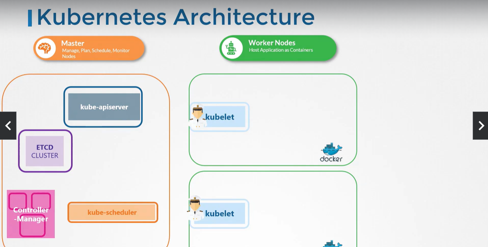
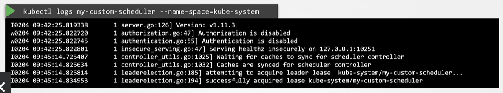

## Manual Scheduling

| Node 위의 pod를 수동으로 scheduling하는 방법

#### How scheduling works

- Cluster에 scheduler가 없을 때에는 내장된 scheduler에 의존하는 대신 pod를 직접 scheduling할 수 있음

- Definition YAML File
    - spec.nodeName
        - 모든 pod는 nodeName 필드를 가지지만, 기본값으로 설정되어 있지 않음
        - Kubernetes scheduler가 사용해 자동으로 nodeName 추가
        - 생성 시에만 지정 가능. 이후에는 X

- Scheduler works
    1. What to Schedule?
    - Scheduler는 모든 pod를 살펴보고 nodeName이 없는 pod를 찾음
    - Scheduling algorithm을 실행해 pod의 올바른 node 식별

    2. Which node to schedule?
    - 식별된 node에 pod 지정

    3. (Schedule) Bind Pod to Node
    - 바인딩 개체를 만들어 node의 이름 속성 설정

`pod-definition.yml`
```
apiVersion: v1
kind: Pod
metadata:
    name: nginx
    labels:
        name: nginx
spec:
    containers:
        - name: nginx
          image: nginx
          ports:
            - containerPort: 8080
    nodeName: node02
```

#### No Scheduler

| Node를 모니터링하고 스케쥴링할 스케쥴러가 없는 경우

- Pod는 Pending 상태

- **직접 Node에 Pod 할당 가능**

- Scheduler 없이 pod를 스케쥴링하는 가장 쉬운 방법은 Pod 생성 시 정의 파일의 nodeName 필드를 원하는 node의 이름으로 설정
    - 지정된 node에 pod 할당됨
    - nodeName은 생성 시에만 지정 가능

- Pod가 이미 생성되었는데 다른 node에 할당하고 싶은 경우
    - **Binding** 리소스 생성하고 pod의 바인딩 API에 게시 요청 전송
    - 실제 Scheduler가 하는 일 모방

- Binding 리소스
    - 1. Binding YAML file 생성
        - nodeName을 대상 node 지정
    `pod-bind-definition.yml`
    ```
    apiVersion: v1
    kind: Binding
    metadata:
        name: nginx
    target:
        apiVersion: v1
        kind: Node
        name: node02
    ```
    - 2. JSON 포맷의 Binding dataset 사용해 Pod의 Binding API에 POST 요청 전송
        - 이때 YAML 파일을 JSON 형식으로 변환해야 함
    `curl --header "Content-Type:application/json" --request POST --data '{"apiVersion":"v1","kind":"Binding",...}' http://$SERVER/api/v1/namespaces/default/pods/$PODNAME/binding/`

## Practice Test - Manual Scheduling

Q3

`k get nodes`

- node 조회 가능

`kubectl get pods -n kube-system`

- kube-system에는 scheduler가 존재해야 하는데, 존재하지 않음

Q4. Manually schedule하는 방법

1. YAML 파일에 spec.nodeName 추가

2. 모두 삭제하고 생성

- `kubectl replace --force -f [YAML]`

- 또는 `kubectl delete -f [YAML]`한 후 `kubectl apply -f [YAML]`

| `kubectl get pods --watch` 명령어로 pod의 상태 변화 모니터링 가능

| `kubectl get pods -o wide` 명령어로 더 많은 정보 조회 가능

## Labels and Selectors

| Label과 Selector는 그룹으로 묶는 표준 방법


Label이란, 각 물품에 부착된 속성
- Ex. 동물을 분류하는 경우를 예를 들 때 Label은 class, kind, color

Selector는 항목들을 필터링하는 것을 도움
- Ex. class=Mammal인 경우 해당하는 모든 항목이 나오고, class=Mammal이면서 동시에 color=Green인 경우 이에 해당하는 항목이 필터링됨

#### Labels & Selectors in Kubernetes

- Kubernetes에는 다양한 Object 존재하고, 이를 카테고리별로 필터링하고 볼 수 있는 방법 필요
    - 아래와 같이 다양하게 그룹화하여 선택 가능 
- Ex1. Object 타입별로 필터링 => Pods, ReplicaSets, Deployment, Services
- Ex2. Application 별로 필터링 => App1, App2, App3, App4, App5
- Ex3. 기능별로 필터링 => Front-end, Back-end, Auth, Image-Processing, App-servers, Audit, Video-Processing, Cache, DB

#### Labels & Selectors

1. 각 Object에 ㅣabel 부착
    - Ex. app, function
    - pod definition file의 `metadata.labels`에 label 지정 가능

    `pod-definition.yml`
    ```
    ...
    metadata:
        name: simple-webapp
        labels:
            app: App1
            function: Front-end
    ...
    ```

    


2. 선택하는 동안 특정 object를 필터링할 조건인 Selector 명시
    - Ex. app=App1
    - pod 생성 후 `kubectl get pods --selector app=App1`으로 해당 selector 사용 가능

#### ReplicaSet

| Kubernetes object는 내부에서 label과 selector를 이용해 서로 다른 object 연결

- Label 먼저 하고 ReplicaSet의 Selector를 이용해 pod를 그룹으로 묶음

- metadata.labels는 ReplicaSet의 label이고, spec.template.metadata.labels는 Pod의 label
- spec.selector.matchLabels는 Pod를 찾아 ReplicaSet으로 관리하려는 Selector이기에 Pod의 Label과 연관
    - Pod의 label과 일치하면 ReplicaSet이 성공적으로 만들어짐
- ReplicaSet의 label은 다른 object 구성 시 해당 ReplicaSet을 찾아야 할 때 사용


`replicaset-definition.yml`
```
apiVersion: v1
kind: ReplicaSet
metadata:
    name: simple-webapp
    labels:     #ReplicaSet의 label
        app: App1
        function: Front-end
spec:
    replicas: 3
    selector:   #Pod의 label을 찾는 selector. Pod에 정의된 label과 일치하기 위함
        matchLabels:
            app: App1
    template:
        metadata:
            labels: #Pod의 label
                app: App1
                function: Front-end
        spec:
            containers:
                - name: simple-webapp
                  image: simple-webapp
```

#### Service

| Service에서도 위와 동일하게 동작

`service-definition.yml`
```
apiVersion: v1
kind: Service
metadata:
    name: my-service
spec:
    selector:
        app: App1
    ports:
        - protocol: TCP
          port: 80
          targetPort: 9376
```

#### Annotations

- label과 selector는 그룹과 개체를 선택하는 데 사용되고, Annotation은 정보 수집 목적으로 다른 세부 사항을 기록하는 데 사용
- Annotation 예시: 이름, 버전, 빌드 정보 등

`replicaset-definition.yml`
```
apiVersion: apps/v1
kind: ReplicaSet
metadata:
    name: simple-webapp
    labels:
        app: App1
        function: Front-end
    annotations:
        buildversion: 1.34
spec:
    ...
```

## Practice Test - Labels and Selectors

Q1

`k get pods --selector env=dev`

- label이 env=dev인 pod 탐색

`k get pods --selector env=dev --no-headers | wc -l`

- `wc -l`은 숫자 빠르게 계산해주는 명령어(wc -l: word cound와 line의 축약어). 맨 윗 줄(NAME|READY|STATUS|RESTARTS|AGE)이 출력되지 않도록 `--no-headers` 옵션 사용

Q4

`kubectl get all --selector env=prod,bu=finance,tier=frontend`

- 여러 조건을 모두 만족하는 리소스 찾기

## Taints and Tolerations

| 한 Node에 어떤 Pod를 Scheduling 할지 결정하기 위한 제한 설정 시 사용


- Node1,2,3과 Pod A,B,C,D 존재
- Pod가 생성되면 Kubernetes Scheduler는 이 pod를 가능한 Worker node에 배치하고자 함


- Node1에 전용 리소스가 있어 해당하는 Application에 속한 Pod만 Node1에 배치하고 싶음
    1. Node1에 Taint=blue 설정
        - Taint를 견디지 못 하는 Pod는 절대 그 Node에 속하지 못 함
    2. Pod D에 Tolerations 설정
        - Pod D는 Taint=blue에 내성이 생겨 scheduler가 Node1에 이 pod를 두려고 하면 그대로 실행됨
    - 따라서 Node1은 taint=blue에 내성이 있는 Pod만 받을 수 있음

| Taints는 Node에, Tolerations는 Pod에 설정함을 기억할 것

#### Taints - Node

`kubectl taint nodes node-name key=value:taint-effect`

- Example. node1에 app=blue taint 설정. 내성이 없으면 절대 Pod를 올리지 않도록 설정 
    - `kubectl taint nodes node1 app=blue:NoSchedule`

- **taint-effect**란 새로운 tolerations로 Pod가 생성되거나 수정될 때, Node에 Pod를 스케쥴링하는 방법 (Node에 scheduling 방법 또는 기존 Node에서 퇴거할지 결정)
    1. NoSchedule
        - Node에 내성이 없는 Pod를 절대 올리지 않음
        - Node에 기존 실행되던 Pod에는 적용 안 됨
    2. PreferNoSchedule
        - 선호하는 방식
        - 시스템은 Node에 Pod를 설치하는 것을 피하려 하지만, 장담할 수는 없음
    3. NoExecute
        - 처음부터 Node에 설정되면 내성이 없는 Pod를 절대 올리지 않음
        - 이미 실행 중인 pod가 있는 Node에 해당 taint-effect가 추가되면, 내성이 없는 pod는 Node에 스케쥴링되고 즉시 또는 특정 유예 기간 후에 퇴출

#### Tolerations - Pod

- Node taint하는 것이 우선이므로
    - `kubectl taint nodes node1 app=blue:NoSchedule`

- Pod Definition File에 코드 추가
    - spec.tolerations의 key-value 값은 모두 더블 코드로 인코딩되어야 함 (" ")
    - spec.tolerations는 Node의 taint를 보고 작성 !

`pod-definition.yml`
```
apiVersion: v1
kind: Pod
metadata:
    name: myapp-pod
spec:
    containers:
        - name: nginx-container
          image: nginx
    tolerations:
        - key: "app"            #taint의 app
          operator: "Equal"     #taint의 =
          value: "blue"         #taint의 blue
          effect: "NoSchedule"  #taint의 NoSchedule
```

#### Taint - NoExecute

| 실행되는 Node 3개 (Node1,2,3), Pod 4개 (Pod A,B,C,D)

1. 어떤 Taint, Tolerations도 존재하지 않음


2. Node1에 Taint 추가 & Pod D에 Tolerations 추가

3. Taint Effect가 Node1에서 Pod C를 내보냄 (= Pod Kill)

- Tolerations가 있는 Pod D는 Node1에 계속 존재

| Taints와 Tolerations는 Pod가 특정 Node로 가게 하는 것이 아님 ! 허용되지 않은 Pod가 들어오지 못 하게 막는 것 => Pod D는 Node2 또는 Node3에 갈 수도 있음

- Scheduler는 Master node에 어떤 pod도 스케쥴링하지 않음
    - Kubernetes Cluster가 처음 설정되면 Master node에 Taints 설정이 자동으로 되어 pod가 지정되는 것을 막음
    - Taints, Tolerations를 사용해 Master node를 사용할 수도 있지만, Master node에는 Application을 배포하지 않는 것이 모범 

    - `kubectl describe node kubemaster | grep Taint`

        - Master node에 적용된 Taint 확인

## Practice Test - Taints and Tolerations

Q10

`kubectl taint node [NODE NAME] [해당 NODE의 TAINTS]-`
    - Ex. `kubectl taint node controlplane node-role.kubernetes.io/master:NoSchedule-`

- 마지막에 `-`를 붙여 Node의 Taint 제거

## Node Selectors

- Node가 3개인데 그 중 2개는 작고 하드웨어 리소스가 적고 1개는 더 큰 리소스를 가지는 큰 Node로 구성


- Cluster에서 실행되는 다른 종류의 workload 존재
- 더 큰 Node에 큰 데이터 프로세싱 작업 고정해야 함
    - 작업이 추가 리소스를 요구할 경우 리소스가 부족하지 않는 유일한 Node이기 때문
- BUT 현재 모든 Pod는 어떤 Node로든 갈 수 있음
- 따라서 특정 Node에서만 작동하도록 Pod의 한계 설정해야함 => Node Selectors or Node Affinity

#### Node Selectors

| Node에 size를 나타내는 label을 붙이고, Pod에 nodeSelector를 사용해 원하는 size 지정

- Pod Definition File
    - spec.nodeSelector.size로 원하는 크기 설정

- Kubernetes는 어떤 Node가 큰지 어떻게 아는가?
    - size: Large 쌍은 Node에 할당된 Label
    - Scheduler는 label을 이용해 pod를 올릴 올바른 node를 찾음

- Pod 정의 전 Node의 size를 Labeling 해야 함
    - `kubectl label nodes [NODE NAME] [LABEL KEY]=[LABEL VALUE]`
    - Ex. `kubectl label nodes node1 size=Large`

`pod-definition.yml`
```
apiVersion: v1
kind: Pod
metadata:
    name: myapp-pod
spec:
    containers:
        - name: data-processor
          image: data-processor
    nodeSelector:
        size: Large
```

`kubectl create -f pod-definition.yml`

#### Node Selectors - Limits

| NodeSelector는 유용하지만 한계 존재

- 복잡한 요구 사항이 있을 때 원하는대로 동작하지 않음
    - Large or Medium으로
    - Small만 아니게

=> 이러한 한계 때문에 Node Affinity 등장 !

## Node Affinity

| 주된 목적은 Pod가 특정 Node에 호스팅될 수 있도록 하는 것

#### Node Affinity

| 특정 Node에 Pod 배치 제한

- Pod Definition file은 위의 Node Selector를 이용한 것과 정확히 동일하게 동작
    - BUT 섬세한 설정이 가능해 복잡
- Pod Definition file
    - spec.affinity.[...].operator
        - In 오퍼레이터는 해당 Label의 크기가 지정된 값에 해당하는 값을 가진 Node에 해당 Pod 배치
        - In으로 Medium과 Large를 한 경우와 NotIn으로 Small을 한 경우는 동일하게 동작
        - In, NotIn, Exists(Exists는 values 필요 없음.그저 그러한 key 값을 가지는 label이 존재하는지만 확인)
    - spec.affinity.[...].values
        - 2개 이상의 선택지 중 어떤 것이든 가능한 경우, values에 해당 값 추가

`pod-definition.yml`
```
apiVersion: v1
kind: Pod
metadata:
    name: myapp-pod
spec:
    containers:
        - name: data-processor
          image: data-processor
    affinity:
        nodeAffinity:
            requiredDuringSchedulingIgnoredDuringExecution:
                nodeSelectorTerms:
                    - matchExpressions:
                        - key: size
                          operator: In
                          values:
                            - Large
```

#### Node Affinity Types

| Node Affinity 유형은 스케쥴러의 기능 정의. Node Affinity와 해당 pod의 lifecycle 단계 정의

1. Available

- `requiredDuringSchedulingIgnoredDuringExecution`

- `preferredDuringSchedulingIgnoredDuringExecution`

2. Planned

- `requiredDuringSchedulingRequiredDuringExecution`

||DuringScheduling|DuringExecution|
|:--:|:--:|:--:|
|Type1|Required|Ignored|
|Type2|Preferred|Ignored|
|Type3|Required|Required|

- DuringScheduling은 pod가 존재하지 않다가 처음으로 만들어지는 상태
    - Pod가 처음 생성되면 지정된 Affinity rule에 따라 pod를 올바른 node에 배치

    - `Required`
        - 일치하는 Node를 찾지 못 하면 Pod 배치하지 않음
    - `Preferred`
        - Pod 배치가 작업 자체 실행보다 덜 중요한 경우
        - 일치하는 Node가 없는 경우 scheduler는 Node Affinity를 무시하고 해당 Pod를 모든 가능한 Node에 배치 

- DuringExecution은 Pod가 실행되고 Node Affinity가 변한 경우

    - 현재 사용 가능한 Node Affinity는 모두 Ignored
    - `Ignored`
        - Pod는 계속 실행되고 Node Affinity의 변화는 Schedule이 정해지면 영향을 미치지 않음
    - `Required`
        - 현재 사용 가능하지는 않지만 새 옵션 도입
        - Node Affinity에 부합하지 않는 Node에서 실행 중인 Pod를 쫓아내는 것

        - Ex. 큰 Node에서 실행되는 Pod는 Node에서 Large Label이 제거되면 퇴출되거나 종료

## Practice Test - Node Affinity

Q1

`kubectl get node [NODE NAME] --show-labels`

- Node가 가지는 label 확인

Q3

`kubectl label node [NODE NAME] [KEY]=[VALUE]`

- Node에 Label 붙임

## Taints and Tolerations vs Node Affinity


| 3개의 Node와 3개의 Pod가 각각 세가지 색(green, blue, red)을 가지고 존재. 색을 가지지 않은 2개의 Pod와 2개의 node도 존재. 궁극적인 목표는 blue pod를 blue node에 넣고, green pod를 greed node에 넣고, red pod를 red node에 넣는 것

#### Taints and Tolerations

- 각 Node에 taint, Pod에 toleration 설정

- BUT 이때 toleration을 가진 pod는 해당 node에 들어갈 수 있을 뿐, 무조건 해당 node에 들어가지는 않음 => 문제 발생

#### Node Affinity

- 각 Node에 label 설정
- Pod selector로 node 지정

- BUT 색상을 가지지 않은 pod가 해당 node에 들어갈 수 있음 => 문제 발생

#### Taints/Tolerations and Node Affinity

| Taints and Tolerations와 Node Affinity를 동시에 사용해 원하는 pod를 원하는 node에 고정

1. Node에 taints, Pod에 tolerations 설정
2. Node에 label을 붙여 해당 pod가 다른 node에 배치되는 것을 막음


## Resource Requirements and Limits

- Cluster에 3개의 Node 존재한다고 가정
    - 각 Node에는 사용 가능한 CPU와 Memory 리소스 존재


- Pod를 실행하려면 자원 필요
     - Ex. Pod 1개 실행 시 CPU 2개와 Memory unit 1개 필요
- Pod가 Node에 놓일 때마다 해당 Node의 리소스 소비
- Kube-scheduler가 pod가 배치될 Node 결정
    - 이때 kube-scheduler는 pod가 요구하는 리소스 양을 고려해 노드 결정
- Node에 충분한 리소스가 없으면 kube-scheduler는 해당 node에 pod를 두지 않고 다른 node에 pod 배치
- Pod를 배치할 node가 없는 경우 Pending 상태

#### Resource Requests

- Pod를 만들 때 필요한 CPU와 memory 양을 정할 수 있음
- container에서 요청한 최소의 CPU나 memory
- kube-scheduler가 pod를 node에 배치할 때 이 값을 이용해 배치할 수 있는 node 선택

`pod-definition.yml`
```
apiVersion: v1
kind: Pod
metadata:
    name: simple-webapp-color
    labels:
        name: simple-webapp-color
spec:
    containers:
        - name: simple-webapp-color
          image: simple-webapp-color
          ports:
            - containerPort: 8080
          resources:
            requests:
                memory: "4Gi"
                cpu: 2
```

#### Resource - CPU

- 1 CPU는 1 AWS vCPU, 1GCP Core, 1 Azure Core, 1 Hyperthread 의미

#### Memory

- 1 G(Gigabyte) = 1,000,000,000 bytes
- 1 M(Megabyte) = 1,000,000 bytes
- 1 K(Kilobyte) = 1,000 bytes
- 1 Gi(Gibibyte) = 1,073,741,824 bytes
- 1 Mi(Mebibyte) = 1,048,576 bytes
- 1 Ki(Kibibyte) = 1,024 bytes


#### Resource Limits

- Pod의 리소스 제한

`pod-definition.yml`
```
apiVersion: v1
kind: Pod
metadata:
    name: simple-webapp-color
    labels:
        name: simple-webapp-color
spec:
    containers:
        - name: simple-webapp-color
          image: simple-webapp-color
          ports:
            - containerPort: 8080
          resources:
            requests:
                memory: "1Gi"
                cpu: 2
            limits:
                memory: "2Gi"
                cpu: 2
```

#### Exceed Limits

- Pod가 지정된 limit을 초과하는 경우
    - CPU
        - 시스템이 CPU를 조절해 지정된 한도를 넘지 않도로 함
        - container는 제한 이상의 CPU 리소스를 사용할 수 없음
    - Memory
        - container는 제한보다 많은 memory 리소스 사용 가능
        - 많은 메모리를 소모하면 OOM(Out Of Memory) 오류로 Pod 종료

#### Default Behavior

- 기본적으로 Kubernetes는 CPU나 Memory의 request, limit 없음
- 어떤 Pod든 Node에서 요구되는 만큼의 자원을 소비하여 리소스 node에서 실행 중인 다른 pod나 프로세스를 종료할 수 있음

#### Behavior - CPU

| 2개의 Pod가 경쟁하는 상황 

- No Request, No Limit
    - 하나의 Pod가 node의 모든 CPU 리소스를 소비해 2번째 Pod가 실행되지 않을 수 있음

- No Request, Limit
    - Kubernetes는 자동으로 requests = limits으로 설정
    - Pod의 Limit이 모두 3vCPU인 경우, Pod마다 3개의 CPU 보장하고 limit도 3으로 설정됨

- Request, Limit
    - 각 Pod는 1 requests와 3 limit을 가짐
    - 가장 이상적으로 보이지만, Pod1이 더 많은 CPU를 요구하고 Pod2가 CPU를 모두 사용하지 않는 경우 CPU1의 limit을 두고 싶지 않을 것

- Request, No Limit
    - 가장 이상적인 시나리오
    - requests를 부여받아 pod마다 하나의 vCPU를 보장
    - limit은 설정하지 않아 pod마다 CPU 사이클을 최대한 많이 사용할 수 있음
    - 따라서 pod2가 추가적인 CPU 사이클이나 요청한게 요구되면 요청된 CPU 사이클 보장

#### Behavior - Memory

| 위와 동일. 추가 내용만 작성

- Requests, No Limit
    - Memory는 CPU와 달리 조절할 수 없기 때문에 Pod2가 메모리를 더 요청하면 죽음

#### LimitRange

- Kubernetes는 pod를 위해 구성된 리소스 requests나 limit이 없음
- LimitRange로 제한 범위에서의 Pod의 기본 설정 가능

`limit-range-cpu.yaml`
```
apiVersion: v1
kind: LimitRange
metadata:
    name: cpu-resource-constraint
spec:
    limits:
        - default:
            cpu: 500m
          defaultRequest:
            cpu: 500m
          max:
            cpu: "1"
          min:
            cpu: 100m
          type: Container
```

`limit-range-memory.yaml`
```
apiVersion: v1
kind: LimitRange
metadata:
    name: memory-resource-constraint
spec:
    limits:
        - default:
            memory: 1Gi
          defaultRequest:
            memory: 1Gi
          max:
            memory: 1Gi
          min:
            memory: 500Mi
          type: Container
```

- LimitRange를 생성하고 변경해도 기존에 존재하는 리소스는 변경되지 않고, 이후에 생성한 리소스에만 적용

#### Resource Quotas

- Kubernetes cluster에 배포된 전체 Application이 사용할 수 있는 리소스 제한하는 방법 
- Namespace 레벨에서 제한
- Resource Quotas는 namespace 레벨 객체로 requests와 limits에 대한 엄격한 설정에 사용

`resource-quota.yml`
```
apiVersion: v1
kind: ResourceQuota
metadata:
    name: my-resource-quota
spec:
    hard:
        requests.cpu: 4
        requests.memory: 4Gi
        limits.cpu: 10
        limits.memory: 10Gi
```

## Practice Test - Resource Requirements and Limits

`k edit` 명령어 사용해 requests와 limits를 변경할 수 없지만, 이때 새로운 파일에 변경 사항이 적용되어 `k replace --force -f` 명령어로 변경사항 저장 가능

## DaemonSets

- ReplicaSet과 Deployment로 다양한 Worker node에 Application 복제본 사용할 수 있음
- DaemonSet은 ReplicaSet과 비슷한 것으로, 여러 개의 Pod Instance를 배포하도록 도움
- 하지만 Cluster의 Node마다 Pod를 하나씩 실행


- Cluster에 새 Node가 추가될 때마다 Pod 복제본이 자동으로 해당 Node에 추가
    - Node가 제거되면 Pod도 자동으로 제거


- DaemonSet은 Pod의 복제본을 Cluster 내 모든 Node에 존재하도록 함

#### DaemonSets - Use case

- Monitoring Solution 또는 Logs Viewer를 cluster 내의 각 Node에 배포하는 경우
- Daemonset을 사용하면 cluster에 변화가 있을 때 node에 monitoring agent를 추가하거나 제거할 필요 없음

#### DaemonSets - Use case - kube-proxy

- Kubernetes 아키텍처에서 말한 kube-proxy는 cluster 내 모든 node에 필요
- kube-proxy는 cluster에서 daemonset으로 배포

#### DaemonSets - Use case - Networking

- weave net과 같은 네트워킹 솔루션은 agent가 cluster 내 각 node에 배포되어야 함

#### DaemonSet Definition

| DaemonSet은 ReplicaSet 정의 파일과 거의 동일 (kind만 다름)

`daemon-set-definition.yml`
```
apiVersion: apps/v1
kind: DaemonSet
metadata:
    name: monitoring-daemon
spec:
    selector:
        matchLabels:
            app: monitoring-agent
    template:
        metadata:
            labels:
                app: monitoring-agent
        spec:
            containers:
                - name: monitoring-agent
                  image: monitoring-agent
```

`replicaset-definition.yml`
```
apiVersion: apps/v1
kind: ReplicaSet
metadata:
    name: monitoring-daemon
spec:
    selector:
        matchLabels:
            app: monitoring-agent
    template:
        metadata:
            labels:
                app: monitoring-agent
        spec:
            containers:
                - name: monitoring-agent
                  image: monitoring-agent
```

#### View DaemonSets

`kubectl get daemonsets`

`kubectl describe daemonsets monitoring-daemon`

#### How does it work?

- 어떻게 각 node의 pod 스케쥴링하고 모든 node에 pod가 있는지 확실히 하는가
- 클러스터의 각 node에 pod를 지정해야 하면 어떻게 해야 하는가

- 해결 방법은 각 pod에 nodeName을 지정

## Practice Test - DaemonSets

`kubectl create deployment [DAEMONSET NAME] -n [NAMESPACE] --image=[IMAGE] --dry-run=client -o yaml > daemonset.yaml`

- Daemonset은 replicaset, deployment와 유사한 형태이기 때문에 --dry-run=client -o yaml을 사용해 생성
- replicas와 strategy 필드 삭제

## Static Pods

#### Kubernetes Architecture

- kubelet은 kube-apiserver에 의존해 node에서 로드할 pod에 대한 지시를 받음
    - 이는 kube-scheduler의 결정에 근거한 것으로 ETCD에 저장




- Master node가 사라진 경우 독립된 Node를 관리할 수 있는가?

- Worker node에는 kubelet과 container를 동작할 docker 존재
    - Kubernetes cluster와 kube-apiserver와 같은 것은 없음
- kubelet은 pod를 만드는 방법만 알고 있음
    - pod 상세 정보를 제공하는 apiserver 없음
- pod를 만드려면 pod의 세부 정보 YAML 파일 존재해야 함
    - Definition file을 kubelet에게 제공하는 방법
    - kubelet을 설정하면 pod에 관한 정보를 저장하는 서버 디렉토리(`/etc/kubernetes/manifests`)를 통해 definition file을 읽을 수 있음
    - 이 디렉토리에 pod definition file 넣으면 됨 
- kubelet은 주기적으로 이 디렉토리 파일을 확인하고 pod 생성     
    - 디렉토리에서 파일을 제거하면 pod도 자동으로 삭제
- kubelet이 스스로 만든 이 pod는 kube-apiserver의 간섭이나 나머지 kubernetes cluster의 구성 요소의 간섭 없음 => `Static Pods`

#### Static Pods

- ReplicaSet과 Deployment는 생성할 수 없고 Pod만 생성 가능
- 지정된 디렉토리에 Definition file 위치시킴

- 디렉토리는 서비스를 실행하는 동안 kubelet에 옵션으로 전달
    - `/etc/Kubernetes/manifests`
    

- 디렉토리 구성하는 다른 방법
    - config 옵션을 이용해 다른 구성 파일에 경로 제공
    - `--config=kubeconfig.yaml`
    - kubeconfig.yaml 파일에서 디렉토리 경로 정의
    - `staticPodPath: /etc/kubernetes/manifests`
    

- kube admin이 셋업한 클러스터는 이 접근법 사용
- 기존 클러스터를 조사할 때 디렉토리로 가는 경로를 확인하기 위해 kubelet 옵션 살펴봐야 함
    - 그럼 Static Pod definition file을 어디에 둘 지 알 수 있음

- 디렉토리 찾는 방법
    1. kubelet 파일에서 pod-manifest-path 경로 확인
    2. pod-manifest-path가 없는 경우, --config 옵션을 찾아 kubeconfig 파일로 사용된 파일 식별
    - kubeconfig 파일에서 staticPodPath 찾기

- Static pod가 생성되면 `docker ps` 명령어로 조회

- 기존의 명령어를 사용하지 않는 이유
    - Kubernetes cluster를 확보하지 못 했기 때문
    - kubectl 명령어는 kube-apiserver와 작동
    
- Master node가 존재할 때, kube-apiserver를 사용하거나 Static pod를 생성해 pod를 생성할 수 있음
    - 두 종류의 pod를 동시에 생성할 수 있는가?
    - kubelet pod 생성 방법
        1. Static Pod 폴더에서 Pod Definition file을 통해 가능
        2. HTTP API endpoint를 통해 생성
        - 이 방식이 kube-apiserver가 kubelet에 입력을 제공하는 방법

- kube-apiserver가 static pod를 인식하는가? => YES
    - static pod를 조회할 수는 있지만, 일반 pod처럼 편집하거나 삭제할 수 없음
- static pod는 manifests 폴더의 definition file을 수정해야만 수정 및 삭제 가능
    - static pod 이름은 자동으로 node 이름이 추가됨

#### Use case

- Master node 전부에 kubelet 설치하고 pod definition file 생성
- /etc/kubernetes/manifests 경로에 controller-manager.yaml, apiserver.yaml, etcd.yaml 파일 생성
- 이렇게 구성하면 서비스를 구성하거나 서비스가 다운되는 것을 걱정할 필요가 없음

- kube-system namespace에 pod를 열거할 때 kube admin 툴이 설치한 cluster에서 control plane 구성 요소를 pod로 볼 수 있음
 
#### Static Pods vs DaemonSet

|Static Pods|DaemonSets|
|:--:|:--:|
|Created by the Kubelet|Created by Kube-API server (DaemonSet Controller)|
|Deploy Control Plane components as Static Pods|Deploy Monitoring Agents, Logging Agents on nodes|
|Ignored by the Kube-Scheduler|Ignored by the Kube-Scheduler|

## Practice Test - Static Pods

Q1

`kubectl get pod [POD NAME] -o yaml`

- YAML 파일의 ownerReferences의 kind가 Node인 경우 Static pod
- Static pod는 이름 뒤에 node명이 붙음

Q5

`cat /var/lib/kubelet/config.yaml`

- 위 YAML 파일에서 staticPodPath가 static pod의 definition file이 존재하는 경로

Q8

`k run [POD NAME] --image [IMAGE NAME] --dry-run=client -o yaml>[YAML FILE NAME]`
`cp [이동시킬 YAML 파일] [이동할 경로]`

- YAML 파일 생성 후 경로 이동

Q10

`kubectl get nodes -o wide`
`ssh [NODE INTERNAL IP]`
- 해당 node IP를 확인한 후 이동

(node로 이동 후) `cat /var/lib/kubelet/config.yaml`

- 디렉토리 경로 확인

`cd [디렉토리 경로]`
(디렉토리 경로로 접근 후) `rm [FILE NAME]`

(node 탈출) `exit`


## Multiple Schedulers

| Kubernetes scheduler 프로그램을 작성해 기본 scheduler로 패키징하거나 kubernetes cluster에서 추가 scheduler 배포 가능

- 일부 특정 Application은 사용자 지정 scheduler를 사용해 node 배치 가능
- Kubernetes는 여러 scheduler를 가질 수 있고 pod를 만들거나 배치할 때 kubernetes에게 특정 scheduler가 특정 pod를 지정하도록 지시 가능
- schduler의 이름은 서로 달라야 함

- 기본 scheduler 이름은 default-scheduler
    - 이는 scheduler-config.yaml 파일의 profiles.schedulerName에 지정

    `my-scheduler-config.yaml`
    ```
    apiVersion: kubescheduler.config.k8s.io/v1
    kind: KubeSchedulerConfiguration
    profiles:
        - schedulerName: my-scheduler
    ```

#### Deploy Additional Scheduler

1. kube-scheduler 바이너리 다운로드한 후 여러 옵션과 함께 service로 실행

`wget https://storage.googleapis.com/kubernetes-release/release/v1.12.0/bin/linux/amd64/kube-scheduler`

`kube-scheduler.service`
```
ExecStart=/usr/local/bin/kube-scheduler \\
    --config=/etc/kubernetes/config/kube-scheduler.yaml
```

- 추가 scheduler를 배포하기 위해서 동일한 kube-scheduler 바이너리를 사용하거나 다르게 작동하기를 원한다면 직접 구축하여 사용 가능

- 동일한 바이너리를 이용해 추가 scheduler 배포
    
    `my-scheduler.service`
    ```
    ExecStart=/usr/local/bin/kube-scheduler \\
        --config=/etc/kubernetes/config/my-scheduler-config.yaml
    ```


    `my-scheduler-2.service`
    ```
    ExecStart=/usr/local/bin/kube-scheduler \\
        --config=/etc/kubernetes/config/my-scheduler-2-config.yaml
    ```

2. Scheduler를 pod로 배포

| 대부분의 경우 모든 control plane 구성 요소가 kubernetes cluster 안에서 pod 또는 deployment로 실행

- Definition file - my-custom-scheduler.yaml
    - `--kubeconfig`를 명시에 scheduler config 파일로 가는 경로로서, kube-apiserver로 가기 위한 인증 정보가 있는 파일
    - `--config`로 파일 이름에 scheduler 이름 존재. 지정한 파일명으로 scheduler 이름 결정

`my-custom-scheduler.yaml`
```
apiVersion: v1
kind: Pod
metadata:
    name: my-custom-scheduler
    namespace: kube-system
spec:
    containers:
        - command:  #여기가 중요
              - kube-scheduler
              - --address=127.0.0.1
              - --kubeconfig=/etc/kubernetes/scheduler.conf
              - --config=/etc/kubernetes/my-scheduler-config.yaml
          image: k8s.gcr.io/kube-scheduler-amd64:v1.11.3
          name: kube-scheduler
```


- Definition file - my-scheduler-config.yaml
    - `leaderElection`은 scheduler의 복사본을 여러 개의 master node에서 실행할 때 사용. 셋업으로 여러 개의 master node에서 kubernetes scheduler 프로세스가 양쪽에서 실행되는 것
        - 동일한 scheduler의 복사본 여러 개가 다른 node에서 실행될 경우 한 번에 하나만 활성화 가능하고, 이 옵션을 통해 활성화할 node 결정

`my-scheduler-config.yaml`
```
apiVersion: kubescheduler.config.k8s.io/v1
kind: KubeSchedulerConfiguration
profiles:
    - schedulerName: my-scheduler
leaderElection:
    leaderElect: true
    resourceNamespace: kube-system
    resourceName: lock-object-my-scheduler
```

#### View Schedulers

`kubectl get pods -n kube-system`

- 아래와 같이 2개의 scheduler 동작
    

- 특정 pod에서 특정 scheduler 사용하는 방법
    - YAML 파일에 schedulerName 추가

`pod-definition.yaml`
```
apiVersion: v1
kind: Pod
metadata:
    name: nginx
spec:
    containers:
        - name: nginx
          image: nginx
    schedulerName: my-custom-scheduler
```

#### View Events

| 원하는대로 Scheduler와 연결되었는지 확인하는 방법

`kubectl get events -o wide`

- 현재 namespace에 있는 모든 event 조회 가능
    

#### View Scheduler Logs

| scheduler에 문제가 생긴 경우 로그 확인

`kubectl logs [SCHEDULER NAME] --name-space=kube-system`



## Practice Test - Multiple Schedulers

- configmap 생성 -> scheduler 생성 
- pod 생성

## Configuring Scheduler Profiles

`pod-definition.yaml`
```
apiVersion: v1
kind: Pod
metadata:
    name: simple-webapp-color
spec:
    priorityClassName: high-priority
    containers:
        - name: simple-webapp-color
          image: simple-webapp-color
          resources:
            requests:
                memory: "1Gi"
                cpu: 10
```


1. Scheduling Queue => PrioritySort 플러그인 사용
- Pod가 생성되면 Scheduling Queue에 들어감
- 이때 priority가 존재하는데, Pod definition file의 spec.priorityClassName에 따라 정렬
    - priorityClassName 사용 시 PriorityClass 생성해야 함

2. Filtering => NodeResourcesFit, NodeName, NodeUnschedulable 플러그인 사용
- 필요한 Resource가 없는 node는 제외
- nodeName에 해당하지 않는 경우 제외
- node가 unschedulable true인 경우 제외

3. Scoring => NodeResourcesFit, ImageLocality 플러그인 사용
- 해당 pod에 필요한 CPU를 보유한 후 남은 공간을 근거로 점수 매김
    - 더 많은 공간이 더 높은 점수 획득
- 특정 image를 가지는 경우 더 높은 점수 획득

4. Binding => DefaultBinder 플러그인 사용
- 가장 높은 점수를 가진 node에 pod 바인딩

| 각 플러그인 필터 단계에 진입하기 전에 확장 포인트(Extension Point) 존재

- PreFileter > Filter > PostFilter
- PreScore > Score > Reserve
- Permit > PreBind > Bind > PostBind

| 위와 같이 다양한 플러그인을 조합해 사용자 지정 방식을 사용하거나 자신만의 스케쥴링 작성 가능

#### Scheduler Profiles

- 3개의 scheduler는 각각 다른 scheduler 바이너리로 배포
- 아래는 모두 3개의 분리된 scheduler 바이너리로 config 파일 구성
- 다중 스케쥴러 배포하는 방법 => 각각 다른 프로세스이기 때문에 각각의 프로세스를 유지하기 위한 추가적인 노력 필요
    - 한 스케쥴러가 node에 pod 배치할 때 다른 스케쥬러도 동일한 node에 배치할 수 있음

`scheduler-config.yaml`
```
apiVersion: kubescheduler.config.k8s.io/v1
kind: KubeSchedulerConfiguration
profiles:
    - schedulerName: default-scheduler
```

`my-scheduler-config.yaml`
```
apiVersion: kubescheduler.config.k8s.io/v1
kind: KubeSchedulerConfiguration
profiles:
    - schedulerName: my-scheduler
```

`my-scheduler-config-2.yaml`
```
apiVersion: kubescheduler.config.k8s.io/v1
kind: KubeSchedulerConfiguration
profiles:
    - schedulerName: my-scheduler-2
```

- config 파일에서 단일 scheduler 내에 다수의 profile 구성 가능
    - 각각의 scheduler에 대한 분리된 profile 생성
    - 각각의 scheduler 자체도 분리된 scheduler처럼 작동
    - 단지 여러 개의 scheduler가 하나의 바이너리로 실행되는 것 뿐 !
        - 위에서 진행한 개별 바이너리를 생성하는 것과 반대

`my-scheduler-config-2.yaml`
```
apiVersion: kubescheduler.config.k8s.io/v1
kind: KubeSchedulerConfiguration
profiles:
    - schedulerName: my-scheduler-2
    - schedulerName: my-scheduler-3
    - schedulerName: my-scheduler-4
```


- Scheduler profile이 서로 다르게 작동하도록 구성하는 방법
    - 원하는 방식으로 플러그인 구성 가능

`my-scheduler-2-config.yaml`
```
apiVersion: kubescheduler.config.k8s.io/v1
kind: KubeSchedulerConfiguration
profiles:
    - schedulerName: my-scheduler-2
      plugins:
          score:
                disabled:
                    - name: TaintToleration
                enabled:
                    - name: MyCustomPluginA
                    - name: MyCustomPluginB

    - schedulerName: my-scheduler-3
      plugins:
          preScore:
                disabled:
                    - name: '*'
          score:
                disabled:
                    - name: '*'
```