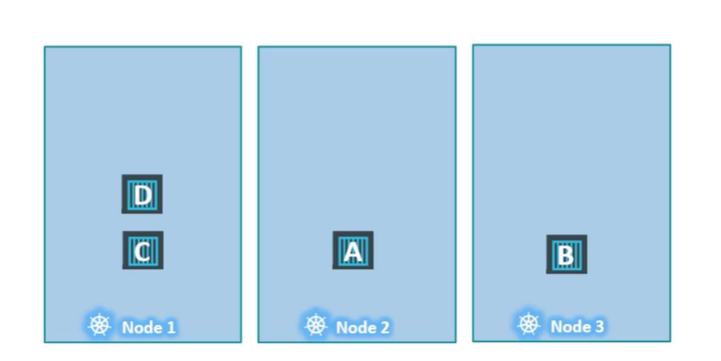

## Manual Scheduling

| Node 위의 pod를 수동으로 scheduling하는 방법

#### How scheduling works

- Cluster에 scheduler가 없을 때에는 내장된 scheduler에 의존하는 대신 pod를 직접 scheduling할 수 있음

- Definition YAML File
    - spec.nodeName
        - 모든 pod는 nodeName 필드를 가지지만, 기본값으로 설정되어 있지 않음
        - Kubernetes scheduler가 사용해 자동으로 nodeName 추가
        - 생성 시에만 지정 가능. 이후에는 X

- Scheduler works
    1. What to Schedule?
    - Scheduler는 모든 pod를 살펴보고 nodeName이 없는 pod를 찾음
    - Scheduling algorithm을 실행해 pod의 올바른 node 식별

    2. Which node to schedule?
    - 식별된 node에 pod 지정

    3. (Schedule) Bind Pod to Node
    - 바인딩 개체를 만들어 node의 이름 속성 설정

`pod-definition.yml`
```
apiVersion: v1
kind: Pod
metadata:
    name: nginx
    labels:
        name: nginx
spec:
    containers:
        - name: nginx
          image: nginx
          ports:
            - containerPort: 8080
    nodeName: node02
```

#### No Scheduler

| Node를 모니터링하고 스케쥴링할 스케쥴러가 없는 경우

- Pod는 Pending 상태

- **직접 Node에 Pod 할당 가능**

- Scheduler 없이 pod를 스케쥴링하는 가장 쉬운 방법은 Pod 생성 시 정의 파일의 nodeName 필드를 원하는 node의 이름으로 설정
    - 지정된 node에 pod 할당됨
    - nodeName은 생성 시에만 지정 가능

- Pod가 이미 생성되었는데 다른 node에 할당하고 싶은 경우
    - **Binding** 리소스 생성하고 pod의 바인딩 API에 게시 요청 전송
    - 실제 Scheduler가 하는 일 모방

- Binding 리소스
    - 1. Binding YAML file 생성
        - nodeName을 대상 node 지정
    `pod-bind-definition.yml`
    ```
    apiVersion: v1
    kind: Binding
    metadata:
        name: nginx
    target:
        apiVersion: v1
        kind: Node
        name: node02
    ```
    - 2. JSON 포맷의 Binding dataset 사용해 Pod의 Binding API에 POST 요청 전송
        - 이때 YAML 파일을 JSON 형식으로 변환해야 함
    `curl --header "Content-Type:application/json" --request POST --data '{"apiVersion":"v1","kind":"Binding",...}' http://$SERVER/api/v1/namespaces/default/pods/$PODNAME/binding/`

## Practice Test - Manual Scheduling

Q3

`k get nodes`

- node 조회 가능

`kubectl get pods -n kube-system`

- kube-system에는 scheduler가 존재해야 하는데, 존재하지 않음

Q4. Manually schedule하는 방법

1. YAML 파일에 spec.nodeName 추가

2. 모두 삭제하고 생성

- `kubectl replace --force -f [YAML]`

- 또는 `kubectl delete -f [YAML]`한 후 `kubectl apply -f [YAML]`

| `kubectl get pods --watch` 명령어로 pod의 상태 변화 모니터링 가능

| `kubectl get pods -o wide` 명령어로 더 많은 정보 조회 가능

## Labels and Selectors

| Label과 Selector는 그룹으로 묶는 표준 방법


Label이란, 각 물품에 부착된 속성
- Ex. 동물을 분류하는 경우를 예를 들 때 Label은 class, kind, color

Selector는 항목들을 필터링하는 것을 도움
- Ex. class=Mammal인 경우 해당하는 모든 항목이 나오고, class=Mammal이면서 동시에 color=Green인 경우 이에 해당하는 항목이 필터링됨

#### Labels & Selectors in Kubernetes

- Kubernetes에는 다양한 Object 존재하고, 이를 카테고리별로 필터링하고 볼 수 있는 방법 필요
    - 아래와 같이 다양하게 그룹화하여 선택 가능 
- Ex1. Object 타입별로 필터링 => Pods, ReplicaSets, Deployment, Services
- Ex2. Application 별로 필터링 => App1, App2, App3, App4, App5
- Ex3. 기능별로 필터링 => Front-end, Back-end, Auth, Image-Processing, App-servers, Audit, Video-Processing, Cache, DB

#### Labels & Selectors

1. 각 Object에 ㅣabel 부착
    - Ex. app, function
    - pod definition file의 `metadata.labels`에 label 지정 가능

    `pod-definition.yml`
    ```
    ...
    metadata:
        name: simple-webapp
        labels:
            app: App1
            function: Front-end
    ...
    ```

    


2. 선택하는 동안 특정 object를 필터링할 조건인 Selector 명시
    - Ex. app=App1
    - pod 생성 후 `kubectl get pods --selector app=App1`으로 해당 selector 사용 가능

#### ReplicaSet

| Kubernetes object는 내부에서 label과 selector를 이용해 서로 다른 object 연결

- Label 먼저 하고 ReplicaSet의 Selector를 이용해 pod를 그룹으로 묶음

- metadata.labels는 ReplicaSet의 label이고, spec.template.metadata.labels는 Pod의 label
- spec.selector.matchLabels는 Pod를 찾아 ReplicaSet으로 관리하려는 Selector이기에 Pod의 Label과 연관
    - Pod의 label과 일치하면 ReplicaSet이 성공적으로 만들어짐
- ReplicaSet의 label은 다른 object 구성 시 해당 ReplicaSet을 찾아야 할 때 사용


`replicaset-definition.yml`
```
apiVersion: v1
kind: ReplicaSet
metadata:
    name: simple-webapp
    labels:     #ReplicaSet의 label
        app: App1
        function: Front-end
spec:
    replicas: 3
    selector:   #Pod의 label을 찾는 selector. Pod에 정의된 label과 일치하기 위함
        matchLabels:
            app: App1
    template:
        metadata:
            labels: #Pod의 label
                app: App1
                function: Front-end
        spec:
            containers:
                - name: simple-webapp
                  image: simple-webapp
```

#### Service

| Service에서도 위와 동일하게 동작

`service-definition.yml`
```
apiVersion: v1
kind: Service
metadata:
    name: my-service
spec:
    selector:
        app: App1
    ports:
        - protocol: TCP
          port: 80
          targetPort: 9376
```

#### Annotations

- label과 selector는 그룹과 개체를 선택하는 데 사용되고, Annotation은 정보 수집 목적으로 다른 세부 사항을 기록하는 데 사용
- Annotation 예시: 이름, 버전, 빌드 정보 등

`replicaset-definition.yml`
```
apiVersion: apps/v1
kind: ReplicaSet
metadata:
    name: simple-webapp
    labels:
        app: App1
        function: Front-end
    annotations:
        buildversion: 1.34
spec:
    ...
```

## Practice Test - Labels and Selectors

Q1

`k get pods --selector env=dev`

- label이 env=dev인 pod 탐색

`k get pods --selector env=dev --no-headers | wc -l`

- `wc -l`은 숫자 빠르게 계산해주는 명령어(wc -l: word cound와 line의 축약어). 맨 윗 줄(NAME|READY|STATUS|RESTARTS|AGE)이 출력되지 않도록 `--no-headers` 옵션 사용

Q4

`kubectl get all --selector env=prod,bu=finance,tier=frontend`

- 여러 조건을 모두 만족하는 리소스 찾기

## Taints and Tolerations

| 한 Node에 어떤 Pod를 Scheduling 할지 결정하기 위한 제한 설정 시 사용


- Node1,2,3과 Pod A,B,C,D 존재
- Pod가 생성되면 Kubernetes Scheduler는 이 pod를 가능한 Worker node에 배치하고자 함


- Node1에 전용 리소스가 있어 해당하는 Application에 속한 Pod만 Node1에 배치하고 싶음
    1. Node1에 Taint=blue 설정
        - Taint를 견디지 못 하는 Pod는 절대 그 Node에 속하지 못 함
    2. Pod D에 Tolerations 설정
        - Pod D는 Taint=blue에 내성이 생겨 scheduler가 Node1에 이 pod를 두려고 하면 그대로 실행됨
    - 따라서 Node1은 taint=blue에 내성이 있는 Pod만 받을 수 있음

| Taints는 Node에, Tolerations는 Pod에 설정함을 기억할 것

#### Taints - Node

`kubectl taint nodes node-name key=value:taint-effect`

- Example. node1에 app=blue taint 설정. 내성이 없으면 절대 Pod를 올리지 않도록 설정 
    - `kubectl taint nodes node1 app=blue:NoSchedule`

- **taint-effect**란 새로운 tolerations로 Pod가 생성되거나 수정될 때, Node에 Pod를 스케쥴링하는 방법 (Node에 scheduling 방법 또는 기존 Node에서 퇴거할지 결정)
    1. NoSchedule
        - Node에 내성이 없는 Pod를 절대 올리지 않음
        - Node에 기존 실행되던 Pod에는 적용 안 됨
    2. PreferNoSchedule
        - 선호하는 방식
        - 시스템은 Node에 Pod를 설치하는 것을 피하려 하지만, 장담할 수는 없음
    3. NoExecute
        - 처음부터 Node에 설정되면 내성이 없는 Pod를 절대 올리지 않음
        - 이미 실행 중인 pod가 있는 Node에 해당 taint-effect가 추가되면, 내성이 없는 pod는 Node에 스케쥴링되고 즉시 또는 특정 유예 기간 후에 퇴출

#### Tolerations - Pod

- Node taint하는 것이 우선이므로
    - `kubectl taint nodes node1 app=blue:NoSchedule`

- Pod Definition File에 코드 추가
    - spec.tolerations의 key-value 값은 모두 더블 코드로 인코딩되어야 함 (" ")
    - spec.tolerations는 Node의 taint를 보고 작성 !

`pod-definition.yml`
```
apiVersion: v1
kind: Pod
metadata:
    name: myapp-pod
spec:
    containers:
        - name: nginx-container
          image: nginx
    tolerations:
        - key: "app"            #taint의 app
          operator: "Equal"     #taint의 =
          value: "blue"         #taint의 blue
          effect: "NoSchedule"  #taint의 NoSchedule
```

#### Taint - NoExecute

| 실행되는 Node 3개 (Node1,2,3), Pod 4개 (Pod A,B,C,D)

1. 어떤 Taint, Tolerations도 존재하지 않음



2. Node1에 Taint 추가 & Pod D에 Tolerations 추가

3. Taint Effect가 Node1에서 Pod C를 내보냄 (= Pod Kill)

- Tolerations가 있는 Pod D는 Node1에 계속 존재

| Taints와 Tolerations는 Pod가 특정 Node로 가게 하는 것이 아님 ! 허용되지 않은 Pod가 들어오지 못 하게 막는 것 => Pod D는 Node2 또는 Node3에 갈 수도 있음

- Scheduler는 Master node에 어떤 pod도 스케쥴링하지 않음
    - Kubernetes Cluster가 처음 설정되면 Master node에 Taints 설정이 자동으로 되어 pod가 지정되는 것을 막음
    - Taints, Tolerations를 사용해 Master node를 사용할 수도 있지만, Master node에는 Application을 배포하지 않는 것이 모범 

    - `kubectl describe node kubemaster | grep Taint`

        - Master node에 적용된 Taint 확인

## Practice Test - Taints and Tolerations

Q10

`kubectl taint node [NODE NAME] [해당 NODE의 TAINTS]-`
    - Ex. `kubectl taint node controlplane node-role.kubernetes.io/master:NoSchedule-`

- 마지막에 `-`를 붙여 Node의 Taint 제거

## Node Selectors

- Node가 3개인데 그 중 2개는 작고 하드웨어 리소스가 적고 1개는 더 큰 리소스를 가지는 큰 Node로 구성


- Cluster에서 실행되는 다른 종류의 workload 존재
- 더 큰 Node에 큰 데이터 프로세싱 작업 고정해야 함
    - 작업이 추가 리소스를 요구할 경우 리소스가 부족하지 않는 유일한 Node이기 때문
- BUT 현재 모든 Pod는 어떤 Node로든 갈 수 있음
- 따라서 특정 Node에서만 작동하도록 Pod의 한계 설정해야함 => Node Selectors or Node Affinity

#### Node Selectors

| Node에 size를 나타내는 label을 붙이고, Pod에 nodeSelector를 사용해 원하는 size 지정

- Pod Definition File
    - spec.nodeSelector.size로 원하는 크기 설정

- Kubernetes는 어떤 Node가 큰지 어떻게 아는가?
    - size: Large 쌍은 Node에 할당된 Label
    - Scheduler는 label을 이용해 pod를 올릴 올바른 node를 찾음

- Pod 정의 전 Node의 size를 Labeling 해야 함
    - `kubectl label nodes [NODE NAME] [LABEL KEY]=[LABEL VALUE]`
    - Ex. `kubectl label nodes node1 size=Large`

`pod-definition.yml`
```
apiVersion: v1
kind: Pod
metadata:
    name: myapp-pod
spec:
    containers:
        - name: data-processor
          image: data-processor
    nodeSelector:
        size: Large
```

`kubectl create -f pod-definition.yml`

#### Node Selectors - Limits

| NodeSelector는 유용하지만 한계 존재

- 복잡한 요구 사항이 있을 때 원하는대로 동작하지 않음
    - Large or Medium으로
    - Small만 아니게

=> 이러한 한계 때문에 Node Affinity 등장 !

## Node Affinity

| 주된 목적은 Pod가 특정 Node에 호스팅될 수 있도록 하는 것

#### Node Affinity

| 특정 Node에 Pod 배치 제한

- Pod Definition file은 위의 Node Selector를 이용한 것과 정확히 동일하게 동작
    - BUT 섬세한 설정이 가능해 복잡
- Pod Definition file
    - spec.affinity.[...].operator
        - In 오퍼레이터는 해당 Label의 크기가 지정된 값에 해당하는 값을 가진 Node에 해당 Pod 배치
        - In으로 Medium과 Large를 한 경우와 NotIn으로 Small을 한 경우는 동일하게 동작
        - In, NotIn, Exists(Exists는 values 필요 없음.그저 그러한 key 값을 가지는 label이 존재하는지만 확인)
    - spec.affinity.[...].values
        - 2개 이상의 선택지 중 어떤 것이든 가능한 경우, values에 해당 값 추가

`pod-definition.yml`
```
apiVersion: v1
kind: Pod
metadata:
    name: myapp-pod
spec:
    containers:
        - name: data-processor
          image: data-processor
    affinity:
        nodeAffinity:
            requiredDuringSchedulingIgnoredDuringExecution:
                nodeSelectorTerms:
                    - matchExpressions:
                        - key: size
                          operator: In
                          values:
                            - Large
```

#### Node Affinity Types

| Node Affinity 유형은 스케쥴러의 기능 정의. Node Affinity와 해당 pod의 lifecycle 단계 정의

1. Available

- `requiredDuringSchedulingIgnoredDuringExecution`

- `preferredDuringSchedulingIgnoredDuringExecution`

2. Planned

- `requiredDuringSchedulingRequiredDuringExecution`

||DuringScheduling|DuringExecution|
|:--:|:--:|:--:|
|Type1|Required|Ignored|
|Type2|Preferred|Ignored|
|Type3|Required|Required|

- DuringScheduling은 pod가 존재하지 않다가 처음으로 만들어지는 상태
    - Pod가 처음 생성되면 지정된 Affinity rule에 따라 pod를 올바른 node에 배치

    - `Required`
        - 일치하는 Node를 찾지 못 하면 Pod 배치하지 않음
    - `Preferred`
        - Pod 배치가 작업 자체 실행보다 덜 중요한 경우
        - 일치하는 Node가 없는 경우 scheduler는 Node Affinity를 무시하고 해당 Pod를 모든 가능한 Node에 배치 

- DuringExecution은 Pod가 실행되고 Node Affinity가 변한 경우

    - 현재 사용 가능한 Node Affinity는 모두 Ignored
    - `Ignored`
        - Pod는 계속 실행되고 Node Affinity의 변화는 Schedule이 정해지면 영향을 미치지 않음
    - `Required`
        - 현재 사용 가능하지는 않지만 새 옵션 도입
        - Node Affinity에 부합하지 않는 Node에서 실행 중인 Pod를 쫓아내는 것

        - Ex. 큰 Node에서 실행되는 Pod는 Node에서 Large Label이 제거되면 퇴출되거나 종료

## Practice Test - Node Affinity

Q1

`kubectl get node [NODE NAME] --show-labels`

- Node가 가지는 label 확인

Q3

`kubectl label node [NODE NAME] [KEY]=[VALUE]`

- Node에 Label 붙임

## Taints and Tolerations vs Node Affinity

## Resource Requirements and Limits

## A quick note on editing Pods and Deployments

## Practice Test - Resource Requirements and Limits

## DaemonSets

## Practice Test - DaemonSets

## Static Pods

## Practice Test - Static Pods

## Multiple Schedulers

## Practice Test - Multiple Schedulers

## Configuring Scheduler Profiles
