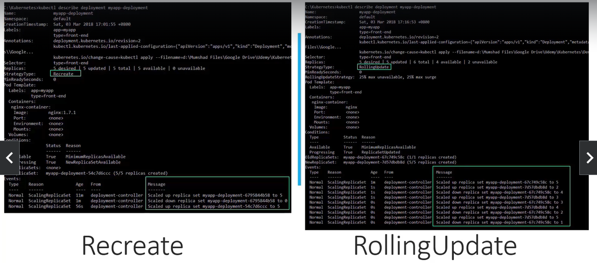
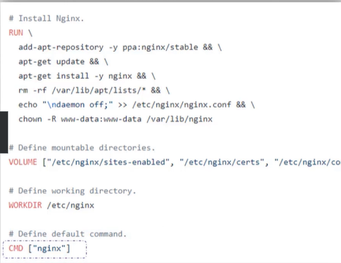
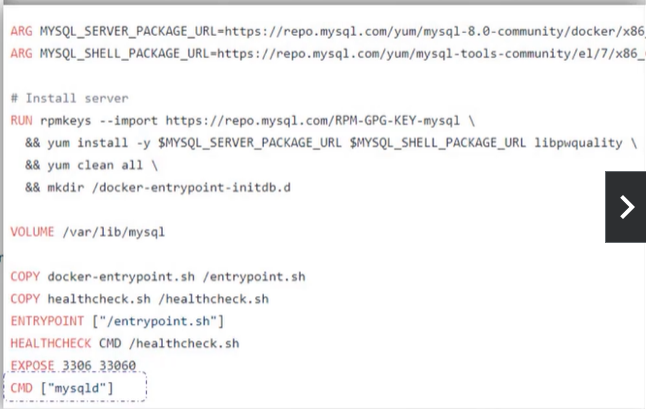
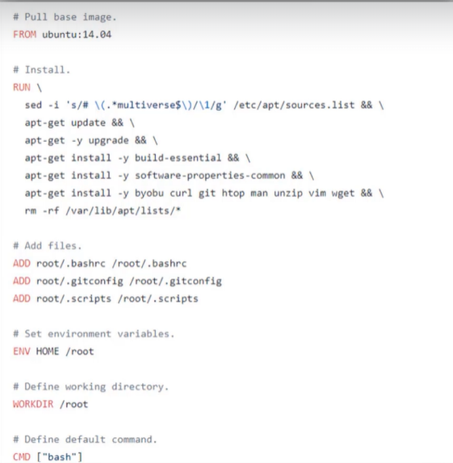

## Rolling Updates and Rollbacks 

| Deployment의 Update와 Rollback

#### Rollout and Versioning

| Deployment의 Rollout과 버전 관리

1. 처음 Deployment를 생성하면 Rollout 트리거
- container 버전: nginx:1.7.0 가정
- 새로운 Rollout은 새로운 Deployment의 Revision 생성 => Revision 1

2. Application이 업그레이드되면 container 버전이 새로운 버전으로 업데이트되면서 새 Rollout 트리거
- container 버전: nginx:1.7.0 -> nginx:1.7.1
- 새로운 Deployment Revision 생성 => Revision 2

=> Deployment에 일어난 변화를 추적할 수 있게 하고 필요하다면 이전 Deployment 버전으로 Rollback 가능

#### Rollout Command

`kubectl rollout status deployment/[DEPLOYMENT NAME]`

- rollout으로 출시 상태 확인 가능

`kubectl rollout history deployment/[DEPLOYMENT NAME]`

- history 확인

#### Deployment Strategy

| Deployment Strategy에는 2가지 전략 존재

- 배포된 Application instance replicas가 5개라 가정
- 이것을 새로운 버전으로 업그레이드하는 방법

    1. Recreate
    - Instance를 먼저 파괴
    - 다음 새 Application 버전의 새로운 instance 5개 배포
    - 단점: 구 버전이 다운되고 새 버전이 업되기 전 시간동안 **Application Down**되어 사용자 접근 불가능

    2. Rolling Update
    - 기본 Deployment Strategy
    - 구 버전을 하나씩 내리고 새 버전을 하나씩 올림
    - Application이 down되지 않고 사용자 접근 가능

#### Kubectl apply


`kubectl apply -f [DEFINITION FILE]`

- Rolling Update하려면 수정 사항은 YAML definition file에 변경한 후 apply 명령어 실행
- 새로운 출시 버전이 트리거되고 새로운 Deployment 생성

`kubectl set image deployment/[DEPLOYMENT NAME] [CONTAINER NAME]=[변경할 이미지]`

- container 이미지 변경

#### Recreate vs Rolling Update

- kubectl 명령어 실행했을 때
    - Recreate는 replicaset을 0으로 scale down 후 5로 scale up
    - Rolling Update는 replicaset을 하나씩 축소하고 새 replicaset 생성



#### Upgrades

| Deployment가 업그레이드를 어떻게 수행하는지

- 새 deployment 생성하면 자동으로 replicaset1 먼저 생성
    - replicas에 부합하는 pod 개수 생성
- Application Upgrade 시 Deployment가 업그레이드할 replicaset2 생성
- replicaset1을 제거하는 동시에 replicaset2의 pod 배포

`kubectl get replicasets` 명령어로 조회 가능

#### Rollback

- Application을 업그레이드한 후 업그레이드한 새 버전에 문제가 있는 경우 업데이트를 이전 버전으로 돌려야 함 => Rollback

`kubectl rollout undo deployment/[DEPLOYMENT NAME]`

- Kubernetes Deployment는 이전 revision으로 rollback해줌

#### Commands

1. Create

`kubectl create -f [DEPLOYMENT YAML FILE]`

2. Get

`kubectl get deployments`

3. Update

`kubectl apply -f [DEPLOYMENT YAML FILE]`

`kubectl set image deployment/[DEPLOYMENT NAME] [CONTAINER NAME]=[변경할 이미지]`

4. Status

`kubectl rollout status deployment/[DEPLOYMENT NAME]`

- deployment 진행 상태 확인 가능

`kubectl rollout history deployment/[DEPLOYMENT NAME]`

- deployment history 조회 가능

5. Rollback

`kubectl rollout undo deployment/[DEPLOYMENT NAME]`

- 이전 Revision으로 Rollback

## Practice Test - Rolling Updates and Rollbacks

Q3

`./curl-test.sh`

- script 실행
    - script란 사용할 명령어를 모아놓은 파일

Q11

`k edit deployment [DELOYMENT NAME]`

- image 변경 가능

## Commands

| Ubuntu 이미지로 Docker container 운용한다고 가정

- `docker run ubuntu` 명령어로 ubuntu 이미지 인스턴스 실행 & 즉시 종료
- `docker ps` 명령어로 실행 중인 container 조회
    - 이때 실행되는 container 조회 불가능
- `docker ps -a` 명령어로 종료된 container를 포함한 모든 container 조회

#### WHY ?

- Virtual Machine과 달리 Container는 운영체제를 호스팅하도록 되어 있지 않음
- Container는 특정 작업이나 프로세스 실행
    - Web server, Application server, DB 인스턴스 호스팅하거나 연산 또는 분석하는데 사용
    - container 내의 작업이 끝나거나 충돌하면 container 빠져나옴
    - 즉 container는 그 안의 과정이 살아 있어야만 살 수 있음 

- Container 내에서 실행되는 프로세스는 누가 정의하는가?
    - NGINX와 같은 인기 Docker image의 Docker file을 보면 `CMD` 필드 존재
    - 이 CMD에 container 안에서 실행될 명령 정의
    
    

- 처음에 하고자 한 것은 Ubuntu 운영 체제로 container를 실행하는 것
    - `CMD`가 기본 명령인 bash
        - bash는 웹 서버나 데이터베이스 서버 같은 프로세스가 아님
        - 터미널의 입력을 듣는 shell
        - 터미널 못 찾으면 exit


- 처음에 Ubuntu container 실행했을 때 Docker는 Ubuntu 이미지로부터 container를 만들어 bash 프로그램 실행
    - 기본값으로 Docker는 실행 중일 때 container에 터미널에 연결하지 않음
    - bash 프로그램은 shell을 찾지 못해 종료
    - container가 완성되고 그 과정이 시작되었기 때문에 container도 exit
    
- Container 시작 명령 지정하는 법
1. `docker run` 명령어에 명령 추가
    - 이미지에 지정된 기본 명령 재정의
     - Ex. `docker run ubuntu sleep 5`
        - docker를 실행하는 ubuntu 명령을 실행하고, sleep 5 명령을 추가 옵션으로 실행
        - 이 경우 container가 작동할 때 sleep 프로그램을 실행하고 5초간 기다렸다가 exit
    - 이 변화를 영구적으로 만드는 방법, 즉 container 시작 시 sleep 명령을 항상 실행하는 이미지를 원함
        ```
        FROM Ubuntu
        CMD sleep 5
        
        //또는
        CMD sleep 5        //CMD command param1
        //또는
        CMD ["sleep","5"]             //CMD ["command","param1"]
        ```
        - 아래와 같이 command와 parameter를 함께 지정하면 안 됨
        ```
        CMD ["sleep 5"]
        ```

    - 위와 같이 docker file 지정 후 `docker build -t ubuntu-sleeper .` , `docker run ubuntu-sleeper` 명령어 실행
        - sleep 5 명령을 수행하는 container 생성


- ENTRYPOINT
    - parameter 추가
    - container가 시작되면 실행할 프로그램 지정
    ```
    FROM Ubuntu

    ENTRYPOINT ["sleep"]
    ```
    - 이때 `docker run ubuntu-sleeper 10` 명령어 실행
    - ENTRYPOINT가 sleep이기 때문에 sleep 10 수행

    - 이때 `docker run ubuntu-sleeper` 명렁어 실행 시 오류 발생

- docker run 명령어 수행 시 명시되지 않은 경우의 기본 값 구성
    ```
    FROM Ubuntu
    ENTRYPOINT ["sleep"]
    CMD ["5"] 
    ```
    - 이때 `docker run ubuntu-sleeper` 수행 시 sleep 5
    - `docker run ubuntu-sleeper 10` 수행 시 sleep 10

- 런타임 동안 ENTRYPOINT 수정하고 싶은 경우
    - `docker run --entrypoint sleep2.0 ubuntu-sleeper 10`
    - docker sleep2.0 10 수행 

## Commands and Arguments

| Application(Pod) Commands & Arguments
| Dockerfile과 Pod definition file의 관계: pod definition file의 `command`는 Dockerfile의 `ENTRYPOINT` 재정의, definition file의 `args`는 Dockerfile의 `CMD 재정의

- 이전에 생성한 docker image로 pod 생성
    - `docker run --name ubuntu-sleeper ubuntu-sleeper`
    - 10초 sleep 원하는 경우, `docker run --name ubuntu-sleeper ubuntu-sleeper 10`

- Pod Definition
    - spec.containers.args
        - 아까 생성한 docker image 사용할 때, 기본은 5초지만 10초로 변경하고 싶은 경우 argument 명시 => docker run 명령어에 추가된 모든 것은 spec.containers.args에 명시
    - spec.containers.command
        - DockerFile의 ENTRYPOINT 변경 시 명시

`pod-definition.yml`
```
apiVersion: v1
kind: Pod
metadata:
    name: ubuntu-sleeper-pod
spec:
    containers:
        - name: ubuntu-sleeper
          image: ubuntu-sleeper
          command: ["sleep2.0"]
          args: ["10"]
```

`kubectl create -f pod-definition.yml`

- 이때의 Docker File
    - ENTRYPOINT: 시작 시 실행되는 명령
    - CMD: 명령에 전달되는 기본 매개 변수 
        - 이 CMD는 pod-definition 파일의 args 필드로 재정의 가능

```
FROM Ubuntu
ENTRYPOINT ["sleep"]
CMD ["5"]
```


## Practice Test - Commands and Arguments

- Definition file에서 command & args 명시

`방법 1`
```
spec:
    containers:
        - name: ...
          command: ["sleep","5000"]
```

`방법 2`
``` 
spec:
    containers:
        - name: ...
          command: 
            - "sleep"
            - "5000"
```

---

`k replace --force -f [임시파일]`
- 이미 생성된 리소스의 YAML 파일에서 command와 argument 수정 시 경고 문자 나옴
- 이때 변경된 YAML 파일은 임시파일 경로에 존재하므로 해당 파일이 적용되도록 함

`k run [POD NAME] --image=[IMAGE NAME] -- [ARGS1] [ARGS1] ...`

- `--` 뒤에는 내부에서 실행되는 Application을 위한 옵션
    - 이때 command에 해당하는 --도 반드시 넣어야 함
    - `k run webapp-green --image=kodekloud/webapp-color -- --color green`

## Configure Environment Variables in Applications

- ENV 속성 하의 모든 항목은 배열의 항목을 나타내는 대시 (`-`) 부터 시작
- container와 함께 사용 가능한 값

`docker run -e APP_COLOR=pink simple-webapp-color`

`pod-definition.yaml`
```
...
spec:
    containers:
        - name: simple-webapp-color
          image: simple-webapp-color
          ports:
            - containerPort: 8080
          env:
            - name: APP_COLOR
              value: pink
```

#### ENV Value Type

| ENV 지정 방식은 두 가지

1. key-value 포맷을 이용해 환경 변수 지정

```
env:
    - name: APP_COLOR
      value: pink
```

2. ConfigMap

- 값을 지정하는 대신 valueFrom 사용

```
env:
    - name: APP_COLOR
      valueFrom:
        configMapKeyRef:
```

3. Secrets

```
env: 
    - name: APP_COLOR
      valueFrom:
        secretKeyRef:
```

## Configuring ConfigMaps in Applications

- pod definition file이 많을수록 쿼리 파일에 저장된 환경을 관리하기 어려움

#### ConfigMaps

- Pod definition file에서 environment 정보를 가져와 중앙에서 관리할 수 있음
- Kubernetes key-vale 쌍의 configuration 데이터를 전달하는 데 사용
- ConfigMap 구성 후 pod에 configmap을 삽입해 환경 변수로 key-value 값을 사용할 수 있게 함
    - 환경 변수는 pod의 container 안에 호스팅된 application을 위함
- 같은 방식으로 configmap 만들지만 다양한 목적으로 사용할 수 있으므로, 이름을 알아보기 쉽게 정해야함


#### 1. Create ConfigMaps

1. Imperative => `k create configmap`

- 명령어로 생성

- 1. `k create configmap [CONFIGMAP NAME] --from-literal=[KEY]=[VALUE]`
    - key-value 직접 지정
    - 여러 개의 key-value 쌍이 있는 경우, --from-literal 여러 번 사용

- 2. `k create configmap [CONFIGMAP NAME] --from-file=[PATH TO FILE]`
    - 파일로 구성 데이터 입력
    - PATH TO FILE의 데이터를 읽고 파일 이름으로 저장


2. Declarative => `k create -f`

- definition file로 생성

`config-map.yaml`
```
apiVersion: v1
kind: ConfigMap
metadata:
    name: app-config
data:
    APP_COLOR: blue
    APP_MODE: prod
```

`k create -f config-map.yaml`

#### 2. Inject into Pod

- Pod definition file
    - envFrom은 list로, 필요한만큼 환경 변수를 통과할 수 있음

`pod-definition.yaml`
```
apiVersion: v1
kind: Pod
metadata:
    name: simple-webapp-color
    labels:
        name: simple-webapp-color
spec:
    containers:
        - name: simple-webapp-color
          image: simple-webapp-color
          ports:
            - containerPort: 8080
          envFrom:
            - configMapRef:
                name: app-config
```

#### ConfigMap in Pods

1. ENV

- 직전에 사용

```
envFrom:
    - configMapRef:
        name: app-config
```

2. SINGLE ENV

```
env:
    - name: APP_COLOR
      valueFrom:
        configMapRef:
            name: app-config
            key: APP_COLOR

```

3. VOLUME

- 데이터를 파일로 volume에 넣는 방법

```
volumes:
    - name: app-config-volume
      configMap:
        name: app-config
```

#### View ConfigMaps

`k get configmaps`
- configmap 조회

`k describe configmap [CONFIGMAP NAME]`
- configmap 상세조회
    - 이 때 key, value 모두 조회 가능 

## Practice Test - Environment Variables

`k create configmap [CONFIGMAP NAME] --from-literal=[KEY]=[VALUE]`


## Configure Secrets in Applications

#### Web-MySQL Application

| MySQL DB에 연결된 Python web application

- 성공적인 application은 SUCCESS 메세지 보여줌

- host name과 user name, password 코드 존재
    - 코드에 중요 정보를 담기에 좋지 않음
    - config 데이터를 ConfigMap에 옮겨 사용
    - ConfigMap은 일반 텍스트 형식으로 구성 데이터 저장 => DB_Host name, User name을 저장하기에는 괜찮지만, password를 저장하기에는 적합하지 않음 => **Secret 사용**

`app.py`
```
import os
from flask import Flask

app = Flask(_name_)

@app.route("/")
def main():
    mysql.connector.connect(host='host', database='mysql', user='root', password='paswrd')

    return render_template('hello.html', color=fetchcolor())

if _name_=="_main_":
    app.run(host="0.0.0.0", port=8080")
```

#### Secret

- password나 key 같은 민감한 정보를 저장하는 데 사용
- 인코딩 형식으로 저장되는 것 제외하면 ConfigMap과 유사

`Secret`
```
DB_Host: mysql
DB_User: root
DB_Password: paswrd
```


1. Create Secret
- 1. Imperative
    - `kubectl create secret generic [SECRET NAME] --from-literal=[KEY]=[VALUE]`
    - `kubectl create secret generic [SECRET NAME] --from-file=[PATH TO FILE]`

- 2. Declarative
    - `kubectl create -f [YAML FILE NAME]`
    
    `secret-data.yaml`
    ```
    apiVersion: v1
    kind: Secret
    metadata:
        name: app-secret
    data:
        DB_Host: mysql
        DB_User: root
        DB_Password: paswrd
    ```


| 위에서는 데이터를 일반 텍스트로 명시했는데 안전하지 않음 => 인코딩된 형식의 secret 값 지정해야 하며 인코딩된 형식으로 데이터 지정해야 함

- 일반 텍스트에서 인코딩된 형식으로 데이터 변환하는 방법
    - Linux 호스트에서 `echo -n` 명령어를 실행하면 변환하려는 텍스트 나옴

```
DB_Host: bXlzcWw=
DB_User: cm9vdA==
DB_Password: cGFzd3Jk
```

`echo -n 'mysql' | base64` => bXlzcWw= 출력

2. Inject into Pod

`pod-definition.yaml`
```
apiVersion: v1
kind: Pod
metadata:
    name: simple-webapp-color
    labels:
        name: simple-webapp-color
spec:
    containers:
        - name: simple-webapp-color
          image: simple-webapp-color
          ports:
            - containerPort: 8080
          envFrom:
            - secretRef:
                name: app-secret    #secret name
```

- 1. ENV
```
envFrom: 
    - secretRef:
        name: app-config
```

- 2. SINGLE ENV

```
env:
    - name: DB_Password
      valueFrom:
        secretKeyRef:
            name: app-secret
            key: DB_Password
```

- 3. VOLUME
    - Pod의 volume에 secret 담음
    - Secret의 각각의 key 값은 파일로 생성 => `ls /opt/app-secret-volumes`에서 조회 가능
        - `cat /opt/app-secret-volumes/DB_Password` => 여기에서는 그 안에 암호 존재

```
volumes:
    - name: app-secret-volume
      secret: 
        secretName: app-secret
```

#### Note on Secrets

- Secret은 encrypted(암호화)되어 있지 않음
    - encode(암호화)만 되어 있음
    - 누구든 secret 파일을 볼 수 있고 secret 개체 얻을 수 있고 데이터를 볼 수 있음
    - 따라서 GitHub와 같은 코드 업로드 시 secret definition file을 넣으면 안 됨 => 디코드해 기본 암호가 무엇인지 알 수 있음

- Secret은 ETCD에 encrypted 암호화되어 있지 않음
    - ETCD의 어떤 데이터도 기본값으로 암호화되어 있지 않음
    - Encrypting Secret Data at Rest 고려해야 함 => EncryptionConfiguration
        - kube-api server에 옵션으로 통과시킬 수 있음
        - 특정 리소스를 대상으로 EncryptionConfiguration 할 수 있음
        - Ex. Secret만 암호화 `resources.resources.secrets`

- 같은 namespace에 pod나 deployment를 생성할 수 있는 누구나 Secret에 접근할 수 있음
    - RBAC을 구성해 액세스 제한 고려해야 함

- third-party secret store provider 고려해야 함
    - AWS Provider, Azure Provider, GCP Provider, Vault Provider
    - 이를 사용하면 Secret은 ETCD가 아닌 외부 secret store provider에 저장되고, 이들이 보안의 대부분 처리

#### View Secrets

`kubectl get secrets`

`kubectl describe secrets [SECRET NAME]`
- 데이터를 직접 보여주지 않음 => 암호화된 값 보여줌 

`kubectl get secret [SECRET NAME] -o yaml`
- 데이터를 직접 보여주지 않음 => 암호화된 값 보여줌

#### Decode Secrets

`echo -n 'bXlzcWw=' | base64 --decode` => mysql 출력
`echo -n 'cm9vdA==' | base64 --decode` => root
`echo -n 'cGFzd3Jk' | base64 --decode` => paswrd


## Practice Test - Secrets

## Demo: Encrypting Secret Data at Rest

## Multi Container Pods

## Practice Test - Multi Container Pods

## InitContainers

## Practice Test - InitContainers
