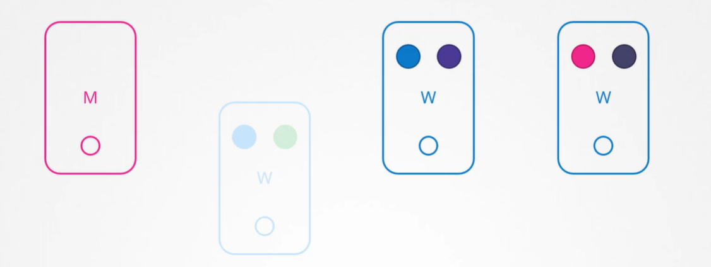
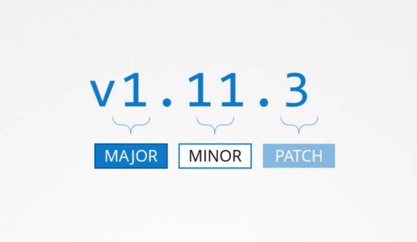
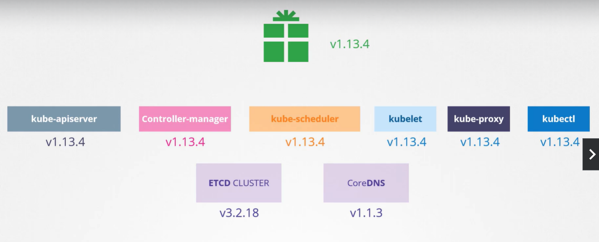
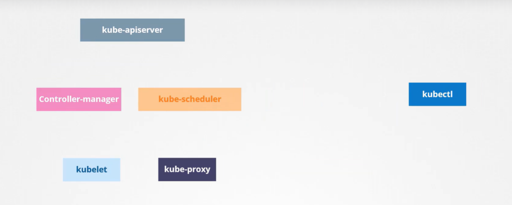
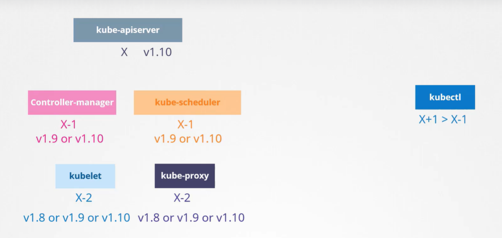
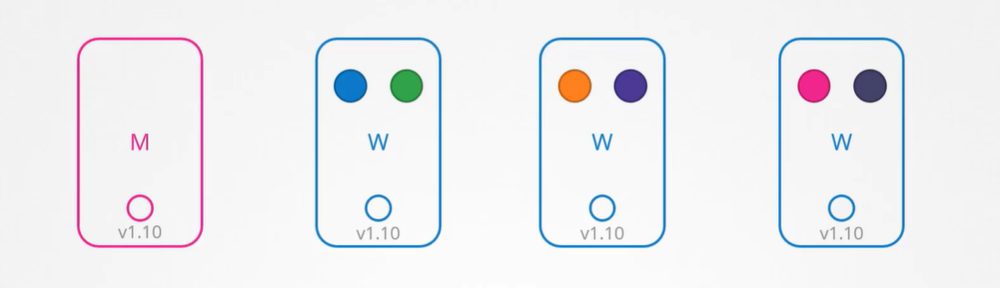

## OS Upgrades

| 유지,보수 목적으로 Node를 제거해야 하는 시나리오. 소프트웨어 기반 업그레이드나 패치 적용, 보안 패치 등을 클러스터에 적용

- 몇 개의 node와 pod가 Application 제공하는 클러스터


- Node 하나가 다운되는 경우 해당 node의 pod는 접근 불가능
  - Pod를 어떻게 배치하느냐에 따라 사용자가 영향 받을 수 있음
  - Ex. Blue pod의 복제본은 여러 개이므로 Blue application에 액세스하는 사용자는 영향받지 않음 => 다른 node의 pod 액세스 가능
  - Ex. Green pod는 green application을 실행하는 유일한 pod이기 때문에 접근하는 사용자는 영향 받음



- Node가 즉시 온라인으로 돌아오면, kubelet process가 시작되고 pod가 온라인으로 돌아옴


- 하지만 Node가 5분 이상 다운되면 해당 node에서 pod가 종료됨

- 이때 Pod가 ReplicaSet의 일부라면 다른 node에 재배치
- Pod가 복구되길 기다리는 시간은 기본 5분

  - `kube-controller-manager --pod-eviction-timeout=5m0s`

- Node가 오프라인될 때마다 master node는 최대 5분까지 기다림
- Node가 5분 후 다시 활성화되면 공백 상태

  - **Green pod는 사라지고, Blue pod는 이미 다른 node에 할당**

- 따라서 Node에서 실행할 유지 관리 작업이 있다면, node에서 실행되는 작업이 ReplicaSet을 가지는 것을 알고 단기간 중단되어도 되고 node가 5분 안에 돌아올 것을 확신한다면 빠른 업그레이드 재부팅 가능

  - 하지만 Node가 5분 안에 돌아온다고 확신할 수 없으니 더 안전한 방법 필요 => drain

- `k drain node-1`

  - node를 의도적으로 drain해 unschedulable 상태 만듬
  - 해당 node에서 pod가 정상적으로 종료(evict pod)되고, 클러스터 내의 다른 node에 재현
  - 특정 제한을 제거하지 않으면 이 node에서 pod를 스케쥴링할 수 없음

- 다른 node의 pod는 안전하니 node-1 재부팅
- 해당 node가 온라인 상태여도 여전히 Unschedulable => uncordon

- `k uncordon node-1`

  - 다운되고 다시 node가 정상이 되면 uncordon해야 다시 pod 스케쥴링할 수 있음
  - schedulable 상태
  - 이때 다른 node에 옮겨진 pod가 자동으로 돌아가지는 않고, 이후에 클러스터에 pod가 생성되면 해당 node에 스케쥴링될 수 있음

- `k cordon node-2`
  - drain과 uncordon 사이에는 cordon 존재
  - 단순히 node에 scheduling만 안 되도록 설정하고 **pod를 종료하거나 이동시키지 않음**
  - 단순히 해당 노드에 새 pod가 스케쥴링되지 않도록 함
    - unschedulable 상태

## Practice Test - OS Ugrades

Q4

`k drain [NODE NAME] --ignore-daemonsets`

- daemonsets에 속한 pod가 해당 worker node에 구동되는 경우, kubectl drain 명령이 수행되지 않는데, `--ignore-daemonsets`를 사용해 해당 pod를 축출 대상에서 제외할 수 있음
- daemonsets에 해당하는 예시: kube-flannel/kube-flannel-ds-vh54n, kube-system/kube-proxy-lxf

Q17

`kubectl drain [NODE NAME] --ignore-daemonsets` 명령어 사용시 불가능

- ReplicaSet, Job, DaemonSet, StatefulSet, ReplicationController로 관리하는 pod가 아닌 pod 존재하는 경우, node를 drain하면 해당 pod는 즉시 사라지므로 drain 불가능
- 단, `kubectl drain [NODE NAME] --ignore-daemonsets --force`로 강제 drain 가능

## Kubernetes Software Versions

Kubernetes API Version

- Kubernetes Cluster 설치 시 특정 버전의 kubernetes 설치
- `k get nodes`로 조회 가능

#### Kubernetes Project가 소프트웨어 릴리스를 어떻게 관리하는지

- Version은 Major, Minor, Patch 3가지로 나뉨

- Minor

  - 새로운 기능을 갖춘 Minor 버전이 몇 달마다 출시

- Patch

  - Bug Fixes
  - 중요한 버그 수리를 하는 Patch 버전이 Minor보다 더 자주 출시

- 알파 버전과 베타 버전 존재
  - 알파 버전
    - 모든 버그를 고치고 개선하면 알파 태그를 부착한 알파 버그 방출
    - 기본값으로 기능이 비활성화되어 버그 존재할 수 있음
  - 베타 버전
    - 코드를 잘 테스트하면 새 기능이 디폴트로 활성화
    - 베타 버전 이후 stable release



- Kubernetes Github에서 다운로드된 패키지는 추출되면 control plane의 모든 구성 요소가 모두 같은 버전으로 존재
  - kube-apiserver, controller-manager, kube-scheduler, kubelet, kube-proxy
- 다른 버전도 존재
  - ETCD Cluster와 CoreDNS Server은 각각 다른 프로젝트(외부 구성 요소)로 고유 버전 존재



## Cluster Upgrade Process

- Control plane의 ETCD Cluster와 CoreDNS Server는 외부 구성 요소로 버전이 다름
  - 당분간은 종속성 유지
- 따라서 핵심 control plane 구성 요소에 집중

#### 핵심 Control plane 구성 요소

| kube-apiserver, controller-manager, kube-scheduler, kubelet, kube-proxy, kubectl

- 구성 요소는 각각 다른 릴리스 버전을 가질 수 있음



- `Kube-apiserver`
  - Ex. v1.10
  - Controlplane의 주요 구성 요소
  - 다른 구성 요소들과 통신하는 구성 요소이기 때문에 어떤 다른 구성 요소도 **kube-apiserver보다 높은 버전으로 되어 있으면 안 됨**
- `Controller-manager`와 `kube-scheduler`는 kube-apiserver보다 한 버전 낮출 수 있음
  - Ex. v1.9 또는 v1.10
- `Kubelet과 Kube-proxy`는 `kube-apiserver`보다 2 버전 낮출 수 있음

  - Ex. v1.8 또는 v1.9 또는 v1.10

- 하지만 `Kubectl`은 유일하게 kube-apiserver보다 1 버전 높을 수 있고 1 버전 낮을 수 있음
  - Ex. v1.11 또는 v1.10 또는 v1.9



#### Upgrade

| Kubernetes는 최근 3개의 버전만 지원. Ex. v1.10, v1.11, v1.12

- 버전 업그레이드할 때에는 Minor 버전 1개씩 올라가는 것이 좋음

  - Ex. v1.10 -> v1.11 -> v1.12 -> v1.13

- Upgrade process는 cluster 설정에 따름
  1. Managed Kubernetes Cluster의 경우
  - Cloud Provider에 따라 배포
  - Ex. Google Kubernetes Engine은 Cluster를 쉽게 업그레이드해줌
  2. kubeadm으로 설치한 경우
  - Cluster를 계획하고 업그레이드하는 데 아래 명령어가 도움이 될 수 있음
  - `kubeadm upgrade plan`, `kubeadm upgrade apply`
  3. 처음부터 직접 배포한 경우
  - Cluster의 다양한 구성 요소를 직접 업그레이드해야 함

#### Cluster Upgrade - Kubeadm

- Master node와 Worker node, 이외의 구성 요소 버전은 v1.10



| Cluster Upgrade 단계

1. Master node 업그레이드

- Master node가 업그레이드되는 동안 Controlplane의 api-server, scheduler, Controller manager 등의 구성 요소는 잠시 다운
- Master node가 다운된다고 Cluster 상의 Worker node와 Application이 영향을 받지는 않음
  - Node와 Pod가 작동하는 한 application은 실행되어야 하고, 사용자는 영향을 받지 않음
- BUT 관리 기능 다운
  - kubectl 동작 X
  - kubernetes api를 이용해 cluster에 액세스할 수 없음
  - 새 application을 생성하거나, 기존의 application 수정 및 삭제 불가능
  - pod가 종료되어도 재생성하지 않음
- 업그레이드가 완료되고 cluster가 백업되면 정상적으로 동작
  - 현재 Master node는 v1.11, Worker node는 v1.10

2. Worker node 업그레이드

- Strategy1. 한 번에 업그레이드
  - Pod가 다운되면 사용자는 application에 접속할 수 없음
  - 업그레이드가 완료되면 node가 백업되고 새 pod가 예약되면 사용자가 다시 접속할 수 있음
- Strategy2. 한 번에 node 하나씩 업그레이드

  - 첫 번째 node 업그레이드
    - 이때 작업(pod)이 두 번째와 세 번째 node로 이동되고, 이 node에서 유저가 서비스됨
  - 첫 번째 node가 업그레이드되고 백업되면, 두 번째 node 업그레이드
    - 첫 번째와 세 번째 node로 작업 이동
  - 세 번째 node 업그레이드
    - 동일한 동작 진행
  - 모든 node가 새 버전으로 업그레이드될 때까지 반복

- Strategy3. Cluster에 새 node 추가
  - 이 때 추가되는 node는 새로운 소프트웨어 버전을 가진 node
  - 작업을 새로운 node로 옮기고 오래된 node 제거
    - 클라우드 환경에서 특히 편리
  - 모든 worker node가 새로운 버전을 가질 때까지 반복

#### Cluster Upgrade(Kubeadm) - Master node

| Kubeadm으로 Cluster Upgrade 명령어

1. `kubeadm upgrade plan`

- cluster upgrade를 도움
  - 현재 cluster version과 kubeadm version, latest stable version(Kubernetes의 안정적인 버전) 등 조회 가능
  - Controlplane의 구성 요소와 버전, 업그레이드할 수 있는 버전 조회 가능
  - controlplane 구성 요소를 업그레이드한 후 **각 node에 수동으로 kubelet 버전 업그레이드 해야함**을 알려줌
    - **kubeadm은 kubelet을 설치하거나 업그레이드하지 않음을 명심**
  - `kubeadm upgrade apply [VERSION]` 명령 존재
  - 필요한 경우, Cluster 업그레이드 전에 kubeadm 먼저 업그레이드해야 함을 알려줌
    - kubeadm은 kubernetes와 같은 소프트웨어 사용

2. kubeadm 도구 업데이트

`apt-get upgrade -y kubeadm=1.12.0-00`

3. cluster 업그레이드

`kubeadm upgrade apply v1.12.0`

- `kubeadm upgrade plan`에서 조회한 kubeadm upgrade apply 명령어 수행

- 이때 `k get nodes` 명령어 수행하면 VERSION이 기존 버전(v1.11.3)이 나타나는데, 이 VERSION은 kubelet 버전이므로 수정해야함

4. kubelet 업그레이드

- 개인의 셋업에 따라 master node에 kubelet이 실행될 수도 있는데, kubeadm과 배포된 cluster에는 master node에 kubelet 존재
  - master node의 pod로서 controlplane 구성 요소를 실행하는 데 사용
- 따라서 master node의 kubelet 업그레이드해야함

`apt-get upgrade -y kubelet=1.12.0-00`

`systemctl restart kubelet`

- 패키지 업그레이드되면 kubelet 서비스 다시 시작

`k get nodes`

- master node의 VERSION 변경 => v1.12.0

#### Cluster Upgrade(Kubeadm) - Worker node

1. 해당 Worker node의 작업을 다른 node로 옮김

`k drain node-1`

- node 내의 모든 작업을 안전하게 종료한 후 다른 node에 스케쥴링

2. kubeadm과 kubelet 패키지 업그레이드

| Master node 업그레이드와 동일

`apt-get upgrade -y kubeadm=1.12.0-00`

`apt-get upgrade -y kubelet=1.12.0-00`

3. 새 kubelet 버전을 위해 node 구성 업데이트

`kubeadm upgrade node config --kubelet-version v1.12.0`

`systemctl restart kubelet`

- kubelet 재시작

- 이제 node는 새로운 소프트웨어 버전으로 다시 올라감

4. schedulable하도록 설정

`kubectl uncordon node-01`

**Worker node 업그레이드 완료 ! 모든 Worker node 위와 같은 방식으로 업그레이드**

## Demo - Cluster upgrade

| 참고: <https://kubernetes.io/docs/tasks/administer-cluster/kubeadm/kubeadm-upgrade/>

1. Package Repository 변경

| 위 동작을 모든 worker node에서도 진행 => `ssh [NODE NAME]`으로 해당 node에 접근

- package를 담은 repository 변경

- `cat /etc/*release*`

  - Debian, Ubuntu OS라 명시되었기 때문에 해당 OS를 기준으로 진행
  - 참고: <https://kubernetes.io/blog/2023/08/15/pkgs-k8s-io-introduction/>

  - 1. `echo "deb [signed-by=/etc/apt/keyrings/kubernetes-apt-keyring.gpg] https://pkgs.k8s.io/core:/stable:/v1.28/deb/ /" | sudo tee /etc/apt/sources.list.d/kubernetes.list`

    - 위 명령어에서 원하는 버전으로 변경

  - 2. `curl -fsSL https://pkgs.k8s.io/core:/stable:/v1.28/deb/Release.key | sudo gpg --dearmor -o /etc/apt/keyrings/kubernetes-apt-keyring.gpg`

    - 위 명령어에서 원하는 버전으로 변경

  - 3. `sudo apt-get update`

2. 업그레이드할 버전 설치 및 조회

```
sudo apt update
sudo apt-cache madison kubeadm
```

3. Control plane node 업그레이드

- 1. kubeadm 업그레이드

  - 아래 명령어에서 원하는 버전으로 수정
  - 업그레이드 후 `kubeadm version`으로 확인

  ```
  sudo apt-mark unhold kubeadm && \
  sudo apt-get update && sudo apt-get install -y kubeadm='1.30.x-*' && \
  sudo apt-mark hold kubeadm
  ```

- 2. `sudo kubeadm upgrade plan`

  - cluster를 업그레이드할 수 있는 다양한 버전 조회 가능
  - 호환성 문제가 없는지 확실히 하는 목적
  - **kubelet은 직접 업그레이드해야 함**

- 3. `sudo kubeadm upgrade apply v1.28.8`

  - 원하는 버전으로 변경
  - 업그레이드 과정 수행

  - 이 과정 완료한 후 `kubectl get nodes`의 VERSION은 아직 변하지 않는데, 이는 kubelet 버전을 가져오기 때문

- 4. kubelet & kubectl 업그레이드

  - `k drain controlplane --ignore-daemonsets`
    - kubelet 업그레이드 이전에 존재하는 리소스를 모두 옮겨야 함
  - kubelet과 kubectl 업그레이드

    - 아래 명령어에서 원하는 버전으로 변경

    ```
    sudo apt-mark unhold kubelet kubectl && \
    sudo apt-get update && sudo apt-get install -y kubelet='1.30.x-*' kubectl='1.30.x-*' && \
    sudo apt-mark hold kubelet kubectl
    ```

  - kubelet 재시작

    ```
    sudo systemctl daemon-reload
    sudo systemctl restart kubelet
    ```

  - `k uncordon controlplane`
    - 리소스 스케쥴링 가능하도록 설정

4. Worker node 업그레이드

| `ssh [NODE NAME]`으로 접근

- 1. kubeadm 업그레이드

  - 아래 명령어에서 원하는 버전으로 수정
  - 업그레이드 후 `kubeadm version`으로 확인

  ```
  sudo apt-mark unhold kubeadm && \
  sudo apt-get update && sudo apt-get install -y kubeadm='1.30.x-*' && \
  sudo apt-mark hold kubeadm
  ```

- 2. `sudo kubeadm upgrade node`

  - Controlplane node는 `sudo kubeadm upgrade apply v1.28.8`. Worker node와 다름

- 3. kubelet & kubectl 업그레이드

  - `k drain [NODE NAME] --ignore-daemonsets`
    - kubelet 업그레이드 이전에 존재하는 리소스를 모두 옮겨야 함
  - kubelet과 kubectl 업그레이드

    - 아래 명령어에서 원하는 버전으로 변경

    ```
    sudo apt-mark unhold kubelet kubectl && \
    sudo apt-get update && sudo apt-get install -y kubelet='1.30.x-*' kubectl='1.30.x-*' && \
    sudo apt-mark hold kubelet kubectl
    ```

  - kubelet 재시작

    ```
    sudo systemctl daemon-reload
    sudo systemctl restart kubelet
    ```

  - `k uncordon [NODE NAME]`
    - 리소스 스케쥴링 가능하도록 설정

## Practice Test - Cluster upgrade

Q1

`kubectl get nodes`

- kubernetes 버전 확인 가능

Q3

`kubectl describe node | grep Taints`

- node들의 Taints 조회 가능

Q7

`kubeadm upgrade plan`

- kubeadm 버전 확인

Q9

1. Package Repository 변경

- **안해도 됨 !! 이미 존재**
- 다음 단계 명령어(sudo apt update, sudo apt-cache madison kubeadm)에서 확인

`echo "deb [signed-by=/etc/apt/keyrings/kubernetes-apt-keyring.gpg] https://pkgs.k8s.io/core:/stable:/v1.30/deb/ /" | sudo tee /etc/apt/sources.list.d/kubernetes.list`

`curl -fsSL https://pkgs.k8s.io/core:/stable:/v1.30/deb/Release.key | sudo gpg --dearmor -o /etc/apt/keyrings/kubernetes-apt-keyring.gpg`

2. kubeadm 업그레이드

```
sudo apt update
sudo apt-cache madison kubeadm
```

```
sudo apt-mark unhold kubeadm && \
sudo apt-get update && sudo apt-get install -y kubeadm='1.30.0-*' && \
sudo apt-mark hold kubeadm
```

`kubeadm version`

`sudo kubeadm upgrade plan`

`sudo kubeadm upgrade apply v1.30.0`

3. kubelet & kubectl 설치

`kubectl drain <node-to-drain> --ignore-daemonsets`

```
sudo apt-mark unhold kubelet kubectl && \
sudo apt-get update && sudo apt-get install -y kubelet='1.30.0-*' kubectl='1.30.0-*' && \
sudo apt-mark hold kubelet kubectl
```

```
sudo systemctl daemon-reload
sudo systemctl restart kubelet
```

`kubectl uncordon <node-to-uncordon>`

Q11

1. `k drain [NODE NAME] --ignore-daemonsets`

2. node01에 접근

`ssh node01`

3. Package Repository 변경

`echo "deb [signed-by=/etc/apt/keyrings/kubernetes-apt-keyring.gpg] https://pkgs.k8s.io/core:/stable:/v1.28/deb/ /" | sudo tee /etc/apt/sources.list.d/kubernetes.list`

`curl -fsSL https://pkgs.k8s.io/core:/stable:/v1.28/deb/Release.key | sudo gpg --dearmor -o /etc/apt/keyrings/kubernetes-apt-keyring.gpg`

4. kubeadm 업그레이드

```
sudo apt-mark unhold kubeadm && \
sudo apt-get update && sudo apt-get install -y kubeadm='1.30.0-*' && \
sudo apt-mark hold kubeadm
```

`sudo kubeadm upgrade node`

- exit

5. kubelet & kubectl 설치

`kubectl drain <node-to-drain> --ignore-daemonsets`

- 다시 `ssh node01`

```
sudo apt-mark unhold kubelet kubectl && \
sudo apt-get update && sudo apt-get install -y kubelet='1.30.0-*' kubectl='1.30.0-*' && \
sudo apt-mark hold kubelet kubectl
```

```
sudo systemctl daemon-reload
sudo systemctl restart kubelet
```

`kubectl uncordon node01`

## Backup and Restore Methods

#### Backup Candidates

| Kubernetes에서 무엇을 백업해야 하는가

1. Resource Configuration

- Deployment, Pod, Service configuration 저장
- Imperative
  - Cluster에 생성한 리소스와 관련해 imperative하게 리소스 생성 가능
    - `k create namespace [NAMESPACE NAME]`, `k create secret`, `k create configmap`

- Declarative
  - pod definition file 사용
  - `k apply -f [YAML FILE]`
  - 리소스의 configuration을 저장하는데 선호되는 방법
  - 단일 application에 필요한 모든 리소스가 Definition file 형식의 단일 폴더에 존재
    - 나중에 재사용하거나 다른 사람과 공유 가능
  - Definition file은 항상 저장해야 함
    - 소스 코드 리포지토리(Ex.GitHUb)에 저장하면 팀이 관리할 수 있어 유리
    - 소스 코드 리포지토리는 올바른 백업 솔루션으로 구성되어야 함
      - Github와 같은 공공 소스 리포지토리는 걱정할 필요 없음
      - Cluster 전체를 잃어도, configuration file을 이용해 Application을 cluster에 재배치할 수 있음

- 모든 사람이 Declarative 방식으로 리소스를 생성하지는 않음 => 리소스 구성을 백업하는 더 나은 방법은 **kube-apiserver를 쿼리**하는 것 

2. ETCD Cluster

- Cluster와 관련된 모든 정보가 저장되는 곳

3. Persistent Volumes

- Application이 Persistent Volumes에 저장됨

#### Backup - Resource Configs

- kubectl을 이용해 kube-apiserver를 쿼리하거나 apiserver에 직접 액세스함으로써 cluster에 생성된 모든 개체에 대한 리소스 구성을 복사해 저장할 수 있음
- `kubectl get all -all-namespaces -o yaml > all-deploy-services.yaml`
  - 백업 스크립트에서 사용되는 명령 중 하나
  - 모든 namespace의 리소스를 모두 가져와 yaml 포맷으로 추출해 파일 저장
  - 단, 이는 일부 리소스 그룹에 해당하고 그 외의 고려해야 하는 리소스 그룹이 더 존재

- Velero 사용해 Kubernetes api를 이용해 cluster 백업을 가져오는 데 도움이 됨

#### Backup - ETCD

- ETCD에 cluster에 관한 상태 정보 저장
  - cluster 자체에 관한 정보, node 및 cluster 내부에서 생성된 모든 리소스 저장

- 이전에 다룬 리소스 백업 대신 etcd server 자체를 백업

- etcd cluster는 master node에 존재
- `etcd.service`의 `--data-dir`에 구성하는 모든 데이터가 저장될 장소 명시
  - 백업 도구가 지원할 수 있도록 구성할 수 있는 디렉토리

- `Snapshot`
  - ETCD는 빌트인 **Snapshot** 솔루션 존재
    - 아래 명령어로 데이터베이스 스냅샷 찍을 수 있음
      - 이떄 ETCDCTL_API 버전은 반드시 3으로 설정해야 함 
        - etcd API version 변경 `export ETCDCTL_API=3`
        - 버전 조회 `etcdctl --version`
      - snapshot이름이 snapshot.db 
      - 경로를 바꾸고 싶은 경우 전체 경로 지정
      - 아래 명령어 진행 후 `ls`로 snapshot 생성
    ```
    ETCDCTL_API=3 etcdctl snapshot save snapshot.db
    ```

    - 아래 명령어로 백업 상태 볼 수 있음
    ```
    ETCDCTL_API=3 etcdctl snapshot status snapshot.db
    ```

  - **Restore Snapshot**
    1. kube-apiserver 중단
    - 복원 프로세스 과정에서 cluster를 다시 시작해야 하는데, kube-apiserver가 cluster에 달려 있기 때문
    - `service kube-apiserver stop`

    2. Snapshot 복원
    - `--data-dir` 지정
      - ETCD를 백업에서 복원할 때 새 cluster 구성을 초기화하고, etcd의 멤버를 새 cluster의 새 멤버로 구성 
      - 새 멤버가 실수로 기존의 cluster에 합류하는 것을 막기 위한 목적
      - 이때 새로 생성된 cluster의 etcd.service의 --data-dir이 변경됨
    ```
    ETCDCTL_API=3 etcdctl snapshot restore [SNAPSHOT NAME] --data-dir [BACKUP FILE 경로]
    ```
    
    Ex
    ```
    ETCDCTL_API=3 etcdctl snapshot restore snapshot.db --data-dir /var/lib/etcd-from-backup
    ```

    3. Service daemon 다시 로드 후 재시작
    - `systemctl daemon-reload`
    - `systemctl etcd restart`

    4. kube-apiserver 시작
    - `service kube-apiserver start`

  - Snapshot 저장 시 인증서 파일을 지정해야 함
  ```
  ETCDCTL_API=3 etcdctl snapshot save snapshot.db --endpoints=https://127.0.0.1:2379 --cacert=/etc/etcd/ca.crt --cert=/etc/etcd/etcd-server.crt --key=/etc/etcd/etcd-server.key
  ```

- ETCD를 이용한 백업(Resource Configuration)과 kube-apiserver 쿼리를 통한 백업(ETCD Cluster) 살펴봄
  - 관리되는 쿠버네티스 환경을 사용하는 경우 때로는 etcd cluster에 액세스조차 안 할 수 있음 => kube-apiserver를 쿼리하는 백업이 더 나음


## Practice Test - Backup and Restore

Q2

`k get pods -n kube-system` 후 `k describe etcd-controlplane -n kube-system`
- 이미지에서 ETCD 버전 확인

Q3

`k describe etcd-controlplane -n kube-system`의 `--listen-client-urls` 확인
- controlplane node에서 ETCD에 접근할 때 사용하는 주소

Q4

`k describe etcd-controlplane -n kube-system`의 `--cert-file`
- ETCD Server certificate file 위치

Q5

`k describe etcd-controlplane -n kube-system`의 `--trusted-ca-file`
- ETCD CA Certificate file 위치

Q6

| Backup

- volumes가 hostPath로 되어있다는 것은 실행중인 노드의 경로를 의미하고 controlplane에 존재하고, volumeMounts는 etcd 내부에 존재

1. ETCDCTL API Version 최신화 => 3으로
- `export ETCDCTL_API=3`
- 이 명령어 쓰면 etcdctl 앞에 ETCDCTL_API=3을 안 써도 되고, 반대로 이 명령어 수행하지 않으면 모든 etcdctl 앞에 ETCDCTL_API=3 을 작성해야 함

2. Snapshot 저장

- `--cacert`, `--cert`, `--key`, `--endpoints` 지정

```
etcdctl snapshot save --cacert="/etc/kubernetes/pki/etcd/ca.crt" --cert="/etc/kubernetes/pki/etcd/server.crt" --key="/etc/kubernetes/pki/etcd/server.key" --endpoints=127.0.0.1:2379 /opt/snapshot-pre-boot.db
```

Q9

| Restore

1. Snapshot restore
- `etcdctl snapshot restore --data-dir /var/lib/etcd-from-backup /opt/snapshot-pre-boot.db`
  - snapshot으로 저장한 파일 내의 데이터를 --data-dir 경로에 저장
  - /opt에는 일반적으로 **사용자 정의** 리소스,서드파티 소프트웨어(모니터링 도구,로깅 시스템, 데이터베이스 서버), 백업 및 복원 파일 존재

2. etcd의 etcd-data volume path 변경 
- `vim /etc/kubernetes/manifests/etcd.yaml`의 volumes.hostPath의 name이 etcd-data인 path를 /var/lib/etcd-from-backup으로 변경
  - `/etc/kubernetes/manifests/etcd.yaml` 암기할 것
  - /etc는 일반적으로 시스템 설정 파일 저장, /etc/kubernetes에는 cluster의 중요한 설정 파일 저장되어 있고, /etc/kubernetes/manifests에는 cluster의 중요 구성 요소가 YAML 형식으로 저장되어 있음 

3. 재시작 확인
- `k get pods -n kube-system`으로 etcd-controlplane, scheduler, controller manager가 재시작되는 것 확인

- 정상적으로 재시작되지 않는 경우, `k delete pod etcd-controlplane -n kube-system`으로 삭제 -> 자동 재시작

## Practice Test - Backup and Restore2

| 다중 클러스터 환경. context를 설정해 kubectl이 어느 클러스터에 연결될지 결정

Q3

`k config view`
- 모든 cluster 조회 가능

Q7

방법 1. `k get pods -n kube-system`에 etcd pod가 존재하는 경우 stacked ETCD

- ETCD Server가 controlplane node에서 실행 중이라는 뜻

방법 2. `k describe pod [API-SERVER POD NAME]`

- `--etcd-servers` (API Server가 ETCD Server와 실제로 통신하기 위한 URL) 호스트 IP 주소를 가리키기 때문에 stacked ETCD

Q8

1. `ssh [CONTROLPLANE NODE]`

- controlplane node에 접속

2. controlplane node에서 `k get describe pod [APISERVER POD]`

- `--etcd-servers`가 외부 IP를 가리키므로 External ETCD 사용

Q10

- Stacked ETCD는 etcd pod 조회로 알 수 있음

Q12

| ETCD의 기본 data directory

`ssh etcd-server`

- ETCD Server에 접속

`ps -ef | grep -i etcd`

- ETCD Server에 대한 모든 구성 보여줌
- 위 명령어에서 `--data-dir` 라인 찾음

Q13

| etcd server가 일부인 etcd cluster node 개수

`ps -ef | grep -i etcd`에서 `--listen-client-urls` 찾아서 아래 명령어 --endpoints에, `--trusted-ca-file` 찾아서 --cacert에, `--cert-file` 찾아서 --cert에 ,`--key-file` 찾아서 아래 --key에 넣음

- `ETCDCTL_API=3 etcdctl --endpoints=[LISTEN_CLIENT_URLS] --cacert=[TRUSTED_CA_FILE] --cert=[CERT_FILE] --key=[KEY_FILE] member list` 명령어 실행

Q14

1. `ssh [CONTROLPLANE NODE]`

- controlplane node에 진입해야 함

2. `ETCDCTL_API=3 etcdctl snapshot save --endpoints=127.0.0.1:2379 --cacert="/etc/kubernetes/pki/etcd/ca.crt" --cert="/etc/kubernetes/pki/etcd/server.crt" --key="/etc/kubernetes/pki/etcd/server.key" /opt/cluster1.db`

3. cluster1의 controlplane에 있는 파일을 student-node의 /opt 경로로 가져옴

| student-node에 저장해야 함

- `exit`

- `scp cluster1-controlplane:/opt/cluster1.db /opt/`

Q15

| 다중 cluster에서 하나의 cluster 백업 - external ETCD

1. `scp /opt/cluster2.db etcd-server:/root`

2. `ssh etcd-server`

3. `ETCDCTL_API=3 etcdctl snapshot restore /root/cluster2.db --data-dir=/var/lib/etcd-data-new`

4. 

`cd /var/lib/`

`ls -la`
- 디렉토리 내용 조회

`chown -R etcd:etcd etcd-data-new/`
- 디렉토리 소유자 변경


`ls -la`

`vi /etc/systemd/system/etcd.service`에서 --data-dir을 /var/lib/etcd-data-new로 변경

`systemctl daemon-reload`

`systemctl restart etcd`
- 재시작

`systemctl status etcd`
- etcd 상태 조회

5. exit

`k config use-context cluster2`

`k delete pod [SCHEDULER POD],[CONTROLLER MANAGER POD]`

- 재시작

6. `ssh cluster2-controlplane`

`systemctl restart kubelet`
- kubelet 재시작

`systemctl status etcd`

- etcd 상태 조회