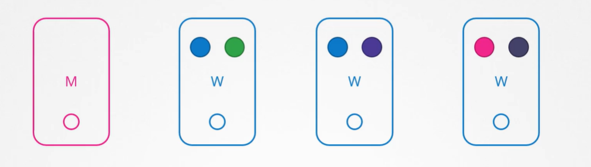
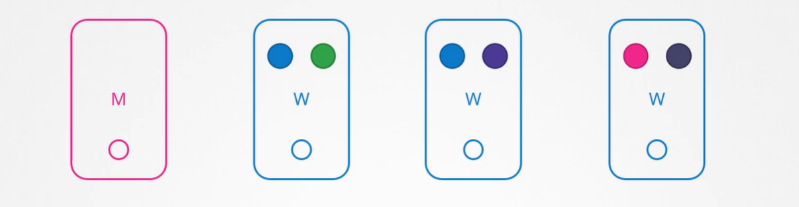

## OS Upgrades

| 유지,보수 목적으로 Node를 제거해야 하는 시나리오. 소프트웨어 기반 업그레이드나 패치 적용, 보안 패치 등을 클러스터에 적용

- 몇 개의 node와 pod가 Application 제공하는 클러스터

- Node 하나가 다운되는 경우 해당 node의 pod는 접근 불가능
  - Pod를 어떻게 배치하느냐에 따라 사용자가 영향 받을 수 있음
  - Ex. Blue pod의 복제본은 여러 개이므로 Blue application에 액세스하는 사용자는 영향받지 않음 => 다른 node의 pod 액세스 가능
  - Ex. Green pod는 green application을 실행하는 유일한 pod이기 때문에 접근하는 사용자는 영향 받음

- Node가 즉시 온라인으로 돌아오면, kubelet process가 시작되고 pod가 온라인으로 돌아옴

- 하지만 Node가 5분 이상 다운되면 해당 node에서 pod가 종료됨

- 이때 Pod가 ReplicaSet의 일부라면 다른 node에 재배치
- Pod가 복구되길 기다리는 시간은 기본 5분

  - `kube-controller-manager --pod-eviction-timeout=5m0s`

- Node가 오프라인될 때마다 master node는 최대 5분까지 기다림
- Node가 5분 후 다시 활성화되면 공백 상태

  - **Green pod는 사라지고, Blue pod는 이미 다른 node에 할당**

- 따라서 Node에서 실행할 유지 관리 작업이 있다면, node에서 실행되는 작업이 ReplicaSet을 가지는 것을 알고 단기간 중단되어도 되고 node가 5분 안에 돌아올 것을 확신한다면 빠른 업그레이드 재부팅 가능

  - 하지만 Node가 5분 안에 돌아온다고 확신할 수 없으니 더 안전한 방법 필요 => drain

- `k drain node-1`

  - node를 의도적으로 drain해 unschedulable 상태 만듬
  - 해당 node에서 pod가 정상적으로 종료(evict pod)되고, 클러스터 내의 다른 node에 재현
  - 특정 제한을 제거하지 않으면 이 node에서 pod를 스케쥴링할 수 없음

- 다른 node의 pod는 안전하니 node-1 재부팅
- 해당 node가 온라인 상태여도 여전히 Unschedulable => uncordon

- `k uncordon node-1`

  - 다운되고 다시 node가 정상이 되면 uncordon해야 다시 pod 스케쥴링할 수 있음
  - schedulable 상태
  - 이때 다른 node에 옮겨진 pod가 자동으로 돌아가지는 않고, 이후에 클러스터에 pod가 생성되면 해당 node에 스케쥴링될 수 있음

- `k cordon node-2`
  - drain과 uncordon 사이에는 cordon 존재
  - 단순히 node에 scheduling만 안 되도록 설정하고 **pod를 종료하거나 이동시키지 않음**
  - 단순히 해당 노드에 새 pod가 스케쥴링되지 않도록 함
    - unschedulable 상태

## Practice Test - OS Ugrades

Q4

`k drain [NODE NAME] --ignore-daemonsets`

- daemonsets에 속한 pod가 해당 worker node에 구동되는 경우, kubectl drain 명령이 수행되지 않는데, `--ignore-daemonsets`를 사용해 해당 pod를 축출 대상에서 제외할 수 있음
- daemonsets에 해당하는 예시: kube-flannel/kube-flannel-ds-vh54n, kube-system/kube-proxy-lxf

Q17

`kubectl drain [NODE NAME] --ignore-daemonsets` 명령어 사용시 불가능

- ReplicaSet, Job, DaemonSet, StatefulSet, ReplicationController로 관리하는 pod가 아닌 pod 존재하는 경우, node를 drain하면 해당 pod는 즉시 사라지므로 drain 불가능
- 단, `kubectl drain [NODE NAME] --ignore-daemonsets --force`로 강제 drain 가능

## Kubernetes Software Versions

Kubernetes API Version

- Kubernetes Cluster 설치 시 특정 버전의 kubernetes 설치
- `k get nodes`로 조회 가능

#### Kubernetes Project가 소프트웨어 릴리스를 어떻게 관리하는지

- Version은 Major, Minor, Patch 3가지로 나뉨

- Minor

  - 새로운 기능을 갖춘 Minor 버전이 몇 달마다 출시

- Patch

  - Bug Fixes
  - 중요한 버그 수리를 하는 Patch 버전이 Minor보다 더 자주 출시

- 알파 버전과 베타 버전 존재
  - 알파 버전
    - 모든 버그를 고치고 개선하면 알파 태그를 부착한 알파 버그 방출
    - 기본값으로 기능이 비활성화되어 버그 존재할 수 있음
  - 베타 버전
    - 코드를 잘 테스트하면 새 기능이 디폴트로 활성화
    - 베타 버전 이후 stable release

- Kubernetes Github에서 다운로드된 패키지는 추출되면 control plane의 모든 구성 요소가 모두 같은 버전으로 존재
  - kube-apiserver, controller-manager, kube-scheduler, kubelet, kube-proxy
- 다른 버전도 존재
  - ETCD Cluster와 CoreDNS Server은 각각 다른 프로젝트(외부 구성 요소)로 고유 버전 존재

## Cluster Upgrade Process

- Control plane의 ETCD Cluster와 CoreDNS Server는 외부 구성 요소로 버전이 다름
  - 당분간은 종속성 유지
- 따라서 핵심 control plane 구성 요소에 집중

#### 핵심 Control plane 구성 요소

| kube-apiserver, controller-manager, kube-scheduler, kubelet, kube-proxy, kubectl

- 구성 요소는 각각 다른 릴리스 버전을 가질 수 있음

- `Kube-apiserver`
  - Ex. v1.10
  - Controlplane의 주요 구성 요소
  - 다른 구성 요소들과 통신하는 구성 요소이기 때문에 어떤 다른 구성 요소도 **kube-apiserver보다 높은 버전으로 되어 있으면 안 됨**
- `Controller-manager`와 `kube-scheduler`는 kube-apiserver보다 한 버전 낮출 수 있음
  - Ex. v1.9 또는 v1.10
- `Kubelet과 Kube-proxy`는 `kube-apiserver`보다 2 버전 낮출 수 있음

  - Ex. v1.8 또는 v1.9 또는 v1.10

- 하지만 `Kubectl`은 유일하게 kube-apiserver보다 1 버전 높을 수 있고 1 버전 낮을 수 있음
  - Ex. v1.11 또는 v1.10 또는 v1.9

#### Upgrade

| Kubernetes는 최근 3개의 버전만 지원. Ex. v1.10, v1.11, v1.12

- 버전 업그레이드할 때에는 Minor 버전 1개씩 올라가는 것이 좋음

  - Ex. v1.10 -> v1.11 -> v1.12 -> v1.13

- Upgrade process는 cluster 설정에 따름
  1. Managed Kubernetes Cluster의 경우
  - Cloud Provider에 따라 배포
  - Ex. Google Kubernetes Engine은 Cluster를 쉽게 업그레이드해줌
  2. kubeadm으로 설치한 경우
  - Cluster를 계획하고 업그레이드하는 데 아래 명령어가 도움이 될 수 있음
  - `kubeadm upgrade plan`, `kubeadm upgrade apply`
  3. 처음부터 직접 배포한 경우
  - Cluster의 다양한 구성 요소를 직접 업그레이드해야 함

#### Cluster Upgrade - Kubeadm

- Master node와 Worker node, 이외의 구성 요소 버전은 v1.10

| Cluster Upgrade 단계

1. Master node 업그레이드

- Master node가 업그레이드되는 동안 Controlplane의 api-server, scheduler, Controller manager 등의 구성 요소는 잠시 다운
- Master node가 다운된다고 Cluster 상의 Worker node와 Application이 영향을 받지는 않음
  - Node와 Pod가 작동하는 한 application은 실행되어야 하고, 사용자는 영향을 받지 않음
- BUT 관리 기능 다운
  - kubectl 동작 X
  - kubernetes api를 이용해 cluster에 액세스할 수 없음
  - 새 application을 생성하거나, 기존의 application 수정 및 삭제 불가능
  - pod가 종료되어도 재생성하지 않음
- 업그레이드가 완료되고 cluster가 백업되면 정상적으로 동작
  - 현재 Master node는 v1.11, Worker node는 v1.10

2. Worker node 업그레이드

- Strategy1. 한 번에 업그레이드
  - Pod가 다운되면 사용자는 application에 접속할 수 없음
  - 업그레이드가 완료되면 node가 백업되고 새 pod가 예약되면 사용자가 다시 접속할 수 있음
- Strategy2. 한 번에 node 하나씩 업그레이드

  - 첫 번째 node 업그레이드
    - 이때 작업(pod)이 두 번째와 세 번째 node로 이동되고, 이 node에서 유저가 서비스됨
  - 첫 번째 node가 업그레이드되고 백업되면, 두 번째 node 업그레이드
    - 첫 번째와 세 번째 node로 작업 이동
  - 세 번째 node 업그레이드
    - 동일한 동작 진행
  - 모든 node가 새 버전으로 업그레이드될 때까지 반복

- Strategy3. Cluster에 새 node 추가
  - 이 때 추가되는 node는 새로운 소프트웨어 버전을 가진 node
  - 작업을 새로운 node로 옮기고 오래된 node 제거
    - 클라우드 환경에서 특히 편리
  - 모든 worker node가 새로운 버전을 가질 때까지 반복

#### Cluster Upgrade(Kubeadm) - Master node

| Kubeadm으로 Cluster Upgrade 명령어

1. `kubeadm upgrade plan`

- cluster upgrade를 도움
  - 현재 cluster version과 kubeadm version, latest stable version(Kubernetes의 안정적인 버전) 등 조회 가능
  - Controlplane의 구성 요소와 버전, 업그레이드할 수 있는 버전 조회 가능
  - controlplane 구성 요소를 업그레이드한 후 **각 node에 수동으로 kubelet 버전 업그레이드 해야함**을 알려줌
    - **kubeadm은 kubelet을 설치하거나 업그레이드하지 않음을 명심**
  - `kubeadm upgrade apply [VERSION]` 명령 존재
  - 필요한 경우, Cluster 업그레이드 전에 kubeadm 먼저 업그레이드해야 함을 알려줌
    - kubeadm은 kubernetes와 같은 소프트웨어 사용

2. kubeadm 도구 업데이트

`apt-get upgrade -y kubeadm=1.12.0-00`

3. cluster 업그레이드

`kubeadm upgrade apply v1.12.0`

- `kubeadm upgrade plan`에서 조회한 kubeadm upgrade apply 명령어 수행

- 이때 `k get nodes` 명령어 수행하면 VERSION이 기존 버전(v1.11.3)이 나타나는데, 이 VERSION은 kubelet 버전이므로 수정해야함

4. kubelet 업그레이드

- 개인의 셋업에 따라 master node에 kubelet이 실행될 수도 있는데, kubeadm과 배포된 cluster에는 master node에 kubelet 존재
  - master node의 pod로서 controlplane 구성 요소를 실행하는 데 사용
- 따라서 master node의 kubelet 업그레이드해야함

`apt-get upgrade -y kubelet=1.12.0-00`

`systemctl restart kubelet`

- 패키지 업그레이드되면 kubelet 서비스 다시 시작

`k get nodes`

- master node의 VERSION 변경 => v1.12.0

#### Cluster Upgrade(Kubeadm) - Worker node

1. 해당 Worker node의 작업을 다른 node로 옮김

`k drain node-1`

- node 내의 모든 작업을 안전하게 종료한 후 다른 node에 스케쥴링

2. kubeadm과 kubelet 패키지 업그레이드

| Master node 업그레이드와 동일

`apt-get upgrade -y kubeadm=1.12.0-00`

`apt-get upgrade -y kubelet=1.12.0-00`

3. 새 kubelet 버전을 위해 node 구성 업데이트

`kubeadm upgrade node config --kubelet-version v1.12.0`

`systemctl restart kubelet`

- kubelet 재시작

- 이제 node는 새로운 소프트웨어 버전으로 다시 올라감

4. schedulable하도록 설정

`kubectl uncordon node-01`

**Worker node 업그레이드 완료 ! 모든 Worker node 위와 같은 방식으로 업그레이드**

## Demo - Cluster upgrade

## Practice Test - Cluster upgrade

## Backup and Restore Methods

## Practice Test - Backup and Restore

## Practice Test - Backup and Restore2
