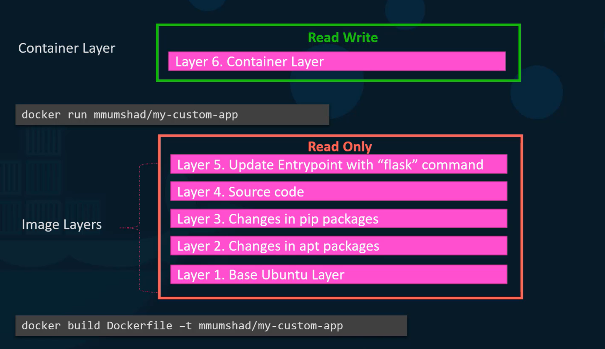
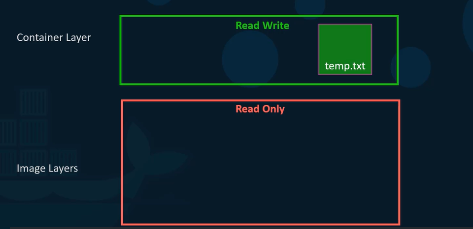
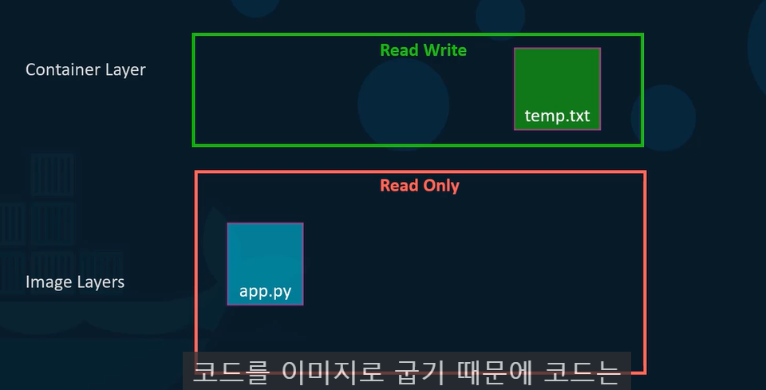
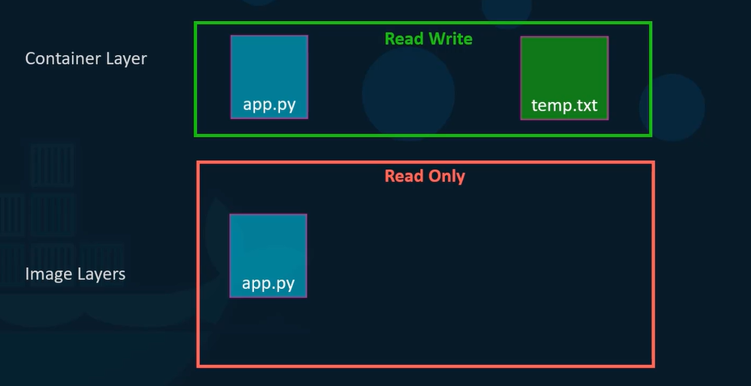
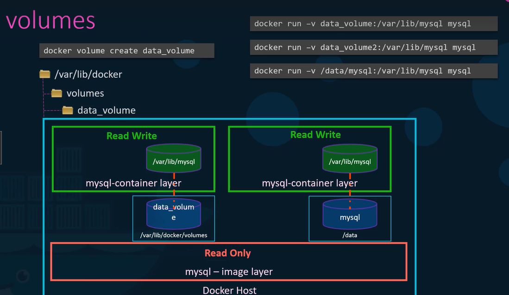
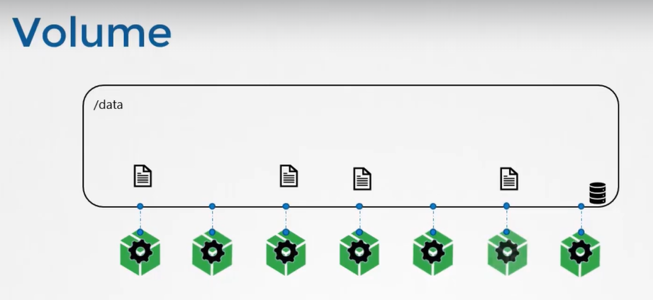
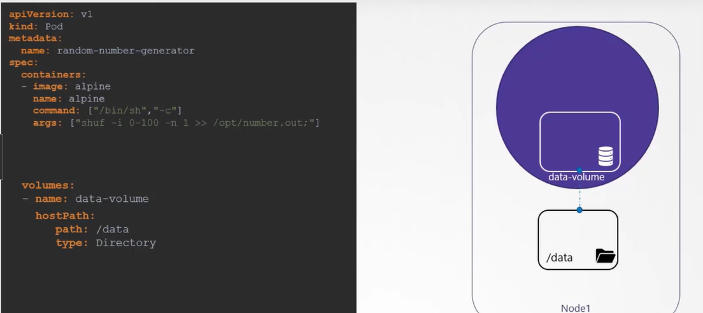
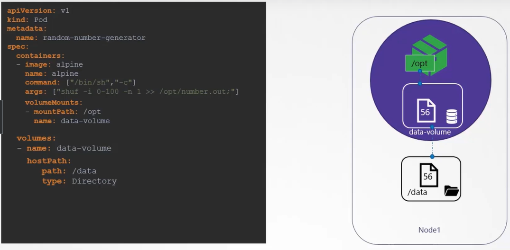
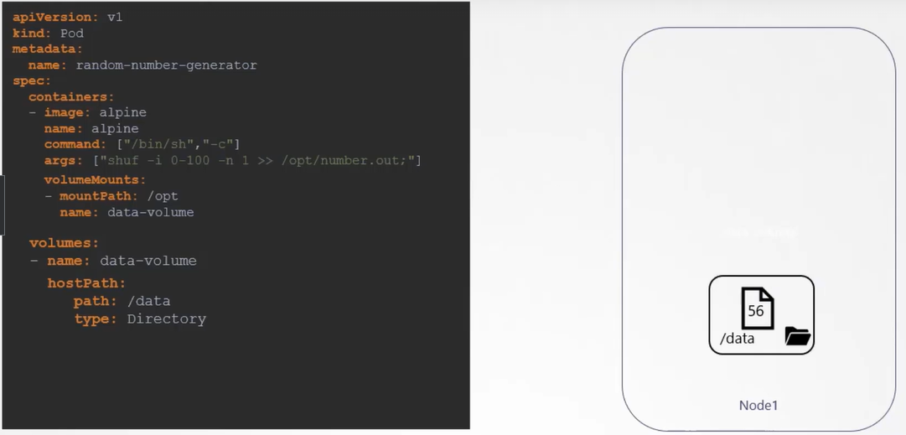

## Introduction to Docker Storage

| Docker로 Storage가 어떻게 작동하는지

1. Storage Drivers

2. Volume Drivers

## Storage in Docker

| Docker Storage - Storage Drivers

- Docker Storage Drivers와 File system에 대해 이야기
- Docker가 데이터를 어디에, 어떻게 저장하고 Container File System을 어떻게 관리하는지

#### File system

- Docker가 로컬 파일 시스템에 데이터를 어떻게 저장하는지
- 시스템에 Docker를 설치하면 `/var/lib/docker` 경로의 폴더 생성
    - 해당 폴더(/var/lib/docker) 아래에 docker가 기본값으로 모든 데이터를 저장하는 폴더 존재
        - aufs, containers, image, volumes
    - 이때 데이터란 Docker Host에서 실행되는 이미지 및 컨테이너와 관련된 파일
        - Ex. Container와 관련된 파일은 container 폴더에 저장되고, image와 관련된 파일은 모두 image 폴더에 저장, docker container에 의해 생성된 모든 volume은 volumes 폴더에 저장
- Docker는 정확히 어떻게 image 및 container 파일을 저장하는가

#### Layered architecture

- Docker는 image를 구축할 때 layered architecture에 구축
- DockerFile의 각각의 명령줄은 이전 layer에서 변경된 것만으로 Docker image에 새 layer를 만듬

`Dockerfile`
```
FROM Ubuntu
RUN apt-get update && apt-get -y install python
RUN pip install flask flask-mysql
COPY . /opt/source-code
ENTRYPOINT FLASK_APP=/opt/source-code/app.py flask run
```

`docker build Dockerfile -t mmumshad/my-custom-app`

- Docker build 명령어 수행 시 Layered Architecture 생성
    - Layer1. Base Ubuntu Layer (120MB)
        - Ubuntu 운영체제
    - Layer2. Changes in apt package (306MB)
        - apt 패키지 모두 설치
    - Layer3. Changes in pip package (6.3MB)
        - python 패키지 모두 설치
    - Layer4. Source code (229B)
        - 소스 코드 복사
    - Layer5. Update Entrypoint (0B)
        - image의 entrypoint 업데이트
- 각 layer는 이전 layer의 변화만 저장하기 때문에 코드 반영


#### Layered Architecture의 이점

- 아래 application의 dockerfile은 위와 다른 dockerfile을 가지지만 유사
    - 동일한 OS와 동일한 python과 flask 종속성을 사용
    - 다른 application을 생성하기 위해 다른 소스 코드 사용
    - 다른 entrypoint 사용

 
`Dockerfile2`
```
FROM Ubuntu
RUN apt-get update && apt-get -y install python
RUN pip install flask flask-mysql
COPY . /opt/source-code
ENTRYPOINT FLASK_APP=/opt/source-code/app.py flask run
```

`docker build Dockerfile2 -t mmumshad/my-custom-app-2`

- docker build 명령어 수행 시 Layered Architecture 생성
    - 이때 **처음 3 계층은 위와 같기 때문에 Docker는 처음 3 계층을 빌드하지 않고, 캐시에서 첫 번째 application을 위해 만든 Layer1,2,3 가져와 재사용**
        - 그렇기 때문에 **Docker는 image를 더 빨리 만들고 디스크 공간을 효율적으로 절약**하면서 이미지 생성 가능
        - application code(Ex. app.py)를 업데이트하는 경우에도 해당 단계가 적용되어 
    - Layer1. Base Ubuntu Layer (0MB) <= `캐시에서 가져옴`
    - Layer2. Changes in apt package (0MB) <= `캐시에서 가져옴`
    - Layer3. Changes in pip package (0MB) <= `캐시에서 가져옴`
    - Layer4. Source code (229B)
        - 소스 코드 복사
    - Layer5. Update Entrypoint (0B)
        - image의 entrypoint 업데이트

- 위의 모든 Layer는 최종 Docker image를 생성하기 위해 `docker build` 명령을 실행할 때 생성
    - 모두 docker image layer
- 빌드가 완료되면 layer의 내용을 수정할 수 없음
    - 빌드가 완료된 이미지는 읽기만 가능하고 다시 만드는 것을 제외하고는 변경할 수 없음

`docker run mmmshad/my-custom-app`

- 이 이미지에 기반을 둔 container를 실행 명령어(`docker run`) 수행 시 docker는 위 layer를 기반으로 둔 container를 만들고 이미지 레이어 상단에 **쓸 수 있는 새 레이어** 생성
    - 쓰기(write) 가능한 layer는 container에 의해 생성된 데이터를 저장하는데 사용
        - Ex. application이 작성한 로그 파일, container에 의해 생성된 임시 파일, 사용자에 의해 수정된 파일 등
    - Layer6. Container Layer 


- Container가 살아 있으면(live) 해당 레이어도 살아있고, container가 파괴되면 이 레이어와 그 안에 저장된 모든 변화 파괴
- 동일한 Image Layer는 이 이미지를 이용해 생성된 모든 컨테이너가 공유

#### Demo - COPY-ON-WRITE

- 새로 생성된 container에 로그인해 temp.txt라는 새 파일을 생성하면, 파일을 읽고 쓰는 container layer에 생성



- Image layer는 Read only이기 때문에 해당 layer의 어떤 것도 편집할 수 없음
    - Ex. app.py
    - 코드를 이미지로 만들기 때문에 코드는 Image layer의 일부로, container를 실행한 후에만 읽을 수 있음
    - `소스 코드를 수정해 변화를 테스트하길 바라는 경우` => Container layer에 파일 복사본 생성
        - 동일한 Image Layer는 이 이미지로부터 생성된 여러 container 사이에 공유될 수 있음
        - 따라서 container 내부에서 파일을 수정할 수 있지만, 수정된 파일을 docker를 저장하기 전에 읽기 쓰기 계층(Container Layer)에 파일 복사본을 자동으로 만들고 읽기 쓰기 계층의 다른 파일 버전을 수정
        - 읽기 쓰기 레이어에 있는 이 파일에 앞으로 수정 사항 생김 => **Copy-on-Write 메커니즘**




- Image Layer를 읽는다는 건 이 layer의 파일들이 이미지 자체에 수정되지 않는다는 의미
- 따라서 docker build 명령어로 새 이미지를 구축하기 전까지 이미지 동일

#### Container 삭제

- Container를 삭제하면 container layer에 저장된 모든 데이터 삭제
- application에 변화를 준 것으로 임시 파일도 삭제
    - BUT 데이터를 유지하고 싶은 경우 => `Volumes`

#### Volumes

| Database로 작업하는데 container에서 생성된 데이터를 저장하고 싶다면, container에 영구적인 volume 추가 가능

| Container에서 실행한 데이터를 Volume에 저장 (Volume Mount & Bind Mount)

1. Volume 생성
- `docker volume create data_volume` 명령어 실행
    - Docker의 File System 경로인 /var/lib/docker/volumes 아래에 data_volume 이름의 Volume 폴더 생성

2. Docker container 생성 및 실행
- `docker run -v data_volume:/var/lib/mysql mysql`
    - 해당 volume을 docker container 내부에 마운트
    - 이때 `-v` 옵션을 이용해 layer 다시 사용
    - /var/lib/mysql이 sql 저장 데이터의 기본 위치
- 새 container 생성하고 /var/lib/mysql 폴더에 생성한 데이터 volume을 container 안에 마운트
- 데이터베이스가 작성한 모든 데이터는 Docker host에 생성된 volume에 저장
- container가 삭제되어도 데이터는 살아있음

- `docker run을 실행하기 전에 volume을 생성하는 명령을 실행하지 않은 경우`
    - docker run 명령어를 실행해 명령을 실행하면 sql container의 새 instance 생성
        - `docker run -v data_volume2:/var/lib/mysql mysql` 
    - data_volume2는 아직 생성하지 않았는데 docker는 자동으로 data_volume2라는 volume을 만들어 container에 마운트

- `데이터가 이미 다른 곳에 있는 경우` => **Bound Mounting**
    - Ex. Docker host에 외부 저장소가 있고 해당 volume에 데이터베이스를 저장하고 싶음
        - 이 말은 /var/lib/docker/volumes 폴더가 아닌 경우를 의미
    
    - 이 경우 마운트하기 원하는 폴더의 완전한 경로 제공
        - /data/mysql
    - `docker run -v /data/mysql:/var/lib/mysql mysql`
    - container를 생성하고 그 container에 폴더 마운트 



| 즉 Volume Mount와 Bind Mount 존재

- Volume 디렉토리에서 volume mount를 mount => Volume Mount
- Docker host의 어떤 위치에서든 디렉토리 마운트 바인딩 => Bind Mount


| docker run 시 -v 옵션보다 --mount 옵션을 더 사용

1. -v 옵션
`docker run -v data_volume:/var/lib/mysql mysql`

`docker run -v data_volume:/var/lib/mysql mysql`

2. --mount 옵션

`docker run --mount type=bind,source=/data/mysql,target=/var/lib/mysql mysql`

- source: host의 위치
- target: container의 위치

#### Storage Driver

| Storage Driver는 이미지와 컨테이너의 저장소를 관리하도록 도움

- layered architecture를 유지하고, 쓸 수 있는 layer를 생성하고, layer를 가로질러 파일을 이동해 복사와 쓰기를 가능하게 하는 것은 Storage Driver
- Docker는 storage driver를 이용해 layered architecture를 가능하게 함
- 일반적인 Storage Drivers
    - AUFS
    - ZFS
    - BTRFS
    - Device Mapper
    - Overlay
    - Overlay2
- Storage driver의 선택은 OS의 사용에 따라 달라짐
    - Ex. Ubuntu의 기본 Storage driver는 AUFS로, 다른 OS에서는 AUFS 사용 불가능
    - Docker는 OS에 근거해 자동으로 사용 가능한 최고의 Storage Driver 선택
    - Storage driver마다 다른 성능과 안정성 특성 제공


## Volume Driver Plugins in Docker

| Docker Storage - Volume Drivers

#### Strage Driver

| Storage Driver는 이미지와 컨테이너의 저장소를 관리하도록 도움

- 저장소를 유지하려면 Volume을 만들어야 함
- Volume은 Storage Driver가 처리하지 않음 => Volume Drivers Plugin으로 처리

#### Volume Driver

| Volume 처리

- 기본 Volume Driver 플러그인은 Local
- Local Volume Plugin은 Docker host에 volume 생성을 도와 그 데이터를 /var/lib/docker/volume 디렉토리 아래에 저장
- 많은 다른 volume driver 플러그인이 타사 솔루션에서 volume을 생성하도록 해줌
    - Ex. Azure File Storage, Convoy, DigitalOcean Block Storage, Flocker, gce-docker, GlusterFS, NetApp, RexRay, Portworx, VMware vSphere Storage

- 일부 volume driver는 다른 storage driver 지원

#### Volume Drivers

`docker run -it --name mysql --volume-driver rexray/ebs --mount src=ebs-vol,target=/var/lib/mysql mysql`

- Docker container를 실행할 때 아마존 EBS에서 volume을 공급하기 위해 REX-Ray EBS 같은 특정 volume driver를 선택할 수 있음
- 이 경우 container가 생성되고 AWS Cloud에서 volume 부착 가능
- container가 삭제되어도 클라우드에 데이터 저장

## Container Storage Interface (CSI)

- Kubernetes는 docker를 container runtime engine으로 사용했고, docker와 작동하는 모든 코드는 kubernetes의 소스 코드에 내장되어 있었음
- rkt나 cri-o 같은 container runtime engine이 들어오면서 다른 container runtime을 작업하기 위해 kubernetes에 의존하지 않고 지원을 열고 확장하는 것이 중요해짐 => `Container Runtime Interface` 등장

#### Container Runtime Interface

- Kubernetes와 같은 오케스트레이션 솔루션이 Docker 같은 container runtime과 어떻게 동신할지 정의하는 표준 인터페이스
- 어떤 container runtime interface든 cri 표준만 따르면 그 새로운 container runtime engine은 소스 코드와 접촉할 필요 없이 kubernetes와 작동 가능

#### Container Network Interface

- 네트워킹 솔루션 지원을 확장하기 위해 container network interface 존재
    - Ex. weaveworks, flannel, cilium

#### Container Storage Interface

- 다중 Storage 솔루션을 지원하도록 개발
- CSI 덕분에 Storage에 driver를 만들어 kubernetes와 작업 가능
    - Ex. portworx, Amazon EBS, Dell EMC, GlusterFS
- CSI는 kubernetes 특성이 아닌 유니버셜 표준
- 구현되면 지원되는 플러그인을 가진 storage 공급업체와 작동하는 container 오케스트레이션 도구 허용
- 현재 Kubernetes, Cloud Foundry, Mesos는 CSI와 협력 중

- RPC
    - `CreateVolume`, `DeleteVolume`, `ControllerPublishVolume`
    - Ex. CSI에 따르면 pod가 생성되고 volume이 필요할 때 container orchestration이 createVolume RPC를 호출해 볼륨 이름 같은 세부 사항 전달
    - Ex. Volume이 삭제될 때는 storage driver가 호출되었을 때 array에서 volume을 해체하는 코드 구현해야 함

## Volumes

#### Docker Volume

- Docker container는 일시적인 용도로 아주 짧은 시간동안 사용
- 데이터 처리가 필요할 때 호출되고 끝나면 폐기
- container 안의 데이터도 마찬가지 데이터 처리가 끝나면 즉시 처리

#### Volume

- container로 데이터를 처리하기 위해 container가 생성될 때 volume 하나 붙임
- container로 처리한 데이터는 이 volume에 데이터 저장해 영구적으로 보존
- container가 삭제되어도 그 container에서 생성하고 처리된 데이터는 volume에 남아있음


#### Volumes in Kubernetes

- Kubernetes에서 생성된 pod는 docker container와 마찬가지로 일시적이고, pod가 데이터를 처리하고 삭제할 때 pod가 처리한 데이터도 삭제 => **pod에 volume 부착**
- Pod에 Volume을 부착해 pod에서 생성한 데이터가 volume에 저장
    - pod가 삭제된 후에도 데이터 남아 있음

#### Volumes & Mounts

| Volume의 간단한 구현

- 단일 node의 kubernetes cluster 존재
- 1~100 사이의 랜덤수를 생성하는 pod 생성 후 /opt/number.out 파일 작성
    - pod 내에서는 랜덤수를 생성하고 pod 삭제 시 데이터도 삭제
- Pod로 생성한 데이터를 저장하기 위해 Volume 생성
    - Volume은 Storage 필요
    - Volume 생성할 때 Storage를 다양한 방법으로 구성 가능
        - Ex. host directory 사용 (아래 파일)
            - host directory로 volume에 생성된 파일은 내 node의 디렉토리 데이터에 저장 
            
- Container에서 해당 Volume을 액세스하기 위해 container 내부 디렉토리에 그 volume mount
    - 각 container에서 volumeMounts 필드를 사용해 마운트할 데이터 volume 선택 후 container 내부 경로와 연결 (아래 코드에서는 /opt)
    - 랜덤숫자는 이제 container 안의 /opt에 저장되고, /opt는 데이터 volume 상에 존재
        - 데이터 volume은 host의 /data

    

    - Pod가 삭제되어도 host의 /data에 데이터 존재
    


    ```
    apiVersion: v1
    kind: Pod
    metadata:
        name: random-number-generator
    spec:
        containers:
            - image: alpine
              name: alpine
              command: ["/bin/sh","-c"]
              args: ["shuf -i 0-100 -n 1 >> /opt/number.out;"]
              volumeMounts:
                  - mountPath: /opt
                    name: data-volume
        
        volumes:
            - name: data-volume
              hostPath:
                path: /data
                type: Directory
    ```

#### Volume Types

- 위에서는 hostPath 옵션을 이용해 Volume을 위한 Storage 공간을 host에 직접 설정
- 이는 단일 node에서는 잘 동작하지만, 다중 node cluster에선 권장하지 않음
    - pod는 모든 node에서 /data 디렉토리를 사용하고 모두 동일한 데이터이길 기대하기 때문
    - 외부적으로 복제된 Cluster Storage Solution을 사용하지 않는 한 서버가 다르기 때문에 동일할 수 없음
    - Kubernetes 지원 Storage Solution: NFS, GlusterFS, Flocker, Ceph, AWS Elastic Block Storage Volume(EBS), Azure, Scaleio

- Ex. AWS Elastic Block Storage Volume(EBS)를 구성하기 위해서는 volume의 호스트 경로 필드를 awsElasticBlockStore 필드로 대체하고 volumeID와 파일 시스템 유형 fsType 추가
    - 아래 코드의 volume storage는 AWS EBS에 존재
    
    ```
    volumes:
        - name: data-volume
        awsElasticBlockStore:
            volumeID: [VOLUME ID]
            fsType: ext4
    ```


## Persistent Volumes

## Persistent Volume Claims

## Practice - Persistent Volumes and Persistent Volume Claims

## Storage Class

## Practice - Storage Class
