## Prerequisite - Switching Routing

#### Networking Pre-Requisites

- Switching and Routing

  - Switching
  - Routing
  - Default Gateway

- DNS

  - DNS Configurations on Linux
  - CoreDNS Introduction

- Network Namespaces

- Docker Networking

#### Switching

| 컴퓨터 A와 B가 연결되는 방법

1. Switch는 두 시스템을 포함하는 네트워크를 만듬
2. 네트워크를 Switch에 연결하려면 각 Host interface 필요

   - host에 따라 물리적이거나 가상 interface
   - `ip link` 명령어 사용
     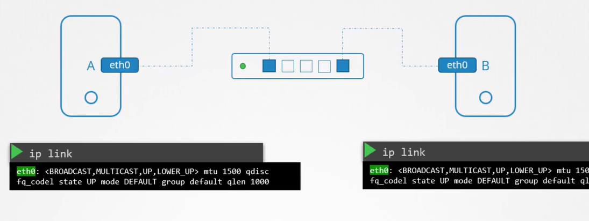

   - eth0 이름의 interface는 스위치에 연결하는 데 사용
   - 네트워크 주소가 192.168.1.0으로 가정

3. 같은 네트워크에 IP 주소로 시스템 할당

   - `ip addr add` 명령어 사용
     - `ip addr add 192.168.1.10/24 dev eth0` and `ip addr add 192.168.1.11/24 dev eth0`

   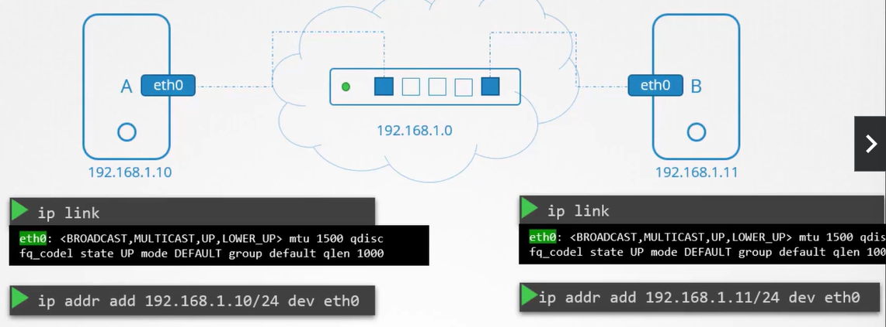

4. Switch를 통해 서로 통신 가능

- 링크가 올라가고 IP 주소 할당되면 서로 통신 가능
- Switch는 Network 내에서만 통신 가능
  - 즉, 네트워크 상의 호스트로부터 packet을 받아 같은 네트워크 내의 다른 시스템으로 전달 수 있음
  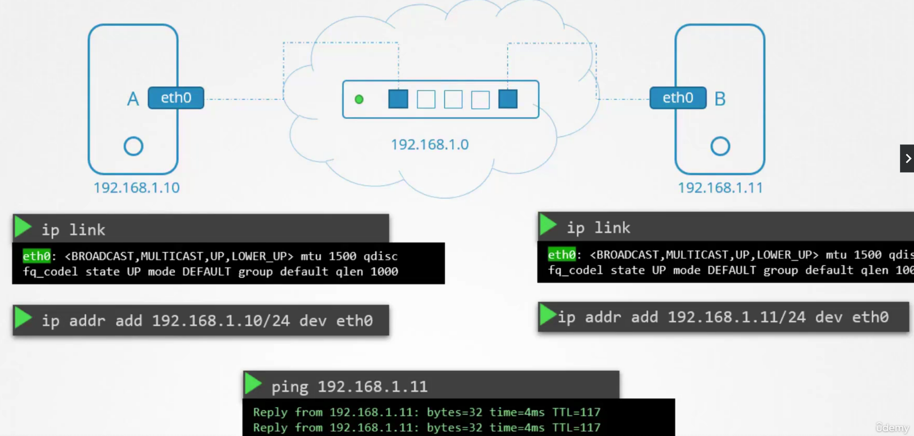

#### Routing

| 한 네트워크의 시스템이 다른 시스템에 도달하는 방법

- Network1 (192.168.1.0)과 Network2 (192.168.2.0) 통신 방법 => `Router` 사용
- Router는 두 Network 연결하는 Intelligence Device
  - 네트워크 포트가 많은 또 다른 서버로 생각할 것
- Router는 두 개별 네트워크는 연결되었기 때문에 각각의 네트워크에 할당된 두 개의 IP를 갖게 됨
  - Network1에서는 192.168.1.1 할당, Network2에서는 192.168.2.1 할당
- 두 네트워크와 연결된 Router가 있기에 두 네트워크는 서로 통신 가능

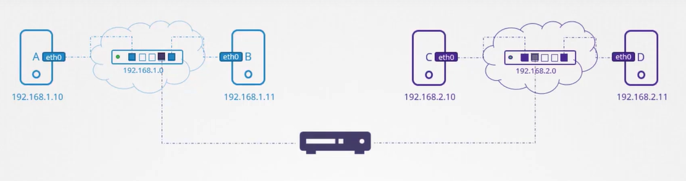

#### Gateway

| 시스템B가 시스템C로 packet을 보내려할 때 router의 위치를 아는 방법

- Router는 네트워크상의 또 다른 장치이므로 다른 장치들도 존재할 수 있음
  => `Gateway` 사용

- Gateway 또는 Root와 함께 시스템을 구성하는 곳
- Network가 방(room)이라면 Gateway는 다른 network나 internet으로 통하는 문

  - 시스템은 그 문의 위치를 알아야 통과할 수 있음
  - 시스템에서 기존 routing 구성을 보려면 `route` 명령어 실행 - Kernel IP routing table 조회 가능 - 현재는 라우팅 구성이 존재하지 않음 => 시스템B가 시스템C로 도달할 수 없음
    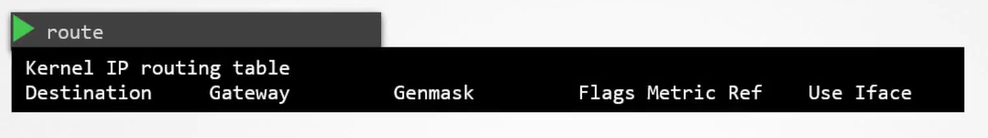

- 시스템B의 Gateway를 구성

  - Network2의 시스템에 도달하기 위해
  - `ip route add 192.168.2.0/24 via 192.168.1.1` 명령어 실행
  - `route` 명령어 실행
    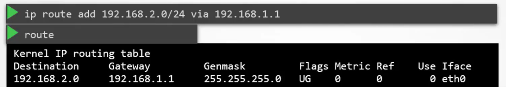

- 이것은 모두 시스템에서 설정되어야 함
  - Ex. 시스템C가 시스템B에 packet을 보내면 시스템C 라우팅 테이블에 route 추가해야 함
  - `ip route add 192.168.1.0/24 via 192.168.2.1`
  - `route`
    

#### Default Gateway

- 이 시스템에 Internet 접속이 필요하다고 가정
  - 172.217.194.0 구글에 접속해야 함

1. Route를 Internet에 연결

`ip route add 172.217.194.0/24 via 192.168.2.1`

2. 네트워크로 가는 모든 트래픽 경로를 라우팅 테이블에 추가

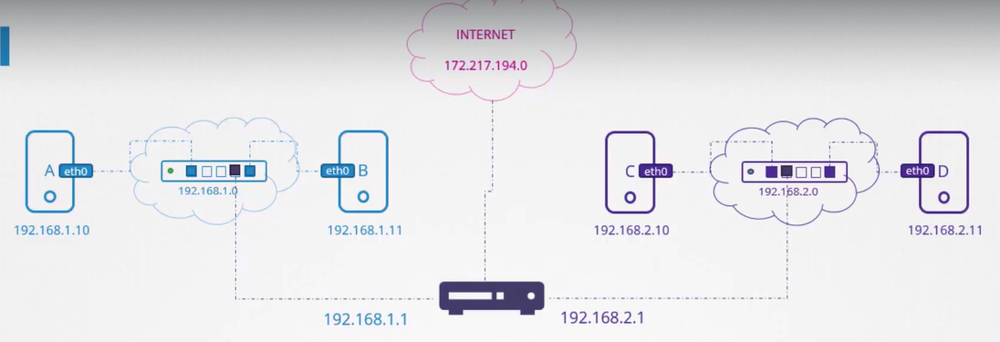

`ip route add default via 192.168.2.1`

- 인터넷 네트워크에 사이트가 많은데, 각 네트워크를 위해 동일한 라우터 IP 주소의 라우팅 테이블 항목을 추가하는 대신 라우터를 모르는 네트워크에 이 라우터를 기본 Gateway로 사용하도록 함

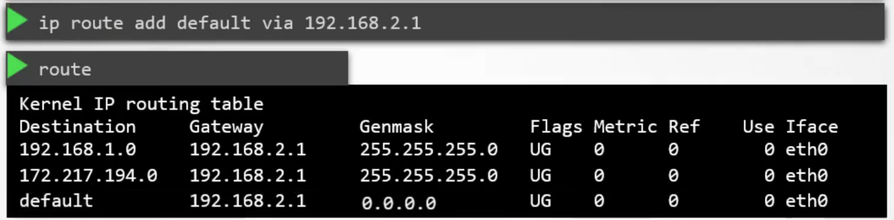

- 기존 네트워크 외의 네트워크에 대한 요청은 이 특정 router로 감
- 이 셋업에서 필요한 것은 단일 **routing table entry router IP address에 대한 기본 gateway 설정**

- 0.0.0.0은 모든 IP destination 의미

- 네트워크가 다중 Router에 존재한다고 가정

  - 하나는 인터넷용, 하나는 내부 사설 네트워크용
  - 각 네트워크에 대해 별개의 entry가 2개 필요
    - 하나는 내부 사설 네트워크에 대한 항목, 하나는 공용 네트워크를 포함한 모든 네트워크에 대한 기본 gateway
  - `ip route add 192.168.1.0/24 via 192.168.2.2`

  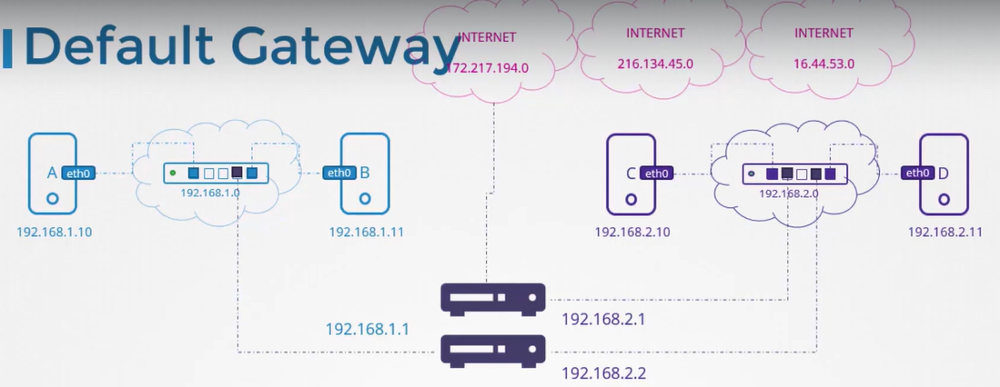

- 따라서 시스템에서 인터넷에 도달하는 데 문제가 있다면 라우팅 테이블과 기본 gateway 구성 확인할 것

#### Linux host를 router로 설정하는 방법

- A,B,C 세 명이 진행
- A와 B는 192.168.1.0 네트워크 IP 주소로 eth0 인터페이스로 연결되고, B와 C는 192.168.2.0 네트워크 IP로 eth1 인터페이스로 연결
  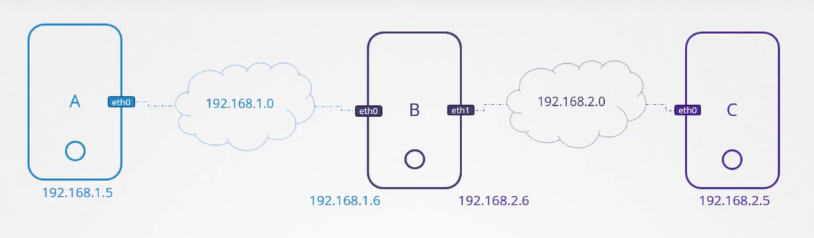

- A와 C 통신하는 방법

  - A에서 `ping 192.168.2.5`로 C에 ping하면, 네트워크에 도달할 수 없다는 메세지 나타남
  - host A는 network2로 가는 gateway가 host B를 통해야 함
    - `ip route add 192.168.2.0/24 via 192.168.1.6`
  - packet이 host C로 가면 hsot C는 host A로 반응을 보내야 함
    - host B를 통해 host A에 도달해야 함 => B는 Router 역할
    - `ip route add 192.168.1.5/24 via 192.168.2.6`
  - 이후 A에서 `ping 192.168.2.5`로 C에 ping => 오류 메세지 안 나타남. **BUT 응답 없음**
    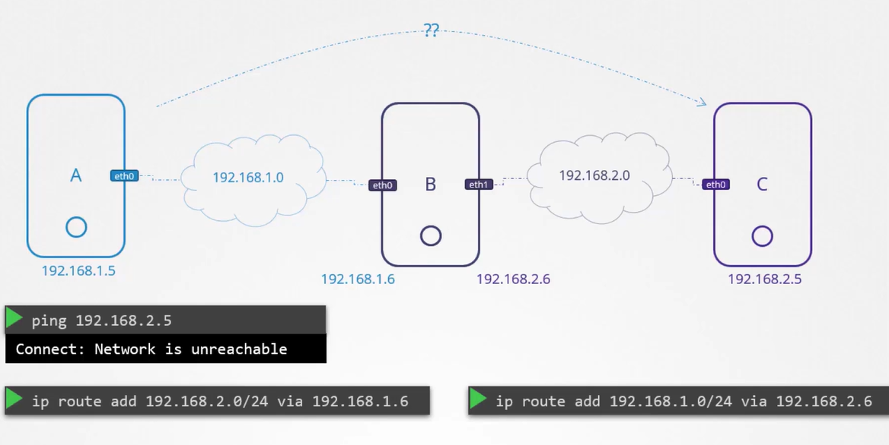

- A에서 응답을 받을 수 없는 이유
  - 기본적으로 Linux에서 **packet은 한 interface에서 다음 interface로 전달되지 않음**
  - Ex. host B에서 eth0으로 받은 packet은 eth1을 통해 다른 곳으로 전달되지 않음
  - host가 interface 간 packet을 전달할 수 있는지 여부는 시스템의 설정에 따라 통제됨
    - `cat /proc/sys/net/ipv4/ip_forward`
      - 0은 전달될 수 없다는 것을 의미
    - 다른 interface로 전달하고 싶은 경우 `echo 1 > /proc/sys/net/ipv4/ip_forward`
    - BUT 이것만으로 interface 설정이 변경되고 저장되는 것은 아님
    - `/etc/sysctl.conf` 파일에 `net.ipv4.ip_forward = 1`로 수정해야 해당 설정 저장

#### Take Aways

| 명령어

`ip link`

- host에서 interface를 조정해 나열

`ip addr`

- 해당 interface에 할당된 IP 주소 조회

`ip addr add 192.168.1.10/24 dev eth0`

- interface에서 IP 주소를 설정하는 데 사용
- 해당 명령어로 변경한 것은 재시작 때까지만 유효
  - 변화를 지속하고 싶다면 /etc/network/interfaces 파일 수정

`ip route` or `route`

- routing table 조회

`ip route add 192.168.1.0/24 via 192.168.2.1`

- routing table에 항목 추가

`cat /proc/sys/net/ipv4/ip_forward`

- host에서 IP forward 가능한지 확인
- host가 router로 구성된 경우

## Prerequisite - DNS

#### Name Resolution

- 컴퓨터 A와 B 존재

  - 같은 네트워크(192.168.1.0)의 일부이고, interface eth0 사용
  - 컴퓨터 A는 192.168.1.10, B는 192.168.1.11 IP 주소 할당
  - A에서 `ping 192.168.1.11` 명령어 수행 시 정상적으로 ping 가능
  - B에는 데이터베이스 서비스 존재해 ip 주소를 기억하는 대신 db라는 이름 붙임
  - A에서 B의 주소와 이름 저장
    - `cat >> /etc/hosts`에 B의 주소와 이름 저장
  - A에서 `ping db`
    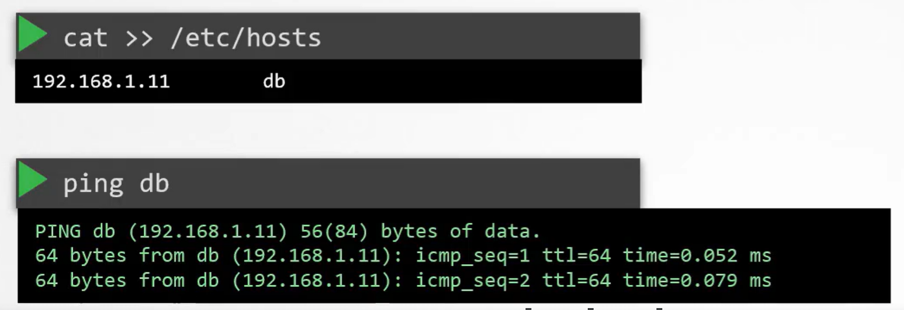

  - BUT host B의 실제 hostname이 db가 아닐 수 있고, 같은 맥락으로 /etc/hosts를 수정해 host A를 속일 수 있음
    - 아래와 같이 www.google.com으로 저장하고 `ping www.google.com`을 하면 host B에서 응답이 옴
    - 같은 IP 주소에 두 개의 이름 존재해 어떤 이름으로든 host B에 접근할 수 있음
    - `ping db`,`ssh db`, `curl http://www.google.com`과 같이 다른 host에 접근할 때 항상 /etc/hosts 파일을 검토해 해당 host의 IP 주소를 찾음
    - 이렇게 host name을 IP address로 해석하는 것을 `Name Resolution`이라고 함

  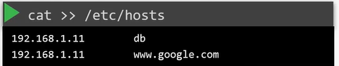

#### DNS

- 소수의 시스템으로 구성된 작은 네트워크 안의 /etc/hosts 파일을 통해 엔트리를 쉽게 얻을 수 있음

  - 각 시스템에서 환경에 있는 다른 시스템 이름을 각 /etc/hosts에서 설정했지만, 시스템이 커질 수록 서버 중 하나의 IP가 변경되면 모든 시스템의 항목을 수정해야 하는 문제 발생
    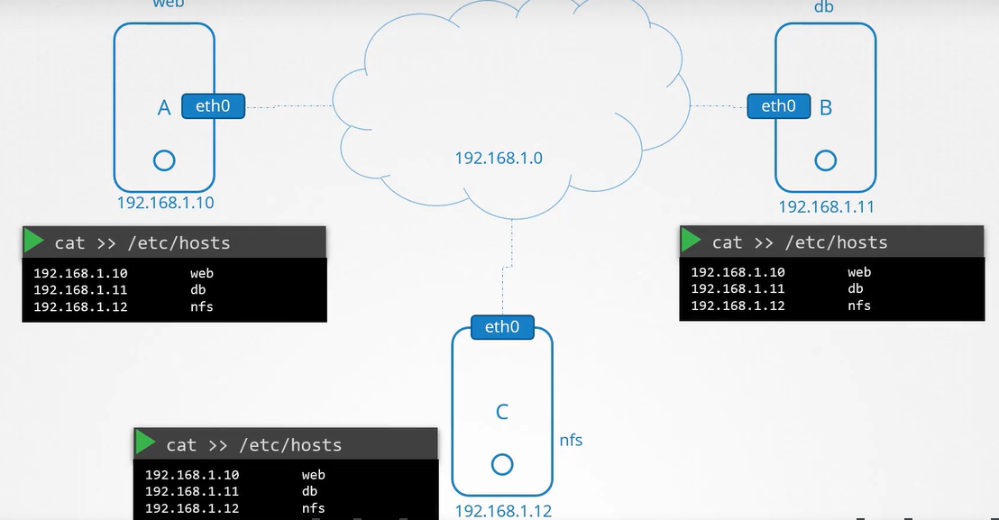

  - 따라서 모든 항목을 중앙에서 관리하도록 변경 => `DNS Server`
    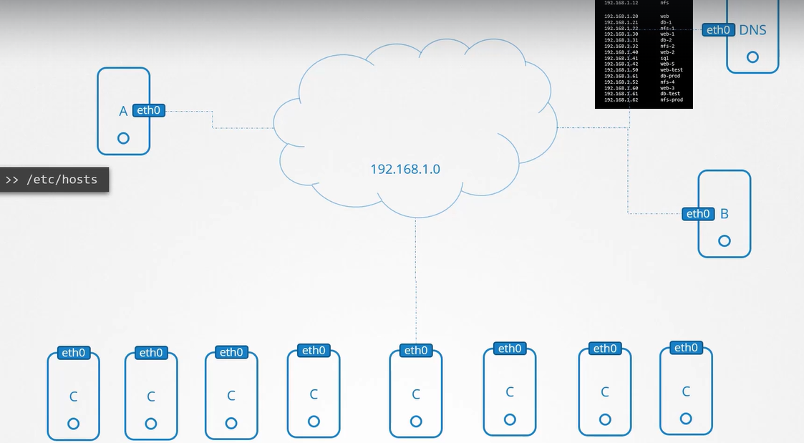

- DNS Server

  - 모든 host를 지정해 해당 서버를 찾도록 함
  - host 파일 대신 host 이름으로 IP 주소를 확인해야 하는 경우 DNS 사용

- Host를 DNS 서버로 전송하는 방법

  - DNS Server의 IP 주소는 192.168.1.100
  - 모든 host는 DNS resolution config file 존재 => /etc/resolv.conf
  - `/etc/resolv.conf`에 DNS Server IP 지정 - 이름은 nameserver, IP address 지정
    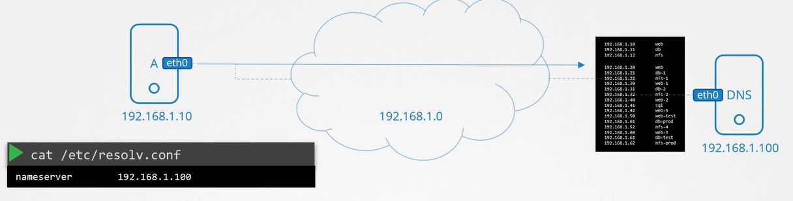

  - 모든 host에서 구성되면 본인(host)이 모르는 host 이름을 마주칠 때마다 DNS Server에서 확인
  - Host의 IP가 변경되면 간단히 DNS Server 업데이트
    - 그럼 모든 host는 앞으로 새 IP 주소 확인

- DNS Server가 있으므로 각 host들은 /etc/hosts에 다른 host의 이름과 주소를 저장할 필요 없음

  - BUT 필요에 따라 원하는 서버 프로비전 가능 - DNS Server에도 추가되지 않고 해당 Host만 저장할 수도 있음 - 그러한 경우 다른 host에서 동일하게 `ping test`하면 해당 host를 찾을 수 없다는 메세지 발생
    

- 시스템은 자신의 local hosts 파일(/etc/hosts)과 DNS Server로부터 host 이름을 IP와 매핑해 사용할 수 있음

  - BUT /etc/hosts와 DNS Server에 동시에 존재하는 경우, /etc/hosts 파일 먼저 본 후 찾을 수 없으면 DNS Server에서 찾음
  - 즉, /etc/hosts와 DNS Server의 이름과 IP 매핑이 다르면 /etc/hosts를 따름
  - 이때 순서는 변경할 수 있음 => `cat /etc/nsswitch.conf` - 아래는 file(/etc/hosts) -> dns(DNS Server) 확인하는 순서
    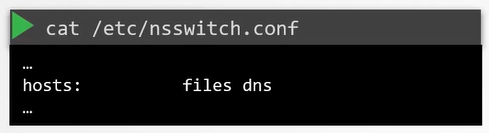

- 두 목록에 모두 없는 이름을 ping하면 fail

  - Ex. `ping www.facebook.com`
    

  - 8.8.8.8은 인터넷에서 사용 가능한 일반적인 nameserver로 google이 hosts

    - 인터넷의 모든 웹사이트를 알고 있음

    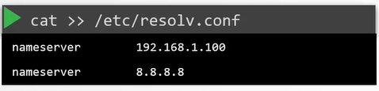

  - 하나의 hosts 내에 구성된 nameserver로 가질 수 있지만 네트워크에 있는 모든 hosts에 구성해야함
    - DNS Server 자체를 구성해 미지의 host 이름을 인터넷에 있는 Public nameserver로 보낼 수 있음

  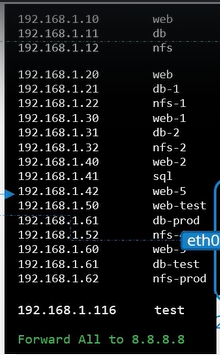

        - ping 가능

  

#### Domain Names

- 지금까지는 웹, NFS, DB와 같은 시스템을 살펴봤는데, 직전에 ping한 www.facebook.com은 Domain name

- Damain name이란 IP가 공용 인터넷에서 사람이 기억할 수 있는 이름으로 전환되는 방법
- Domain 이름의 마지막 부분
    - 웹사이트의 취지를 나타냄
    - 상용 또는 일반 목적, 교육 목적, 비영리 단체 등

    

- Ex. www.google.com
    - google은 google에 할당된 도메인 이름이고, www는 서브 도메인
    - 필요에 따라 서브 도메인 변경 가능 
        - Ex. www, maps, drive, mail, apps
    - apps.google.com 검색
        - `Org DNS` 서버로 해결
        - `Root DNS` 서버는 요청을 보고 서비스하는 DNS 서버를 가리킴
            - 앱을 서빙하는 서버의 IP 제공

        - `.com DNS` 서버는 앞으로의 결과를 신속히 처리하기 위해 Org DNS 서버는 일정 기간 이 IP를 캐시하는 것을 선택
        - `Google DNS` 서버

- `Org DNS` => mycompany.com
    - drive, www, pay, mail, hr
    - DNS Server를 구성하는 파일(/etc/resolv.conf)의 다른 항목을 이해하기 위해 

#### Search Domain

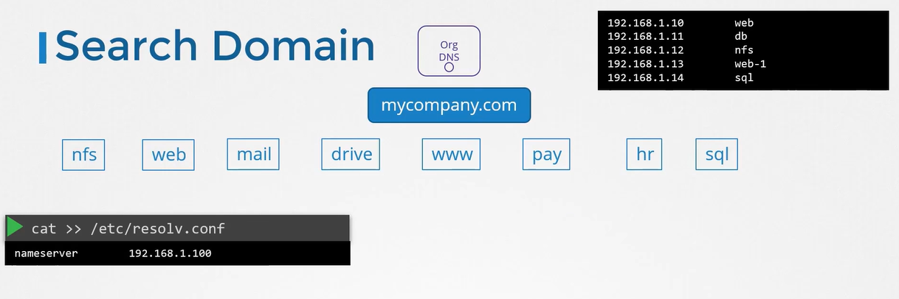


- (DNS Server 변경) 외부인의 경우, web이 아닌 web.mycompany.com으로 접근해야 함


- (Hosts의 /etc/resolv.conf 변경) search 추가

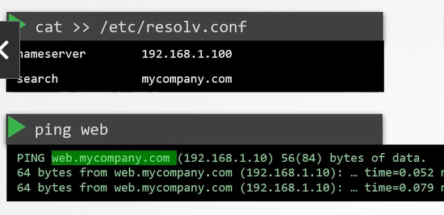

#### Record Types

- `A`
    - Host 이름으로 IP 저장

- `AAAA`
    - Host 이름으로 IPv6를 저장

- `CNAME`
    - 하나의 이름과 다른 이름을 연결

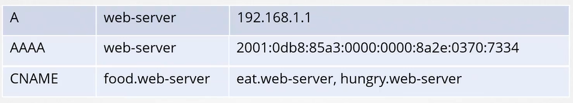

#### nslookup

- ping은 DNS를 테스트하는데 항상 옳지 않을 수 있음
- nslookup을 이용해 DNS Server에서 host 이름을 쿼리할 수 있음
    - `nslookup www.google.com`
    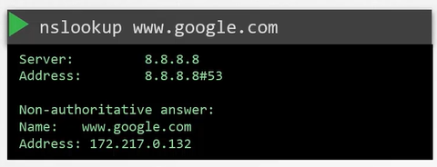

- nslookup은 로컬 호스트 파일의 항목을 고려하지 않음
    - DNS Server만 조사

#### dig

- DNS 이름을 테스트하는 또다른 도구
    - `dig www.google.com`
    

- 서버에 저장된 것과 유사한 형태로 세부사항 더 반환

## Prerequisite - Network Namespaces

- Network Namespace는 Docker 같은 container가 네트워크 격리를 구현하기 위해 사용

#### Namespace

| 간단한 Host

- container는 namespace를 이용해 기본 host에서 분리
- host가 집이라면 namespace는 아이에게 할당하는 방을 의미
    - 방은 모든 아이에게 사생활 제공
        - 아이들은 집에 본인들만 산다고 생각
    - 부모는 집 안의 모든 방을 볼 수 있음
        - 원한다면 방 2개를 연결할 수 있음

#### Process Namespace

- container를 만들 때 host에 다른 process나 다른 container가 보이지 않도록 격리되도록 해야 함
    - 따라서 `namespace`를 이용해 host에 특별한 방 만듬
- container와 관련해서 container가 실행하는 프로세스만 보고 자기 host에 있다고 생각
- 기본 host는 모든 프로세스에 대한 가시성을 가짐
    - container에서 실행되는 것 포함
    - `ps aux`

- container 내부에서 실행할 때와 host에서 실행할 때 같은 프로세스여도 PID 다름
    - namespace 원리

    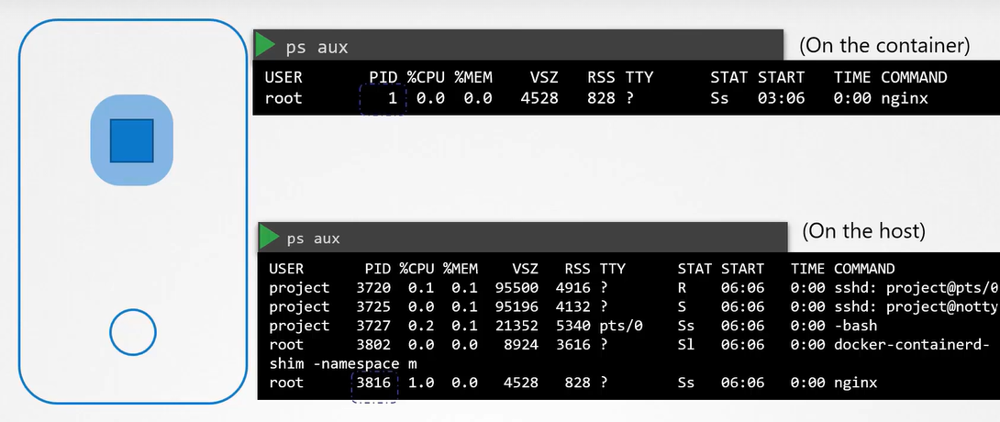

#### Network Namespace

- host는 로컬 지역 네트워크에 연결하는 고유 interface 존재
- host는 고유의 라우팅과 ARP 테이블이 있고 나머지 네트워크에 대한 정보도 가지고 있음

    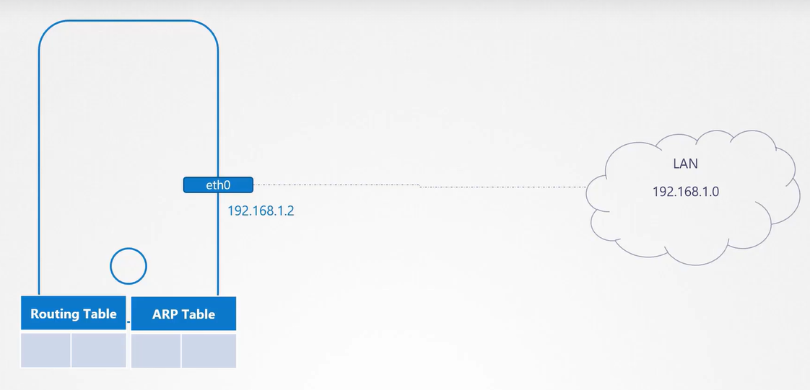

- container에서는 host에 있는 모든 정보를 봉인해야 함
    - container가 생성되면 container를 위한 네트워크 namespace 생성
    - host의 네트워크 관련 정보에 대한 표시가 없도록
    - namespace 내에서 container는 `고유의 가상 interface, 라우팅, ARP 테이블`을 가질 수 있음 

    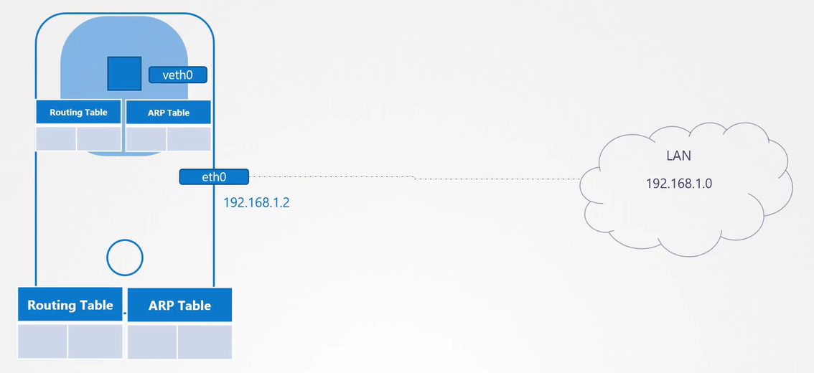

#### Create Network NS

- Linux Host에 새 Network namespace 생성 => `ip netns add` 명령어 실행
    - `ip netns add red`, `ip netns add blue`
- Network namespace 조회
    - `ip netns`

#### EXEC in Network NS

1. interface

- `ip link`
    - Host에서 Interface 열거 
    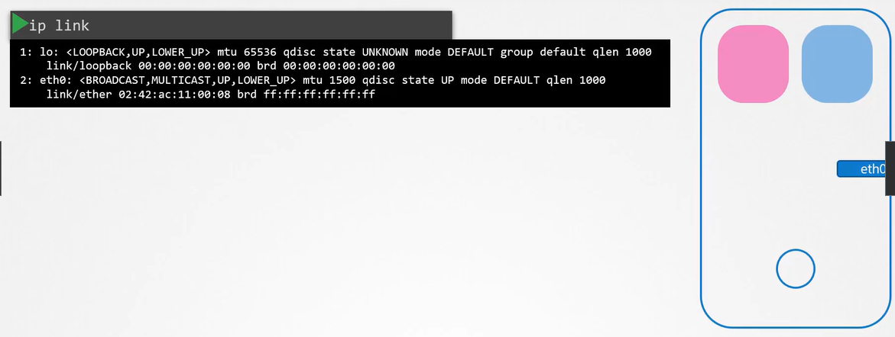

    - host에 LOOPBACK interface와 eth0 interface 존재

- `ip netns exec red ip link`
    - red namespace에서 ip link 실행
    - `ip -n red link`와 동일한 명령어
        - -n 옵션이 더 간단하지만 namespace 안에서 IP 명령을 실행할 때만 작동

    - namespace 내에서 실행했으므로 LOOPBACK interface만 존재하고, host의 interface인 eth0은 보이지 않음
    - namespace는 container가 host interface를 보는 것을 성공적으로 막음

    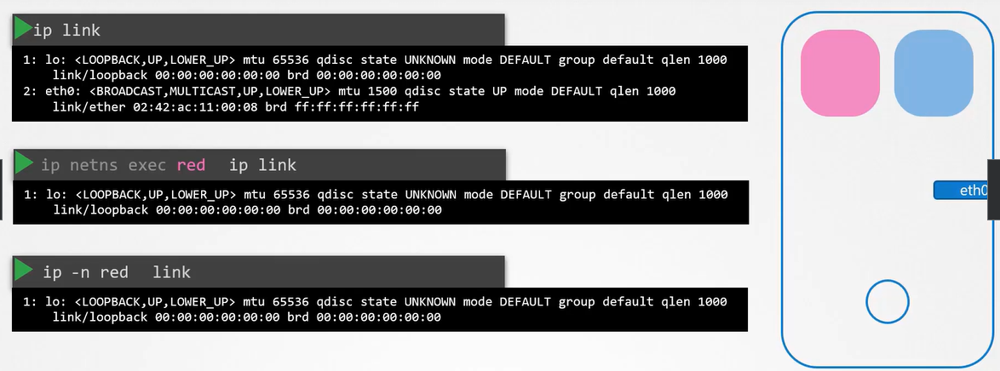 

2. ARP Table

- `arp`
    - Host에서 ARP 테이블 조회

    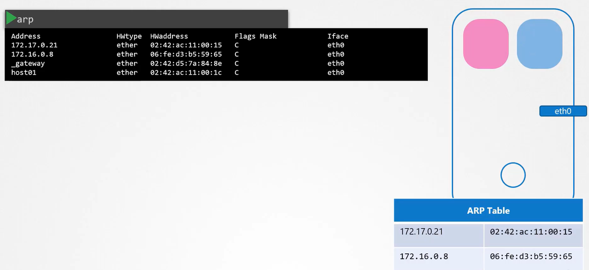

- `ip netns exec red arp`
    - namespace 내에서 arp 명령어 실행
    
    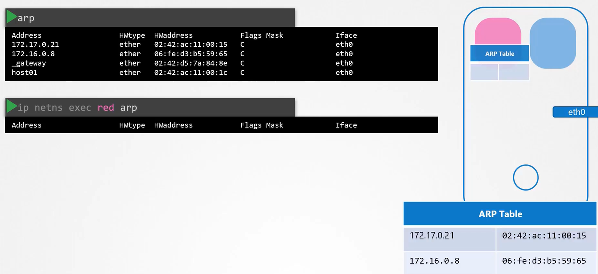

3. Routing Table

- Routing table도 동일하게 동작
    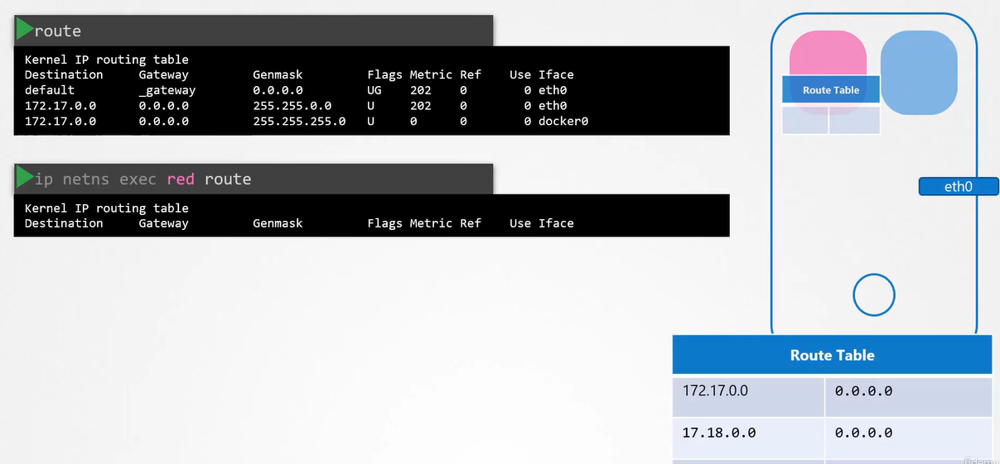

#### Linux Bridge-1

- 현재까지 이 network namespace는 network 연결이 없고 자체 interface가 없으며 기본 host network를 볼 수 없음

- 두 개의 namespace 연결 설정하는 방법
    - 케이블을 이용해 두 개의 물리적 컴퓨터를 연결하고 각 컴퓨터의 인터넷 interface를 연결하듯 가상 이더넷 연결이나 가상 케이블을 사용해 두 개의 namespace 연결 가능
        - 파이프라고 부르지만 양 끝에 2개의 interface가 있는 가상 케이블
        1. 케이블 생성
            - 8기통 타입으로 IP 링크를 연결하고 양쪽 끝을 veth-red와 veth-blue로 설정
            - `ip link add veth-red type veth peer name veth-blue`
            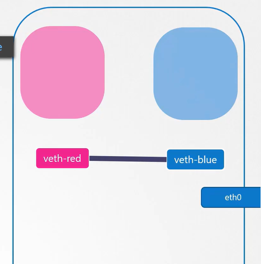

        2. 각 interface를 적절한 namespace에 연결
            - `ip link set veth-red netns red`, `ip link set veth-blue netns blue`
            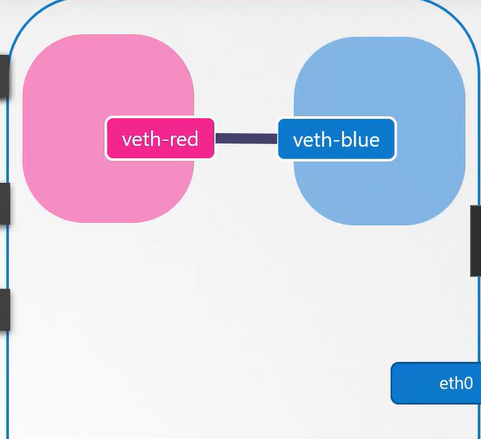

        3. 각각의 namespace에 IP 주소 할당
            - `ip -n red addr add 192.168.15.1 dev veth-red`, `ip -n blue addr add 192.168.15.2 dev veth-blue`
            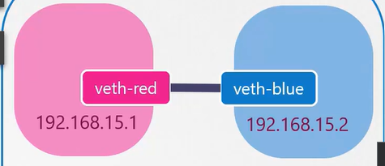

        4. 각각의 namespace 내 장치에 대해 interface 불러옴
            - `ip -n red link set veth-red up`, `ip -n blue link set veth-blue up`

        5. red namespace에서 blue ping
            - `ip netns exec red ping 192.168.15.2`
            - red namespace에서 arp table을 보면 blue 조회 가능
                - `ip netns exec red arp`
            - blue namespace에서 arp table을 보면 red 조회 가능

            - (비교) host arp table
                - 새 namespace나 거기에 생성한 interface 조회 불가능
            
            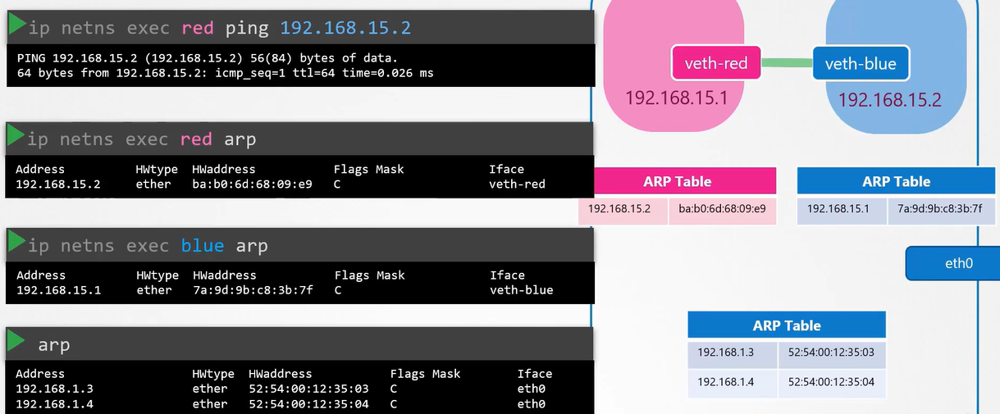


- 직전에는 2개의 namespace만 연결했는데, namespace가 많은 경우 소통하는 방법
    - Host 내부에 가상 네트워크 생성
        - 가상 스위치 필요
        - Host 내에 가상 스위치 생성 후 namespace 연결
    1. Switch 생성
        - Linux Bridge 사용
            - Open vSwitch도 사용 가능
        - Host에 새로운 interface v-net-0 추가 
            - host에 관한 또다른 interface 
            - `ip link add v-net-0 type bridge`
            
        - `ip link`
            - 현재 v-net-0은 down되어있어서 올려줘야 함

        - `ip link set dev v-net-0 up` 
            - v-net-0 UP 상태
            - namespace의 경우 이 interface는 연결할 수 있는 Switch 역할
            - host interface와 namespace의 switch 

        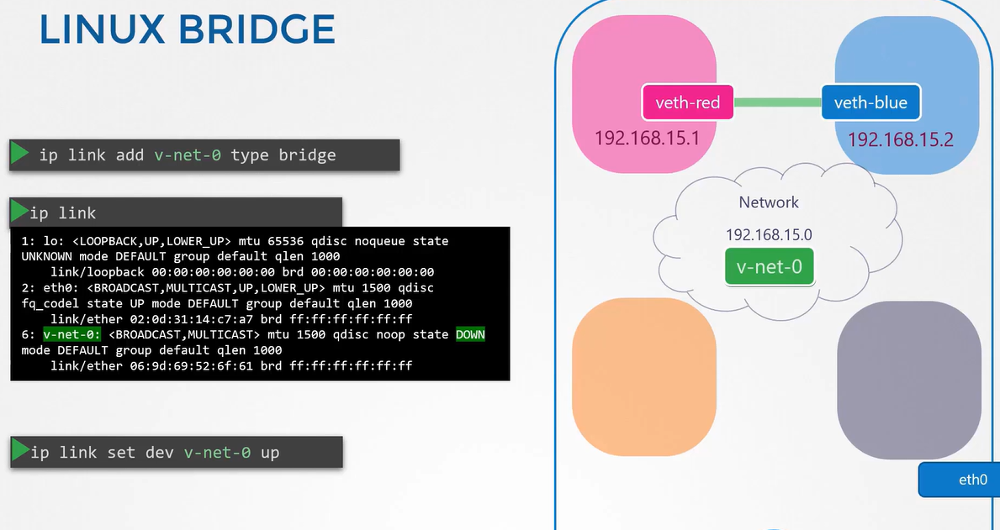

    2. Namespace를 새 가상 네트워크 스위치와 연결
        - 이전에 red와 blue namespace를 연결하는 케이블 생성했음
        - BUT 이제는 브릿지 네트워크와 연결할 것이므로 삭제하고 새 케이블 필요
            - `ip -n red link del veth-red`
                - 한 쪽의 링크만 삭제하면 반대쪽도 자동으로 삭제 (한 쌍이므로)
        - 새 케이블 생성 (namespace와 bridge network 연결)
            - `ip link add veth-red type veth peer name veth-red-br`
                - 이때 veth-red는 red namespace, veth-red-br은 bridge network에 연결
            - `ip link add veth-blue type veth peer name veth-blue-br`
        - 케이블과 namespace 연결
            - `ip link set veth-red netns red`로 red namespace에 veth-red 연결
            - `ip link set veth-red-br master v-net-0`로 bridge network인 v-net-0에 veth-red-br 연결

        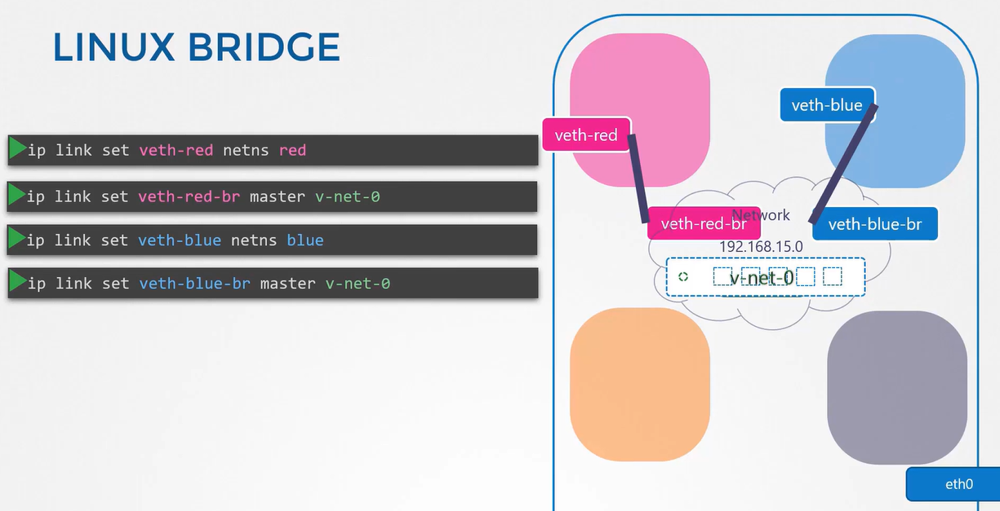

    3. link에 대한 IP 주소 할당
        - `ip -n red addr add 192.168.15.1 dev veth-red`
        - `ip -n blue addr add 192.168.15.2 dev veth-blue`
        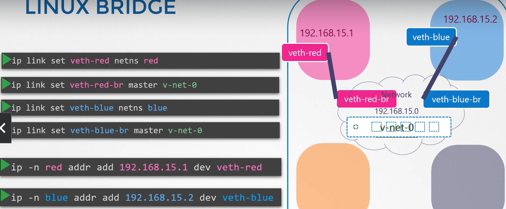


    4. 디바이스 UP
        - container는 네트워크를 통해 서로 닿을 수 있음
        - `ip -n red link set veth-red up`
        - `ip -n blue link set vet-blue up`
        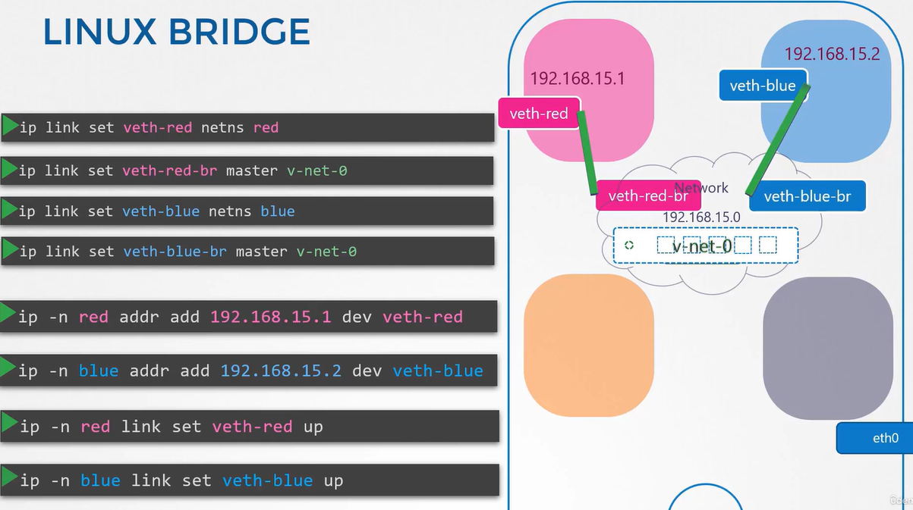

- 위와 같이 남은 2개의 namespace에서도 동일하게 진행
    - 현재 상태에서 namespace 내 interface에 접속하려 `ping 192.168.15.1`하면 fail
    - host는 한 네트워크에 namespace는 다른 네트워크에 존재
    - switch는 host에 대한 네트워크 interface임을 기억
    - 따라서 namespace에 도달할 IP 주소 할당
        - `ip addr add 192.168.15.5/24 dev v-net-0`
    - `ping 192.168.15.1`하면 성공

    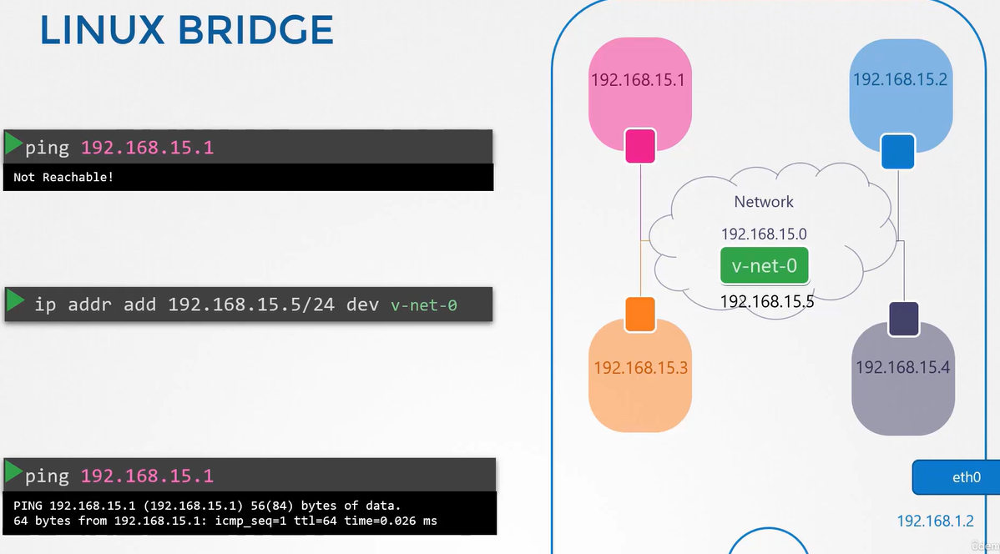

- 이 전체 네트워크는 host 내에서 사적이고 제한되어 있음
    - namespace 안에서는 외부와 접촉할 수 없고 외부인은 이 안에 호스팅된 서비스나 애플리케이션에 접근할 수 없음
    - 외부와 통하는 유일한 문은 host의 이더넷 포트
        
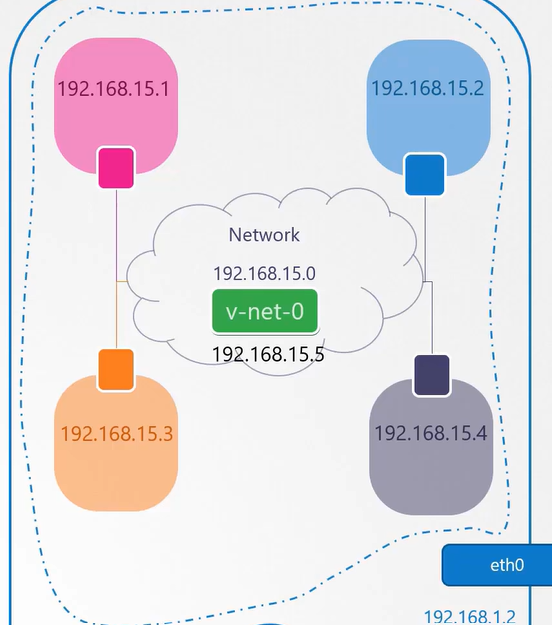

#### Linux Bridge-2

- 이더넷 포트를 통해 라인 네트워크에 도달할 수 있는 브릿지를 구성하는 방법
- 아래의 상황에서 namespace 안에서 이 host로 접근하는 방법

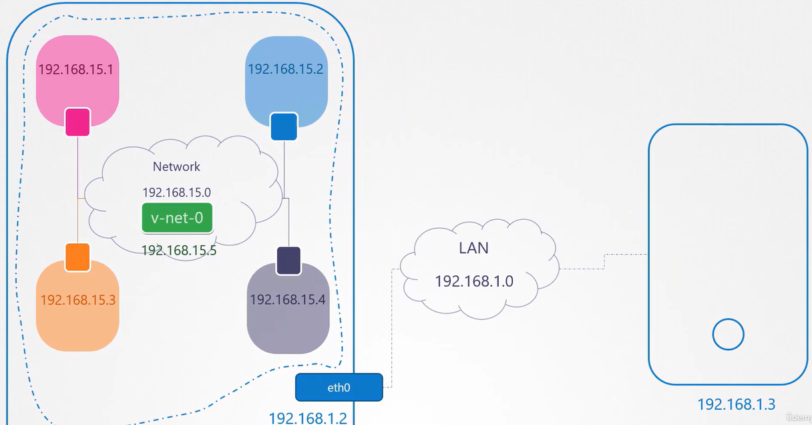

- namespace 내에서 ping 했을 떄는 fail
- `routing table을 추가해야 함`

(다시 정리할 것)

## Prerequisite - Docker Networking

- 단일 Docker host
  - Docker가 설치된 서버
  - eth0 interface와 192.168.1.10 IP 주소 가짐
  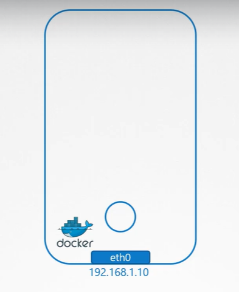

| container를 실행할 떄 선택할 수 있는 네트워킹 옵션 존재

#### Networking Option - None

`docker run --network none nginx`

- Docker container가 어떤 네트워크에도 연결되어 있지 않음
- container는 외부와 닿을 수 없음
  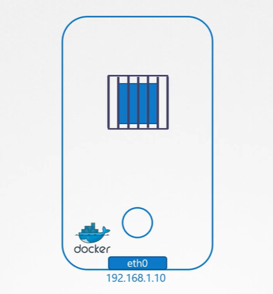
- Multiple container의 경우 서로나 외부와 통신할 수 없음
  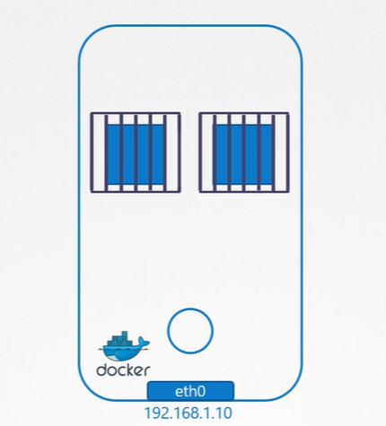

#### Networking Option - Host

`docker run --network host nginx`

- container가 호스트 네트워크에 연결
  - 호스트와 container 사이에 네트워크 격리가 없음
- container 내 port 80에서 수신되는 web application을 배포하면 web application은 port mapping할 필요 없이 host의 port 80에서 사용 가능
  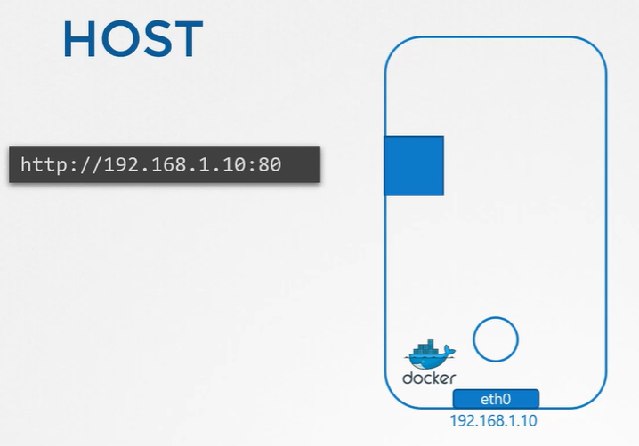
- 같은 port에서 수신하는 같은 container의 다른 instance를 실행하는 경우 호스트 네트워킹을 공유하기 때문에 작동하지 않음
  - 두 프로세스는 동시에 같은 port에서 수신할 수 없음

#### Networking Option - Bridge

| 우리가 주목하는 네트워킹 옵션

`docker run nginx`

- 내부 사설 네트워크인 bridge 생성
  - bridge에 호스트와 container 부착
  - bridge 네트워크 IP 주소는 172.17.0.0
- 네트워크에 연결되는 각 장치는 네트워크의 내부 개인 네트워크 IP 주소를 갖게 됨
  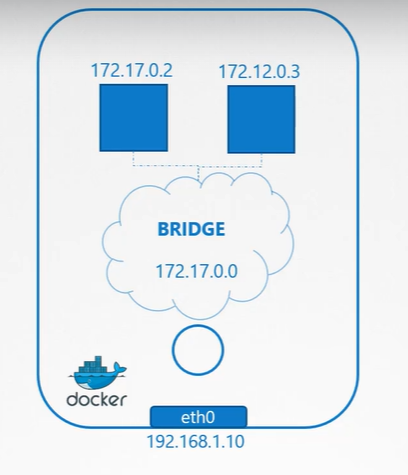

- Bridge Networking 동작

1. Host에 Docker가 설치되면 기본으로 Bridge라는 내부 사설 네트워크 생성
  - `docker network ls`로 docker 내에서 조회 가능
  - `ip link`로 host에서 조회 가능
  - docker는 네트워크를 bridge라는 이름으로 부르지만, host는 해당 네트워크를 docker0라고 부름

2. `ip link add docker0 type bridge`

  - host에서 작동할 물리적 장치 추가
    - bridge 타입으로 설정
    - host에서는 docker0, docker에서는 bridge로 나타남
  - `ip link`에서 docker0 interface가 DOWN된 상태
    - bridge 네트워크는 host interface와 같지만, host 내 namespace나 container의 switch
    - `ip addr`에서 docker0는 IP 할당

    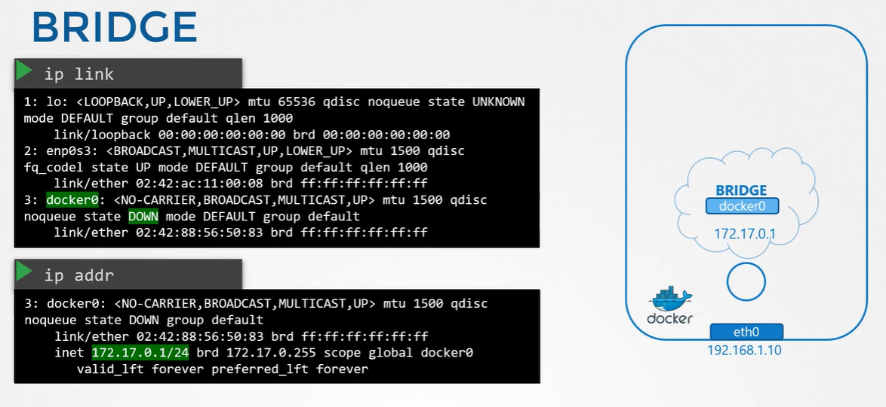

3. container가 생성될 때마다 docker는 그것을 위한 네트워크 namespace 생성

  - `ip netns`로 host에 존재하는 네트워크 namespace 조회
    - namespace는 b3165로 시작
  - `docker inspect [CONTAINER ID]`
    - 각 container와 관련된 namespace 조회 가능

4. Docker container나 네트워크 namespace를 bridge network에 연결
  - 앞으로 container와 네트워크 namespace는 같은 의미
  - 양쪽에 interface가 있는 가상 케이블 
    - docker host에서 `ip link` 명령을 통해 로컬 bridge인 docker0의 interface 조회 가능
      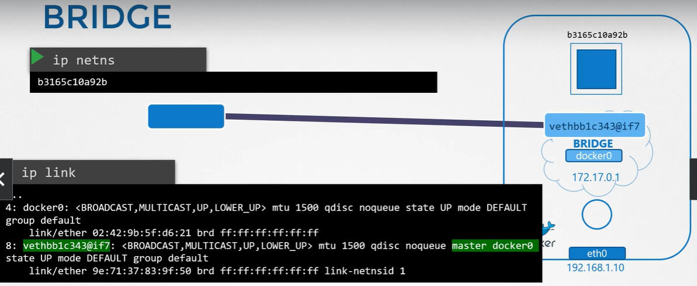
    - `ip -n [NETWORK NAMESPACE] link` 명령어를 통해 네트워크 namespace에서 해당 namespace의 interface 조회
      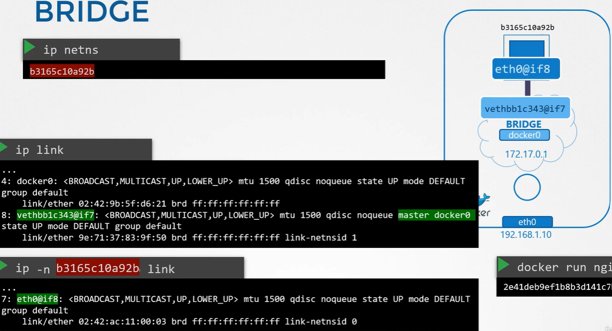

5. interface는 네트워크 내에 할당된 IP 받음
  - `ip -n [NETWORK NAMESPACE] addr`로 할당된 IP 조회 가능
  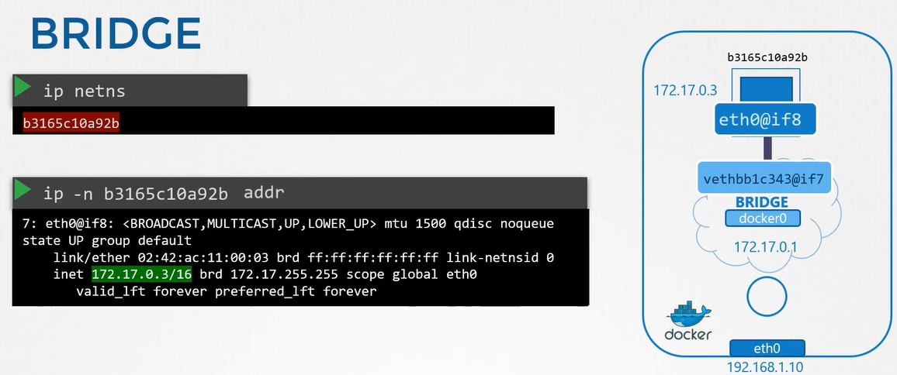


- container가 생성될 때마다 3~5단계 반복 !
  - docker가 namespace 생성, 한 쌍의 interface 생성(하나는 container, 하나는 bridge network)
  - 번호로 interface 쌍 식별 가능 => 짝수는 container, 홀수는 bridge network
  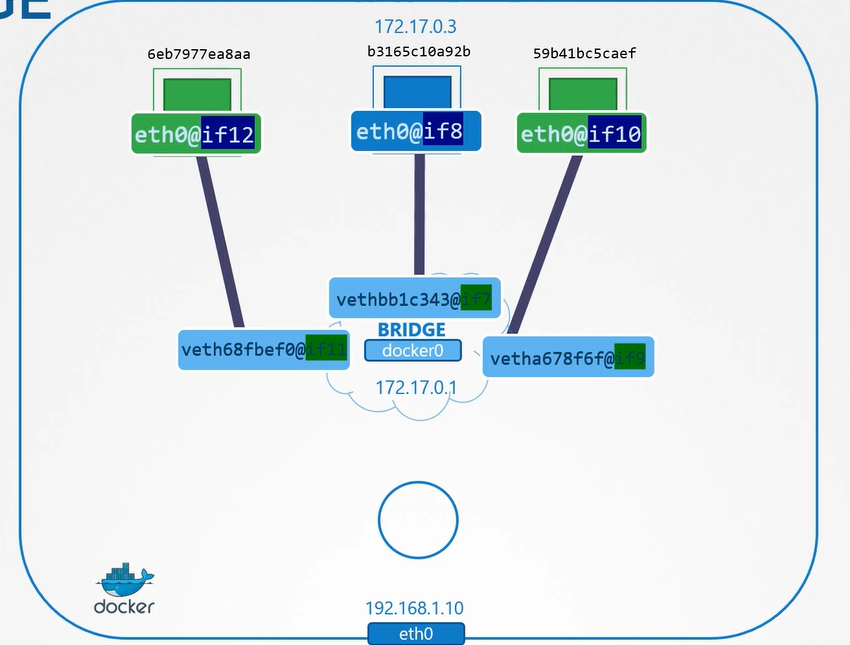
  - 이 과정을 통해 container 사이의 소통 가능


- port 80에서 웹 페이지를 처리하는 web application
- container가 host 내 private 네트워크 내에 있기 때문에 같은 네트워크의 다른 container 혹은 host만이 이 웹페이지를 액세스할 수 있음
  - Docker host 내에서 `curl http://172.17.0.3:80`로 웹페이지 접근 가능
  - host 밖에서 동일한 명령어 수행 시 웹페이지 접근 불가능
  - container에 호스팅된 application에 외부 사용자가 액세스할 수 있도록 Docker는 port 게시 또는 port mapping option 제공
  - container 실행 시 Docker는 Docker port인 8080을 container port 80과 mapping
    - `docker run -p 8080:80 nginx`
  - 외부 사용자와 다른 application 프로그램 또는 서버는 이 URL을 이용해 host에 배포된 application에 액세스 가능
    - `curl http://192.168.1.10:8080`

  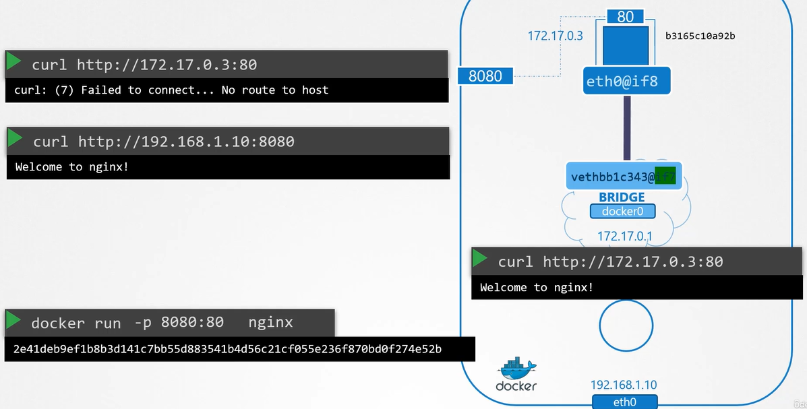

  - BUT 이때 `docker가 port mapping하는 방법`
    - 한 port가 서버의 다른 port로 트래픽을 전달하는 방법
    - NAT 규칙 생성
      - (개념) IP Table을 이용해 NAT Table로 가는 항목을 만들어 사전 루트 체인에 규칙 추가
      - 즉, port를 8080에서 80으로 변경
      - (Docker) Docker chain에 규칙을 추가하고 container의 IP도 포함하도록 목적지 설정
    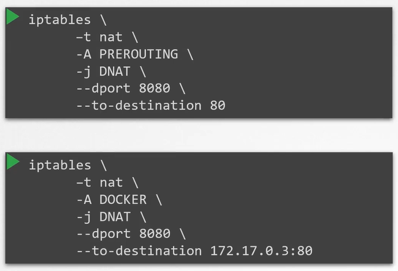

    - `iptables -nvL -t nat`명령어로 Docker가 만든 규칙 조회 가능

## Prerequisite - CNI

#### Network Namespace 동작 방식

1. Create Network Namespace

- 시스템 내에 격리된 네트워크 네임스페이스 환경 생성

2. Create Bridge Network/Interface

- Bridge 네트워크를 통해 다수의 namespace 연결

3. Create VETH Pairs (Pipe, Virtual Cable)

- 양쪽에 가상 interface를 통해 가상 케이블이나 파이프 생성

4. Attach vEth to Namespace

- Bridge와 Namespace 연결

5. Attach Other vEth to Bridge

6. Assign IP Address

7. Bring the interfaces up

8. Enable NAT - IP Masquerade

- NAT이나 IP masquerade로 외부 통신

#### Docker의 네트워킹 - Bridge Networking

1. Create Network Namespace

2. Create Bridge Network/Interface

3. Create VETH Pairs (Pipe, Virtual Cable)

4. Attach vEth to Namespace

5. Attach Other vEth to Bridge

6. Assign IP Address

7. Bring the interfaces up

8. Enable NAT - IP Masquerade

#### Container Network Interface 필요성

- 다른 container solution도 같은 방식으로 네트워킹 진행
  - Ex. Rocket(rkt), Mesos, Kubernetes

- 모두 같은 방식으로 진행하므로 모두가 따를 수 있는 하나의 표준 접근법 생성
  - 솔루션의 네트워킹 아이디어를 모아 하나의 프로그램이나 코드로 옮김
  - 이 네트워크 방식을 `Bridge`라 부름
  - Bridge network에 연결된 container를 얻기 위해 필요한 모든 작업을 수행하는 프로그램이나 스크립트 생성
    - Ex. `bridge add 2e34dcf34 /var/run.netns/2e34dcf34`
      - bridge 이름으로 프로그램 실행하고 특정 네트워크 네임스페이스에 이 container를 추가하고 싶다고 명시
      - bridge 프로그램이 나머지를 처리하고 container runtime 환경은 그 작업에서 해방됨

- 해결해야 하는 문제
  - 새로운 네트워킹 유형을 위한 프로그램을 만들고 싶은 경우 
  - 그러기 위해 어떤 인수와 명령을 지원해야 하는지
  - 현재 container runtime과 맞게 작동하는지
  - 프로그램이 정상적으로 동작하는지

- 위 문제를 해결하기 위해 프로그램의 모습을 정의하는 몇 가지 기준이 정의되어야 함
  - `Container Network Interface` 필요

#### Container Network Interface

- CNI는 container runtime 환경에서 네트워킹 문제를 해결하기 위해 프로그램이 어떻게 개발되어야 하는지 정의하는 표준 집합
  - 이 프로그램을 plugin

- CNI는 plugin이 어떻게 개발되어야 하는지 container runtime이 어떻게 plugin을 호출하는지 정의
- CNI는 container runtime과 plugin에 대한 일련의 책임 정의
  1. Container Runtime

  - Container Runtime must create network namespace
  - Identify network the container must attach to
  - Container Runtime to invoke Network Plugin(bridge) when container is ADDed
  - Container Runtime to invoke Network Plugin(bridge) when container is DELeted
  - JSON format of the Network Configuration

  2. Plugin
  - Must support command line arguments ADD/DEL/CHECK
  - Must support parameters container id, network ns etc
  - Must manage IP Address assignment to PODs
  - Mush Return results in a specific format

- CNI는 이미 지원되는 Plugin 집합을 가짐
  - Ex. Bridge, Vlan, Ipvlan, Macvlan, windows, DHCP, host-local
  
- 타사 조직에서 사용할 수 있는 Plugin
  - Ex. weave, flannel, cilium, nsx

- 단, Docker는 CNI를 만들지 않음
  - Docker는 CNM(Container Network Model)이라는 자체 표준 존재 
  - 네트워킹 문제를 해결하는 것이 목표
  - CNI와 유사하지만 몇 가지 차이가 있어 Plugin은 Docker와 통합되지 않음
  - 따라서 `docker run --network=cni-bridge nginx`와 같이 사용할 수 없음 

- 하지만 Docker를 CNI와 사용할 수 있음
  - `docker run --network=none nginx`로 네트워크 구성 없이 container 생성
  - `bridge add 2e34dcf34 /var/run/netns/2e34dcf34`으로 수동으로 bridge plugin 호출

- Kubernetes도 Docker와 동일하게 동작
  - Docker container 생성 시 none 네트워크로 생성
  - 구성된 CNI Plugin 호출해 나머지 설정 담당

## Cluster Networking

| Kubernetes Cluster에서 Master node와 Worker node에 필요한 네트워킹 구성

#### IP & FQDN

- Kubernetes Cluster에는 Master node와 Worker node 존재
- 각 node는 Network(192.168.1.0)에 연결된 interface(eth0)가 최소 하나 있어야 함
- 각 interface는 반드시 IP Address(Ex.192.168.1.10) 존재
- Host는 고유한 host name(master-01,worker-01,worker-02)과 고유한 MAC 주소(Ex. 02:42:75:98:18:4a) 존재

#### Ports

- 개방해야 하는 port 존재

- Kube-API Server => 6443
  - Master node에 존재
- kubelet => 10250
  - Master node & Worker node
- Kube-Scheduler => 10259
  - Master node
- Kube-Controller-Manager => 10257
  - Master node
- Services => 30000-32767
  - Worker node

- ETCD => 2379
  - Master node

#### Commands

`ip link`

`ip addr`

`ip addr add 192.168.1.10/24 dev eth0`

`ip route`

`ip route add 192.168.1.0/24 via 192.168.2.1`

`cat /proc/sys/net/ipv4/ip_forward`

`arp`

`route`

`netstat -plnt`


## Practice Test - Explore Kubernetes Environment

Q3

`ip addr | grep [IP ADDRESS]`

- 해당 IP interface 탐색
- ip 주소와 ip 주소의 특징에 대한 정보를 출력


Q6

`ssh node01`

Q7

`ip address show type bridge`

- bridge의 interface 조회

Q9

`route`

- routing table 조회

Q10

`netstat -plnt`

- 실행중인 프로그램 조회
- 네트워크 연결 상태, 라우팅 테이블, 인터페이스 상태 등을 보여주는 명령어

Q11

`netstat -npa | grep -i etcd | grep -i 2379 | wc -l`과 `netstat -npa | grep -i etcd | grep -i 2380 | wc -l` 비교


## Pod Networking

| Kubernetes controlplane 구성 요소를 모두 설정했다고 가정

- Node 네트워킹은 완료되었고 Pod 네트워킹은 Kubernetes 빌트인 솔루션이 없고 사용자가 구현해야 함

#### Networking Model

| Kubernetes는 Pod Networking 요건 제시

- Every POD should have an IP Address
- Every POD should be able to communicate with every other POD in the same node
- Every POD should be able to communicate with every other POD on other nodes without NAT 

=> weave, flannel, cilium, nsx와 같은 네트워킹 솔루션 사용 가능

- BUT 스스로 문제 해결해보자

#### Networking Model - 직접 구현

- 3개의 node 존재
  - 모두 192.168.1.0의 일부이고, 각각 192.168.1.11, 192.168.1.12, 192.168.1.13 IP 가짐

1. Container가 만들어지면 Kubernetes는 Network namespace 생성
2. 각 Node에 Bridge network 생성
- 모든 node에 `ip link add v-net-0 type bridge`, `ip link set dev v-net-0 up` 명령어 실행
3. Bridge network에 IP 주소 할당
- 각 bridge network는 자체 subnet으로 설정
- node별로 각각 10.244.1.0/24, 10.244.2.0/24, 10.244.3.0/24로 IP 할당
4. Bridge interface를 위해 IP 주소 할당
- 각 node별로 하나씩 할당 `ip addr 10.244.1.1/24 dev v-net-0`, `ip addr 10.244.2.1/24 dev v-net-0`, `ip addr 10.244.3.1/24 dev v-net-0`

5. 이후는 각 container 별로 동작해야 하므로 script로 작성

`net-script.sh`
```
# Create veth pair
ip link add ....

# Attach veth pair
ip link set ....
ip link set ....

# Assign IP Address
ip -n [NAMESPACE] addr add ....
ip -n [NAMESPACE] route add ....

# Bring Up Interface
ip -n [NAMESPACE] link set ....
```

=> 이제 Pod는 고유한 IP 주소로 같은 Node 내에서의 통신 가능

| 다른 Node의 Pod와도 통신할 수 있어야 함

1. 한 Node에서 다른 모든 Node로의 route 추가

`ip route add 10.244.2.2 via 192.168.1.12`
`ip route add 10.244.3.2 via 192.168.1.13`

2. BUT 위는 구조가 복잡해질수록 복잡

- Router Table로 모든 네트워크의 경로 쉽게 관리 가능

|Network|Gateway|
|:--:|:--:|
|10.244.1.0/24|192.168.1.11|
|10.244.2.0/24|192.168.1.12|
|10.244.3.0/24|192.168.1.13|

#### 정리

- Bridge network와 routing table 수동으로 설정
- 각 container를 네트워크에 연결하기 위한 script 작성 및 수동 동작
  - Kubernetes에 Pod가 생성되면 Script가 자동으로 실행되는 방법 => CNI 사용
  - CNI가 container를 만들자마자 Kubernetes에게 Script 실행하도록 지시
  - Script는 CNI 기준에 맞게 수정해야 함

  `net-script.sh`
  ```
  ADD)
  # Create veth pair
  ip link add ....

  # Attach veth pair
  ip link set ....
  ip link set ....

  # Assign IP Address
  ip -n [NAMESPACE] addr add ....
  ip -n [NAMESPACE] route add ....

  # Bring Up Interface
  ip -n [NAMESPACE] link set ....

  DEL)
  # Delete veth pair
  ip link del ....
  ```

  - container가 생성될 때마다 Container Runtime은 CNI 구성을 보고 실행 -> commandline으로 인수 넘겨 우리 script 이름 식별 -> 스크립트 실행
    - 1. `/etc/cni/net.d/net-script.conflist`
    - 2. `/opt/cni/bin/net-script.sh`
    - 3. `./net-script.sh add [CONTAINER] [NAMESPACE]`

## CNI in kubernetes

## CNI weave

## Practice Test - Explore CNI

