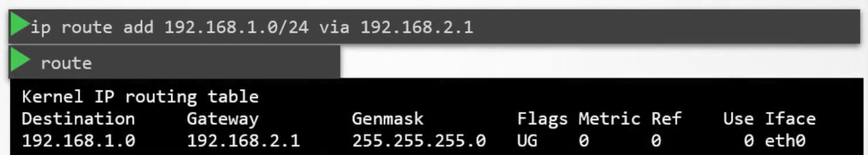
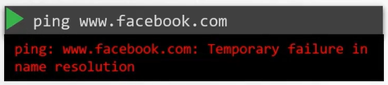
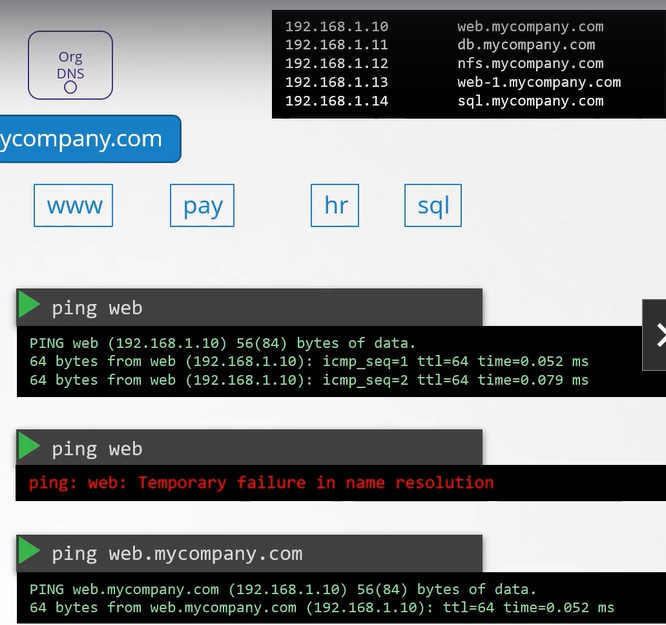
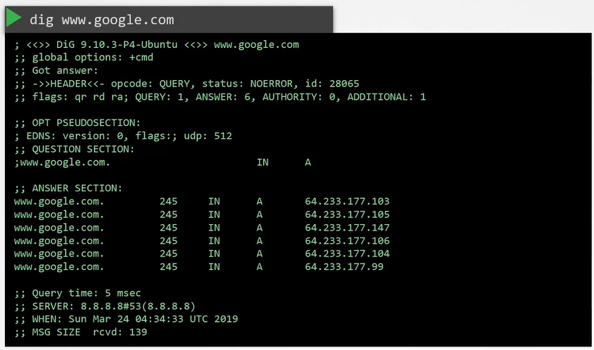

## Prerequisite - Switching Routing

#### Networking Pre-Requisites

- Switching and Routing

  - Switching
  - Routing
  - Default Gateway

- DNS

  - DNS Configurations on Linux
  - CoreDNS Introduction

- Network Namespaces

- Docker Networking

#### Switching

| 컴퓨터 A와 B가 연결되는 방법

1. Switch는 두 시스템을 포함하는 네트워크를 만듬
2. 네트워크를 Switch에 연결하려면 각 Host interface 필요

   - host에 따라 물리적이거나 가상 interface
   - `ip link` 명령어 사용
     

   - eth0 이름의 interface는 스위치에 연결하는 데 사용
   - 네트워크 주소가 192.168.1.0으로 가정

3. 같은 네트워크에 IP 주소로 시스템 할당

   - `ip addr add` 명령어 사용
     - `ip addr add 192.168.1.10/24 dev eth0` and `ip addr add 192.168.1.11/24 dev eth0`

   

4. Switch를 통해 서로 통신 가능

- 링크가 올라가고 IP 주소 할당되면 서로 통신 가능
- Switch는 Network 내에서만 통신 가능
  - 즉, 네트워크 상의 호스트로부터 packet을 받아 같은 네트워크 내의 다른 시스템으로 전달 수 있음
  

#### Routing

| 한 네트워크의 시스템이 다른 시스템에 도달하는 방법

- Network1 (192.168.1.0)과 Network2 (192.168.2.0) 통신 방법 => `Router` 사용
- Router는 두 Network 연결하는 Intelligence Device
  - 네트워크 포트가 많은 또 다른 서버로 생각할 것
- Router는 두 개별 네트워크는 연결되었기 때문에 각각의 네트워크에 할당된 두 개의 IP를 갖게 됨
  - Network1에서는 192.168.1.1 할당, Network2에서는 192.168.2.1 할당
- 두 네트워크와 연결된 Router가 있기에 두 네트워크는 서로 통신 가능

#### Gateway

| 시스템B가 시스템C로 packet을 보내려할 때 router의 위치를 아는 방법

- Router는 네트워크상의 또 다른 장치이므로 다른 장치들도 존재할 수 있음
  => `Gateway` 사용

- Gateway 또는 Root와 함께 시스템을 구성하는 곳
- Network가 방(room)이라면 Gateway는 다른 network나 internet으로 통하는 문

  - 시스템은 그 문의 위치를 알아야 통과할 수 있음
  - 시스템에서 기존 routing 구성을 보려면 `route` 명령어 실행 - Kernel IP routing table 조회 가능 - 현재는 라우팅 구성이 존재하지 않음 => 시스템B가 시스템C로 도달할 수 없음
    

- 시스템B의 Gateway를 구성

  - Network2의 시스템에 도달하기 위해
  - `ip route add 192.168.2.0/24 via 192.168.1.1` 명령어 실행
  - `route` 명령어 실행
    

- 이것은 모두 시스템에서 설정되어야 함
  - Ex. 시스템C가 시스템B에 packet을 보내면 시스템C 라우팅 테이블에 route 추가해야 함
  - `ip route add 192.168.1.0/24 via 192.168.2.1`
  - `route`
    

#### Default Gateway

- 이 시스템에 Internet 접속이 필요하다고 가정
  - 172.217.194.0 구글에 접속해야 함

1. Route를 Internet에 연결

`ip route add 172.217.194.0/24 via 192.168.2.1`

2. 네트워크로 가는 모든 트래픽 경로를 라우팅 테이블에 추가

`ip route add default via 192.168.2.1`

- 인터넷 네트워크에 사이트가 많은데, 각 네트워크를 위해 동일한 라우터 IP 주소의 라우팅 테이블 항목을 추가하는 대신 라우터를 모르는 네트워크에 이 라우터를 기본 Gateway로 사용하도록 함

- 기존 네트워크 외의 네트워크에 대한 요청은 이 특정 router로 감
- 이 셋업에서 필요한 것은 단일 **routing table entry router IP address에 대한 기본 gateway 설정**

- 0.0.0.0은 모든 IP destination 의미

- 네트워크가 다중 Router에 존재한다고 가정

  - 하나는 인터넷용, 하나는 내부 사설 네트워크용
  - 각 네트워크에 대해 별개의 entry가 2개 필요
    - 하나는 내부 사설 네트워크에 대한 항목, 하나는 공용 네트워크를 포함한 모든 네트워크에 대한 기본 gateway
  - `ip route add 192.168.1.0/24 via 192.168.2.2`

  

- 따라서 시스템에서 인터넷에 도달하는 데 문제가 있다면 라우팅 테이블과 기본 gateway 구성 확인할 것

####

| Linux host를 router로 설정하는 방법

- A,B,C 세 명이 진행
- A와 B는 192.168.1.0 네트워크 IP 주소로 eth0 인터페이스로 연결되고, B와 C는 192.168.2.0 네트워크 IP로 eth1 인터페이스로 연결
  

- A와 C 통신하는 방법

  - A에서 `ping 192.168.2.5`로 C에 ping하면, 네트워크에 도달할 수 없다는 메세지 나타남
  - host A는 network2로 가는 gateway가 host B를 통해야 함
    - `ip route add 192.168.2.0/24 via 192.168.1.6`
  - packet이 host C로 가면 hsot C는 host A로 반응을 보내야 함
    - host B를 통해 host A에 도달해야 함 => B는 Router 역할
    - `ip route add 192.168.1.5/24 via 192.168.2.6`
  - 이후 A에서 `ping 192.168.2.5`로 C에 ping => 오류 메세지 안 나타남. **BUT 응답 없음**
    

- A에서 응답을 받을 수 없는 이유
  - 기본적으로 Linux에서 **packet은 한 interface에서 다음 interface로 전달되지 않음**
  - Ex. host B에서 eth0으로 받은 packet은 eth1을 통해 다른 곳으로 전달되지 않음
  - host가 interface 간 packet을 전달할 수 있는지 여부는 시스템의 설정에 따라 통제됨
    - `cat /proc/sys/net/ipv4/ip_forward`
      - 0은 전달될 수 없다는 것을 의미
    - 다른 interface로 전달하고 싶은 경우 `echo 1 > /proc/sys/net/ipv4/ip_forward`
    - BUT 이것만으로 interface 설정이 변경되고 저장되는 것은 아님
    - `/etc/sysctl.conf` 파일에 `net.ipv4.ip_forward = 1`로 수정해야 해당 설정 저장

#### Take Aways

| 명령어

`ip link`

- host에서 interface를 조정해 나열

`ip addr`

- 해당 interface에 할당된 IP 주소 조회

`ip addr add 192.168.1.10/24 dev eth0`

- interface에서 IP 주소를 설정하는 데 사용
- 해당 명령어로 변경한 것은 재시작 때까지만 유효
  - 변화를 지속하고 싶다면 /etc/network/interfaces 파일 수정

`ip route` or `route`

- routing table 조회

`ip route add 192.168.1.0/24 via 192.168.2.1`

- routing table에 항목 추가

`cat /proc/sys/net/ipv4/ip_forward`

- host에서 IP forward 가능한지 확인
- host가 router로 구성된 경우

## Prerequisite - DNS

#### Name Resolution

- 컴퓨터 A와 B 존재

  - 같은 네트워크(192.168.1.0)의 일부이고, interface eth0 사용
  - 컴퓨터 A는 192.168.1.10, B는 192.168.1.11 IP 주소 할당
  - A에서 `ping 192.168.1.11` 명령어 수행 시 정상적으로 ping 가능
  - B에는 데이터베이스 서비스 존재해 ip 주소를 기억하는 대신 db라는 이름 붙임
  - A에서 B의 주소와 이름 저장
    - `cat >> /etc/hosts`에 B의 주소와 이름 저장
  - A에서 `ping db`
    

  - BUT host B의 실제 hostname이 db가 아닐 수 있고, 같은 맥락으로 /etc/hosts를 수정해 host A를 속일 수 있음
    - 아래와 같이 www.google.com으로 저장하고 `ping www.google.com`을 하면 host B에서 응답이 옴
    - 같은 IP 주소에 두 개의 이름 존재해 어떤 이름으로든 host B에 접근할 수 있음
    - `ping db`,`ssh db`, `curl http://www.google.com`과 같이 다른 host에 접근할 때 항상 /etc/hosts 파일을 검토해 해당 host의 IP 주소를 찾음
    - 이렇게 host name을 IP address로 해석하는 것을 `Name Resolution`이라고 함

  

#### DNS

- 소수의 시스템으로 구성된 작은 네트워크 안의 /etc/hosts 파일을 통해 엔트리를 쉽게 얻을 수 있음

  - 각 시스템에서 환경에 있는 다른 시스템 이름을 각 /etc/hosts에서 설정했지만, 시스템이 커질 수록 서버 중 하나의 IP가 변경되면 모든 시스템의 항목을 수정해야 하는 문제 발생
    

  - 따라서 모든 항목을 중앙에서 관리하도록 변경 => `DNS Server`
    

- DNS Server

  - 모든 host를 지정해 해당 서버를 찾도록 함
  - host 파일 대신 host 이름으로 IP 주소를 확인해야 하는 경우 DNS 사용

- Host를 DNS 서버로 전송하는 방법

  - DNS Server의 IP 주소는 192.168.1.100
  - 모든 host는 DNS resolution config file 존재 => /etc/resolv.conf
  - `/etc/resolv.conf`에 DNS Server IP 지정 - 이름은 nameserver, IP address 지정
    

  - 모든 host에서 구성되면 본인(host)이 모르는 host 이름을 마주칠 때마다 DNS Server에서 확인
  - Host의 IP가 변경되면 간단히 DNS Server 업데이트
    - 그럼 모든 host는 앞으로 새 IP 주소 확인

- DNS Server가 있으므로 각 host들은 /etc/hosts에 다른 host의 이름과 주소를 저장할 필요 없음

  - BUT 필요에 따라 원하는 서버 프로비전 가능 - DNS Server에도 추가되지 않고 해당 Host만 저장할 수도 있음 - 그러한 경우 다른 host에서 동일하게 `ping test`하면 해당 host를 찾을 수 없다는 메세지 발생
    

- 시스템은 자신의 local hosts 파일(/etc/hosts)과 DNS Server로부터 host 이름을 IP와 매핑해 사용할 수 있음

  - BUT /etc/hosts와 DNS Server에 동시에 존재하는 경우, /etc/hosts 파일 먼저 본 후 찾을 수 없으면 DNS Server에서 찾음
  - 즉, /etc/hosts와 DNS Server의 이름과 IP 매핑이 다르면 /etc/hosts를 따름
  - 이때 순서는 변경할 수 있음 => `cat /etc/nsswitch.conf` - 아래는 file(/etc/hosts) -> dns(DNS Server) 확인하는 순서
    

- 두 목록에 모두 없는 이름을 ping하면 fail

  - Ex. `ping www.facebook.com`
    

  - 8.8.8.8은 인터넷에서 사용 가능한 일반적인 nameserver로 google이 hosts

    - 인터넷의 모든 웹사이트를 알고 있음

    

  - 하나의 hosts 내에 구성된 nameserver로 가질 수 있지만 네트워크에 있는 모든 hosts에 구성해야함
    - DNS Server 자체를 구성해 미지의 host 이름을 인터넷에 있는 Public nameserver로 보낼 수 있음

  

        - ping 가능

  

#### Domain Names

- 지금까지는 웹, NFS, DB와 같은 시스템을 살펴봤는데, 직전에 ping한 www.facebook.com은 Domain name

- Damain name이란 IP가 공용 인터넷에서 사람이 기억할 수 있는 이름으로 전환되는 방법
- Domain 이름의 마지막 부분
    - 웹사이트의 취지를 나타냄
    - 상용 또는 일반 목적, 교육 목적, 비영리 단체 등

    

- Ex. www.google.com
    - google은 google에 할당된 도메인 이름이고, www는 서브 도메인
    - 필요에 따라 서브 도메인 변경 가능 
        - Ex. www, maps, drive, mail, apps
    - apps.google.com 검색
        - `Org DNS` 서버로 해결
        - `Root DNS` 서버는 요청을 보고 서비스하는 DNS 서버를 가리킴
            - 앱을 서빙하는 서버의 IP 제공

        - `.com DNS` 서버는 앞으로의 결과를 신속히 처리하기 위해 Org DNS 서버는 일정 기간 이 IP를 캐시하는 것을 선택
        - `Google DNS` 서버

- `Org DNS` => mycompany.com
    - drive, www, pay, mail, hr
    - DNS Server를 구성하는 파일(/etc/resolv.conf)의 다른 항목을 이해하기 위해 

#### Search Domain

- (DNS Server 변경) 외부인의 경우, web이 아닌 web.mycompany.com으로 접근해야 함

- (Hosts의 /etc/resolv.conf 변경) search 추가

#### Record Types

- `A`
    - Host 이름으로 IP 저장

- `AAAA`
    - Host 이름으로 IPv6를 저장

- `CNAME`
    - 하나의 이름과 다른 이름을 연결

#### nslookup

- ping은 DNS를 테스트하는데 항상 옳지 않을 수 있음
- nslookup을 이용해 DNS Server에서 host 이름을 쿼리할 수 있음
    - `nslookup www.google.com`
    

- nslookup은 로컬 호스트 파일의 항목을 고려하지 않음
    - DNS Server만 조사

#### dig

- DNS 이름을 테스트하는 또다른 도구
    - `dig www.google.com`
    

- 서버에 저장된 것과 유사한 형태로 세부사항 더 반환

## Prerequisite - CoreDNS

## Prerequisite - Network Namespaces

## Prerequisite - Docker Networking

## Prerequisite - CNI

## Cluster Networking

## Practice Test - Explore Kubernetes Environment

## Pod Networking

## CNI in kubernetes

## CNI weave

## Practice Test - Explore CNI

##
